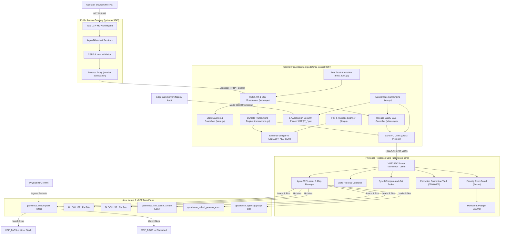
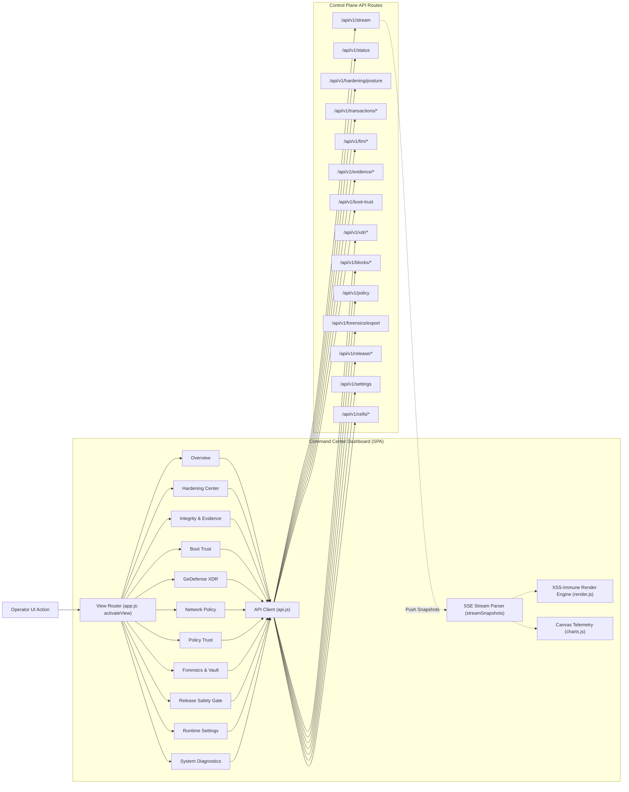
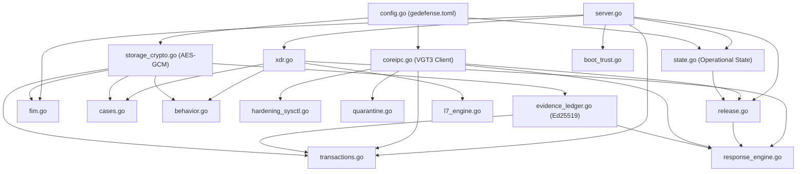
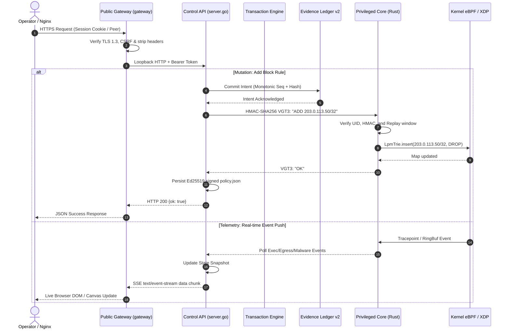

# Architecture Map: VGT GeDefense (4.0.0-beta.1)

// STATUS: DIAMANT VGT SUPREME
// CLASSIFICATION: TECHNICAL ARCHITECTURE SPECIFICATION & DATA TREE
// SYSTEM: VISIONGAIATECHNOLOGY MASTER INTELLIGENCE SYSTEM

---

## Architecture Index

1. [Global Architecture Tree](#1-global-architecture-tree)
2. [File-to-Architecture Mapping](#2-file-to-architecture-mapping)
3. [Module Documentation](#3-module-documentation)
   - [3.1 Public Access Gateway (`gateway`)](#31-public-access-gateway-gateway)
   - [3.2 Web Command Center Dashboard (`control/web`)](#32-web-command-center-dashboard-controlweb)
   - [3.3 Control Plane Daemon & API Server (`control`)](#33-control-plane-daemon--api-server-control)
   - [3.4 Cryptographic Storage & Envelope Security (`storage_crypto`)](#34-cryptographic-storage--envelope-security-storage_crypto)
   - [3.5 Cryptographic Evidence Ledger v2 (`evidence_ledger`)](#35-cryptographic-evidence-ledger-v2-evidence_ledger)
   - [3.6 Durable Security Transactions Engine (`transactions`)](#36-durable-security-transactions-engine-transactions)
   - [3.7 Autonomous XDR & Correlation Engine (`xdr`)](#37-autonomous-xdr--correlation-engine-xdr)
   - [3.8 L7 Application Security Plane / Native WAF (`l7`)](#38-l7-application-security-plane--native-waf-l7)
   - [3.9 Protected Path Integrity & FIM Engine (`fim`)](#39-protected-path-integrity--fim-engine-fim)
   - [3.10 Pacman MTREE Package Integrity Scanner (`package_integrity`)](#310-pacman-mtree-package-integrity-scanner-package_integrity)
   - [3.11 Measured Boot Trust & Platform Attestation (`boot_trust`)](#311-measured-boot-trust--platform-attestation-boot_trust)
   - [3.12 Host Hardening Posture & Sysctl Engine (`hardening`)](#312-host-hardening-posture--sysctl-engine-hardening)
   - [3.13 Correlated Security Cases & Forensics (`cases` / `forensics`)](#313-correlated-security-cases--forensics-cases--forensics)
   - [3.14 Encrypted File Quarantine Broker (`quarantine`)](#314-encrypted-file-quarantine-broker-quarantine)
   - [3.15 Honeytoken Deception Fabric (`deception`)](#315-honeytoken-deception-fabric-deception)
   - [3.16 Styx Outbound Egress Enforcement (`styx_egress`)](#316-styx-outbound-egress-enforcement-styx_egress)
   - [3.17 Morpheus RASP (Process Self-Protection) (`morpheus_rasp`)](#317-morpheus-rasp-process-self-protection-morpheus_rasp)
   - [3.18 Threat Feeds & Airlock Staging Sandbox (`feeds` / `airlock`)](#318-threat-feeds--airlock-staging-sandbox-feeds--airlock)
   - [3.19 Staged Release Controller & Safety Gates (`release`)](#319-staged-release-controller--safety-gates-release)
   - [3.20 AstraeaOS Gaia Cells Isolation Fabric (`cells`)](#320-astraeaos-gaia-cells-isolation-fabric-cells)
   - [3.21 Privileged Response Core Daemon (`gedefense-core`)](#321-privileged-response-core-daemon-gedefense-core)
   - [3.22 Kernel eBPF/XDP Data Plane (`gedefense-ebpf`)](#322-kernel-ebpfxdp-data-plane-gedefense-ebpf)
   - [3.23 OS Integration & Packaging Fabric (`integration` / `packaging`)](#323-os-integration--packaging-fabric-integration--packaging)
   - [3.24 Release Engineering & Verification Toolchains (`scripts`)](#324-release-engineering--verification-toolchains-scripts)
4. [Detailed Dashboard Views Documentation](#4-detailed-dashboard-views-documentation)
   - [4.1 Dashboard -> Overview (`overview`)](#41-dashboard---overview-overview)
   - [4.2 Dashboard -> Hardening Center (`hardening`)](#42-dashboard---hardening-center-hardening)
   - [4.3 Dashboard -> Integrity & Evidence (`integrity`)](#43-dashboard---integrity--evidence-integrity)
   - [4.4 Dashboard -> Boot Trust (`boot`)](#44-dashboard---boot-trust-boot)
   - [4.5 Dashboard -> GeDefense XDR (`xdr`)](#45-dashboard---gedefense-xdr-xdr)
   - [4.6 Dashboard -> Kinetic Network Policy (`network`)](#46-dashboard---kinetic-network-policy-network)
   - [4.7 Dashboard -> Policy Trust (`policy`)](#47-dashboard---policy-trust-policy)
   - [4.8 Dashboard -> Forensics & Quarantine (`forensics`)](#48-dashboard---forensics--quarantine-forensics)
   - [4.9 Dashboard -> Beta Release Safety Gate (`release`)](#49-dashboard---beta-release-safety-gate-release)
   - [4.10 Dashboard -> Runtime Settings (`settings`)](#410-dashboard---runtime-settings-settings)
   - [4.11 Dashboard -> Node Diagnostics & Gaia Cells (`system`)](#411-dashboard---node-diagnostics--gaia-cells-system)
   - [4.12 Dashboard Dialogs: Operator Auth & Support](#412-dashboard-dialogs-operator-auth--support)
5. [CSS & UI Design System Architecture](#5-css--ui-design-system-architecture)
6. [API Architecture & Endpoint Directory](#6-api-architecture--endpoint-directory)
7. [System-Wide End-to-End Data Flows](#7-system-wide-end-to-end-data-flows)
8. [Shared & Core Dependencies](#8-shared--core-dependencies)
9. [Architectural Relation Diagrams (Mermaid)](#9-architectural-relation-diagrams-mermaid)
10. [Technical File & Symbol Cross-Reference](#10-technical-file--symbol-cross-reference)
11. [Architectural Anomalies & Audit Findings](#11-architectural-anomalies--audit-findings)

---

## 1. Global Architecture Tree

```text
VGT GeDefense System (v4.0.0-beta.1)
│
├── 1. PUBLIC ACCESS GATEWAY (Go · Unprivileged)
│   ├── TLS 1.3 Termination & Post-Quantum ML-KEM Curve Preferences
│   ├── Argon2id Password Verification & Secure Record Migration
│   ├── Stateless Cookie Sessions (__Host-vgt_gedefense_session)
│   ├── Synchronizer-Token CSRF Protection & Host Allowlist Validation
│   └── Reverse Proxy Trust-Boundary Cleanup (Stripping Browser Forwarding Headers)
│
├── 2. COMMAND CENTER DASHBOARD (ESNext / Vanilla JS / Native CSS · Browser Client)
│   ├── Application Shell & Dark-First UI Grid
│   ├── Reactive View Navigation (11 Dynamic Pages)
│   ├── Real-Time SSE Stream Consumer (/api/v1/stream) with Polling Fallback
│   ├── Zero-Dependency Canvas Telemetry Engine (Throughput RX/TX Waveforms)
│   ├── Strict DOM Construction & XSS-Immune Render Pipeline (render.js)
│   └── Tri-Lingual Internationalization Engine (DE / EN / RU)
│
├── 3. CONTROL PLANE (Go · Unprivileged Loopback Service)
│   ├── REST API Server (net/http ServeMux · Route Handlers)
│   ├── In-Memory Operational State Machine (Atomic Mutex Snapshots)
│   ├── Storage Cryptography Engine (AES-256-GCM Envelope Encryption)
│   ├── Evidence Ledger v2 (Append-Only Monotonic Chain · Ed25519 Signatures)
│   ├── Durable Security Transactions Engine (6-Phase Reversible Posture Pipeline)
│   ├── Autonomous XDR Engine (Process Sampling, Socket Matching, Behavior Profiling)
│   ├── L7 Application Security Plane (WAF Normalization, Decoders, Detectors, Inline Proxy)
│   ├── File Integrity Monitor (FIM Baseline Verification & Inotify Watcher)
│   ├── Pacman MTREE Package Integrity Verification Scanner
│   ├── Measured Boot Trust Collector (Secure Boot, Lockdown, TPM 2.0 PCRs)
│   ├── Security Incident Case Engine (Deduplicated Fingerprints & Resolutions)
│   ├── Deception Engine (HMAC Canary Tokens: SSH Keys, Cloud Credentials, DotEnv)
│   ├── Styx Egress Engine (Scope-Bound Outbound Protocol & Port Filtering)
│   ├── Morpheus RASP (Process Memory Injection & Ptrace Guard)
│   ├── Threat Feeds Manager & Airlock Sandbox Inspector
│   ├── Production Beta Release Safety Gate Controller (Observe, Canary, Enforce, Degraded)
│   ├── AstraeaOS Gaia Cells Adapter (Cgroup v2 Network & LSM Enforcement)
│   └── Core IPC Client (Unix Socket Client · VGT3 Protocol · HMAC Authentication)
│
├── 4. PRIVILEGED RESPONSE CORE (Rust · Privileged Root Broker)
│   ├── Capability-Bounded IPC Broker (gedefense-core.sock · Mode 0660)
│   ├── Fanotify Executable Permission Guard (FAN_OPEN_EXEC_PERM on /home)
│   ├── Malware Scanner Engine (SHA-256 Reputation, EICAR, Polyglot, Zip Expansion)
│   ├── Peer-Bound User Scan Socket (scan.sock · Mode 0666 · SO_PEERCRED Verification)
│   ├── Race-Free Process Control (pidfd_open + Proc Start Ticks Verification + Signals)
│   ├── Chunked Encrypted Quarantine Vault (AES-256-GCM · openat2 O_NOFOLLOW · DAC 0700/0600)
│   ├── Allowlisted Sysctl Compare-and-Set Broker with Kernel Readback
│   └── eBPF Program Loader & Kernel Map Manager (Aya Pure-Rust eBPF Framework)
│
├── 5. KERNEL DATA PLANE (Rust no_std eBPF / XDP + cgroup-skb + LSM)
│   ├── XDP Ingress Filter (gedefense_xdp · LPM Trie CIDR Matcher)
│   │   ├── Management Allowlist Trie (ALLOWLIST_V4 / ALLOWLIST_V6) -> XDP_PASS
│   │   └── Kinetic Blocklist Trie (BLOCKLIST_V4 / BLOCKLIST_V6) -> XDP_DROP
│   ├── Sched Process Exec Tracepoint (gedefense_sched_process_exec -> RingBuf)
│   ├── Cgroup Outbound Egress Filter (gedefense_egress -> RingBuf)
│   └── Gaia Cells Socket Create LSM Hook (gedefense_cell_socket_create -> AF_UNIX Only)
│
├── 6. INTEGRATION & PLATFORM FABRIC
│   ├── AstraeaOS Native Integration (SDDM Gate, SDDM Theme, Shell Wrapper, Attestation)
│   ├── Universal Linux Integration (PAM Configuration, Polkit Rules, Desktop Entry)
│   ├── Reverse Proxy Integration (Nginx L7 Configuration Example)
│   └── Systemd Unit Hierarchy (gedefense-core, control, access, bpffs)
│
└── 7. RELEASE ENGINEERING & TOOLCHAINS
    ├── Arch Linux Packaging (PKGBUILD)
    ├── Offline Vendored Rust Toolchain (aya eBPF Library)
    ├── Self-Contained One-Click Shell Installer
    ├── Cryptographic Release Signing & Verification Scripts
    └── Automated Distro & Security Test Suites
```

---

## 2. File-to-Architecture Mapping

The repository codebase resides canonically in `V4 Update/VGT_GeDefense_Beta_v4_4.0.0-beta.1_Source/VGT_GeDefense_Beta_v4_4.0.0-beta.1/` (hereafter referenced as project relative paths `control/`, `gateway/`, `rust/`, etc.):

```text
====================================================================================================
PATH RELATIVE TO ROOT                          SUBSYSTEM                      ARCHITECTURAL RESPONSIBILITY
====================================================================================================
control/
  airlock.go                                   Threat Feeds / Airlock         Sandboxed threat intelligence and file staging verification
  airlock_test.go                              Testing                        Unit tests for airlock magic bytes and polyglot detection
  behavior.go                                  XDR / Behavior Modeling        Adaptive process baseline modeling with HMAC integrity checks
  boot_trust.go                                Hardware & Boot Trust          Local attestation of Secure Boot, TPM 2.0, Lockdown, and Kernel digests
  boot_trust_test.go                           Testing                        Unit tests for boot trust report generation and probe parsing
  cases.go                                     Incident Management            Deduplicated security incident cases and investigations
  cases_test.go                                Testing                        Unit tests for security case transitions and encrypted storage
  cells.go                                     AstraeaOS Gaia Cells           Adapter for AstraeaOS Gaia Cells IPC (VGTGC1 protocol)
  cells_test.go                                Testing                        Unit tests for Gaia Cells IPC encoding and parsing
  cells_transaction.go                         Durable Transactions           GaiaCellApplier implementation for cell network isolation
  chronos_fim.go                               Integrity / FIM                Periodic scheduled FIM scanner wrapper and delta reporter
  chronos_fim_test.go                          Testing                        Unit tests for Chronos FIM scheduling
  config.go                                    Configuration                  Strict TOML subset parser for gedefense.toml daemon settings
  config_test.go                               Testing                        Unit tests for configuration validation and bounds
  coreipc.go                                   Control / Core IPC             HMAC-authenticated VGT3 IPC client to gedefense-core.sock
  coreipc_cell_lsm_test.go                     Testing                        Integration tests for core IPC cell LSM command encoding
  coreipc_egress_test.go                       Testing                        Integration tests for core IPC egress events
  coreipc_exec_test.go                         Testing                        Integration tests for core IPC process exec events
  coreipc_test.go                              Testing                        Unit tests for core IPC framing, replay defense, and auth
  deception.go                                 Deception & Honeypots          Decoy canary tokens (SSH, Cloud, Shadow, DotEnv) & access alarms
  deception_test.go                            Testing                        Unit tests for honeytoken generation, hashing, and alarms
  evidence_ledger.go                           Audit & Evidence               Cryptographically chained append-only ledger (Ed25519 + AES-GCM)
  evidence_ledger_test.go                      Testing                        Unit tests for ledger verification, tampering detection, checkpoints
  feeds.go                                     Threat Feeds                   Threat intelligence feed download, staging, and CIDR extraction
  feeds_test.go                                Testing                        Unit tests for threat feed parsing and rate-limited sync
  fim.go                                       Integrity / FIM                File Integrity Monitor engine (streaming SHA-256, symlink jail)
  fim_test.go                                  Testing                        Unit tests for FIM baseline scanning and drift detection
  forensics.go                                 Forensics & Audit              Ed25519-signed forensic export bundle generation and validation
  forensics_test.go                            Testing                        Unit tests for forensics signing and signature verification
  go.mod                                       Build Configuration            Go module definition (zero third-party dependencies)
  hardening_posture.go                         System Hardening               Local security posture scoring and sysctl/LUKS/AppArmor checks
  hardening_posture_test.go                    Testing                        Unit tests for posture scoring and check evaluation
  hardening_sysctl.go                          Durable Transactions           SysctlTransactionApplier (compare-and-set sysctl via Core IPC)
  integrity_watch_linux.go                     Integrity / Watcher            Linux inotify watcher for real-time protected path modifications
  integrity_watch_other.go                     Integrity / Watcher            Fallback stub for non-Linux platforms
  integrity_watch_test.go                      Testing                        Unit tests for integrity file watching
  l7_candidates.go                             L7 Application Security        Inspection candidate extractor for URIs, headers, bodies, forms
  l7_decode.go                                 L7 Application Security        Multi-pass decoding engine (URL, HTML entity, Base64, Hex, Unicode)
  l7_detectors.go                              L7 Application Security        Detection rules for SQLi, XSS, Command Injection, Traversal, XXE
  l7_edge.go                                   L7 Application Security        Native inline reverse-proxy server over Unix socket with upstream
  l7_edge_test.go                              Testing                        Unit tests for inline L7 reverse proxy and response filtering
  l7_engine.go                                 L7 Application Security        Core L7 inspection pipeline orchestrator and scoring engine
  l7_fuzz_test.go                              Testing                        Fuzz tests for L7 parser, decoders, and candidates
  l7_normalize.go                              L7 Application Security        HTTP request normalization (path cleanup, header folding)
  l7_peer_linux.go                             L7 Application Security        SO_PEERCRED Unix socket caller credential extraction (Linux)
  l7_peer_other.go                             L7 Application Security        Fallback peer credentials stub for non-Linux platforms
  l7_rate_limit.go                             L7 Application Security        Token-bucket client rate limiters and global sensitive path limiter
  l7_response.go                               L7 Application Security        Response inspection detectors (SQL error leaks, stack traces, keys)
  l7_server.go                                 L7 Application Security        Bounded standalone L7 inspection HTTP server (/v1/inspect)
  l7_server_test.go                            Testing                        Unit tests for standalone L7 inspection socket server
  l7_test.go                                   Testing                        End-to-end test suite for L7 WAF detection and normalization
  l7_types.go                                  L7 Application Security        Data structures and JSON models for L7 inspection requests/decisions
  l7_validate.go                               L7 Application Security        Pre-inspection boundary validator for size and depth limits
  main.go                                      Daemon Lifecycle               Control plane daemon entry point, CLI flags, subsystem bootstrap
  malware_xdr_test.go                          Testing                        Integration tests linking privileged malware core to XDR incidents
  morpheus_rasp.go                             RASP Protection                Process tampering, memory injection, and ptrace attach detector
  morpheus_rasp_test.go                        Testing                        Unit tests for RASP ptrace boundary and attack story nodes
  package_integrity.go                         Package Integrity              Package manager trust verification interfaces
  package_integrity_linux.go                   Package Integrity              Pacman MTREE database reader and system file hash verifier
  package_integrity_linux_test.go              Testing                        Unit tests for pacman MTREE parser and deviation reports
  package_integrity_other.go                   Package Integrity              Fallback package integrity stub for non-Linux hosts
  panel_status_test.go                         Testing                        Unit tests for internal dashboard diagnostics endpoint
  platform_caps.go                             Host Capabilities              Linux kernel capabilities probe (eBPF, XDP, BTF, cgroups, LSM)
  platform_caps_test.go                        Testing                        Unit tests for platform capability detection
  policy.go                                    Policy Management              Signed policy snapshot generation and deterministic Ed25519 signing
  preflight.go                                 Preflight Checks               Production preflight checks (permissions, storage keys, sockets)
  quarantine.go                                Quarantine Management         QuarantineTransactionApplier (AES-GCM vault isolation via Core)
  quarantine_test.go                           Testing                        Unit tests for quarantine inspect, apply, verify, and restore
  rate_limit.go                                API Middleware                 Leaky/token bucket rate limiters for control plane API
  release.go                                   Release Safety Gate            Staged release state machine (Observe, Canary, Enforce, Degraded)
  release_api_test.go                          Testing                        API integration tests for release stage transitions
  release_manifest.go                          Release Engineering            Cryptographic Ed25519 signing and verification of release manifests
  release_manifest_test.go                     Testing                        Unit tests for release manifest generation and signature validation
  release_test.go                              Testing                        Unit tests for release controller gates and emergency stop
  response_engine.go                           Automated Response             Automated response orchestrator (kill, contain, quarantine, rollback)
  response_engine_test.go                      Testing                        Unit tests for response engine gates and PID verification
  runtime_settings.go                          Runtime Configuration          Encrypted and signed runtime settings store (rules, intervals, weights)
  runtime_settings_test.go                     Testing                        Unit tests for runtime settings loading and persistence
  sdnotify.go                                  Systemd Integration            systemd READY=1, STATUS=..., and WATCHDOG=1 notifications
  security.go                                  Security Utilities             Constant-time token comparisons and cryptographic entropy helpers
  security_fuzz_test.go                        Testing                        Fuzz tests for proc parser, token validation, and input boundaries
  security_test.go                             Testing                        Unit tests for constant-time comparisons and token generation
  security_v5_test.go                          Testing                        Hardening test suite against OWASP and Linux privilege vectors
  server.go                                    Control API Server             HTTP Command Center API server, routing, and REST handlers
  server_security_test.go                      Testing                        Security test suite for API bearer auth, CORS, CSRF, and headers
  server_settings.go                           Control API Server             Handlers for runtime settings updates and allowlist mutations
  server_settings_test.go                      Testing                        Unit tests for settings API endpoints
  state.go                                     State Management               Thread-safe in-memory operational state with atomic snapshots
  state_test.go                                Testing                        Unit tests for state mutation and block expiration
  storage_crypto.go                            Storage Cryptography           AES-256-GCM envelope encryption with derived HMAC purpose keys
  storage_crypto_test.go                       Testing                        Unit tests for storage encryption, AAD validation, and tampering
  styx_egress.go                               Egress Control                 Styx outbound network filtering engine (cell/cgroup scoped)
  styx_egress_test.go                          Testing                        Unit tests for Styx egress rule evaluation and serialization
  telemetry_linux.go                           Host Telemetry                 Linux CPU, RAM, and interface throughput collector (/proc)
  telemetry_other.go                           Host Telemetry                 Fallback telemetry stub for non-Linux platforms
  transactions.go                              Durable Transactions           Durable 6-phase state transaction engine (Preview->Apply->Verify)
  transactions_test.go                         Testing                        Unit tests for transaction rollback, verification, and recovery
  xdr.go                                       XDR Engine                     Extended Detection and Response engine (sampling, scoring, pipeline)
  xdr_baseline.go                              XDR Engine                     JSON baseline specification loader for expected system binaries
  xdr_cell_lsm_test.go                         Testing                        Unit tests for cell LSM socket denial correlation
  xdr_dag.go                                   XDR Correlation                Directed Acyclic Graph (DAG) event correlator and attack stories
  xdr_dag_test.go                              Testing                        Unit tests for incident DAG correlation and attack story tree
  xdr_l7.go                                    XDR / L7 Bridge                L7CorrelationStore linking HTTP WAF detections to process flows
  xdr_linux.go                                 XDR Engine                     Linux-specific /proc and /proc/net process and socket samplers
  xdr_linux_fuzz_test.go                       Testing                        Fuzz testing for Linux /proc/net and stat parsers
  xdr_log.go                                   XDR Engine                     Encrypted and HMAC-chained incident logger (incidents.jsonl)
  xdr_other.go                                 XDR Engine                     Fallback XDR sensor stub for non-Linux hosts
  xdr_rules.go                                 XDR Rule Engine                Built-in and custom RE2 rule evaluator (Command, Origin, Lineage)
  xdr_runtime_settings_test.go                 Testing                        Unit tests for dynamic runtime XDR tuning
  xdr_test.go                                  Testing                        End-to-end tests for XDR correlation and signal scoring
  xdr_types.go                                 XDR Engine                     Data types and models for process samples, flows, and incidents
  web/
    api.js                                     Dashboard API Client           Fetch client, CSRF headers, error handling, SSE stream receiver
    app.css                                    Dashboard Styling              Complete native CSS stylesheet, design tokens, responsive grid
    app.js                                     Dashboard Controller           SPA view router, event handlers, charts driver, state sync
    charts.js                                  Dashboard Charts               Native HTML5 Canvas HiDPI dual-line network throughput graph
    i18n.js                                    Dashboard Localization         Localization dictionary engine for German (de), English (en), Russian (ru)
    index.html                                 Dashboard Markup               Semantic HTML5 single-page application markup and layout
    render.js                                  Dashboard Render Engine        XSS-immune DOM node creation, badges, tables, and event stream

gateway/
  argon2_linux.go                              Gateway Authentication         Linux native Argon2id password hash verification
  crypto_helpers.go                            Gateway Cryptography           Constant-time memory comparisons and random token generators
  go.mod                                       Build Configuration            Go module definition for gateway daemon
  integration_test.go                          Testing                        Integration tests for gateway TLS termination and proxying
  main.go                                      Gateway Daemon                 Public TLS reverse proxy, login page, session cookie manager
  main_test.go                                 Testing                        Unit tests for login form validation and rate limiting
  security_beta5_test.go                       Testing                        Security test suite for gateway origin isolation and CSRF
  tls_files.go                                 Gateway TLS                    TLS certificate loader, keypair validation, self-signed generator
  tls_files_test.go                            Testing                        Unit tests for certificate validity and private key checks

rust/
  Cargo.lock                                   Rust Dependencies              Pinned dependency lockfile for Rust workspace
  Cargo.toml                                   Rust Workspace                 Workspace definition for core, ebpf, and common crates
  .cargo/config.toml                           Rust Build Flags               Cargo target configurations and linker scripts
  gedefense-common/
    Cargo.toml                                 Rust Crate Manifest            Common data models and shared constants
    src/lib.rs                                 Rust Common Library            Wire event types (ExecEvent, EgressDropEvent, CellLsmDenyEvent)
    src/bin/xdp_packet_fuzz.rs                 Testing / Fuzzing              Packet parser fuzzer for Ethernet, VLAN, IPv4, IPv6
  gedefense-core/
    Cargo.toml                                 Rust Crate Manifest            Dependencies: aya, sha2, hmac, aes-gcm, libc, base64
    src/main.rs                                Privileged Core Daemon         VGT3 IPC server, eBPF loader, sysctl broker, signal router
    src/malware.rs                             Malware & Exec Protection      Fanotify permission guard on /home, reputation checks, scan socket
    src/process_control.rs                     Process Containment            pidfd_open, proc start-tick verification, objective kill gates
    src/quarantine.rs                          Quarantine Storage Broker      Chunked AES-256-GCM vault, openat2 directory jail, atomic rename
  gedefense-ebpf/
    Cargo.toml                                 Rust Crate Manifest            Kernel eBPF crate (no_std, aya-ebpf)
    src/main.rs                                Kernel Data Plane              XDP ingress trie filter, LSM socket guard, cgroup skb egress
  vendor/aya/                                  Vendored Library               Complete vendored Aya eBPF library for offline reproducible builds

integration/
  astraeaos/
    50-astraeaos-gedefense.rules               Polkit Policy                  Polkit rules allowing desktop user to invoke GeDefense actions
    astraeaos-boot-attestation                 Shell Script                   Collects Secure Boot, TPM PCR, and kernel digests into JSON
    astraeaos-boot-attestation.service         Systemd Unit                   Service executing boot attestation prior to login gate
    astraeaos-profile.toml                     Configuration                  AstraeaOS default security and cell profile overrides
    astraeaos-runtime.conf                     Systemd Environment            Runtime environment flags for AstraeaOS
    astraeaos-security-boot-failure            Shell Script                   Failsafe GUI notification when measured boot fails
    astraeaos-security-boot-failure.service    Systemd Unit                   Service triggered on boot verification failure
    astraeaos-security-login-gate              Shell Script                   Blocks SDDM login until GeDefense core is verified active
    astraeaos-security-login-gate.service      Systemd Unit                   Service holding SDDM until security fabric is ready
    build-local-packages.sh                    Build Script                   Compiles local pacman packages for AstraeaOS target
    contract.json                              System Contract                Distribution contract definition for AstraeaOS
    firefox-policies.json                      Browser Hardening              Enterprise policies enforcing browser quarantine jail
    gedefense-access-astraeaos.conf            Systemd Drop-in                Drop-in configuration for gedefense-access on AstraeaOS
    gedefense-access-ready                     Shell Script                   Readiness probe for public access gateway
    gedefense-app                              Shell Script                   Launcher script for native desktop webapp
    gedefense-astraeaos-provision              Shell Script                   Initial node provisioning and storage key generation
    gedefense-astraeaos-provision.service      Systemd Unit                   One-shot systemd provisioning service
    gedefense-control-astraeaos.conf           Systemd Drop-in                Drop-in configuration for gedefense-control on AstraeaOS
    gedefense-core-astraeaos.conf              Systemd Drop-in                Drop-in configuration for gedefense-core on AstraeaOS
    gedefense-core-launch                      Shell Script                   Wrapper script ensuring BPF filesystem mount before core start
    gedefense-ensure-ready                     Shell Script                   Host health verification script
    gedefense-set-password                     Shell Script                   Administrative tool to set Argon2id gateway password
    gedefense-shell.cpp                        Native C++ Wrapper             C++ Qt/WebEngine hardened desktop client shell with certificate pinning
    gedefense.desktop                          Desktop Entry                  XDG desktop entry for Application Menu
    org.astraeaos.gedefense.policy             Polkit Policy XML              PolicyKit action XML definition for privileged operations
    PKGBUILD                                   Arch Packaging                 Complete Arch package recipe for AstraeaOS integration
    README.md                                  Documentation                  AstraeaOS deployment and integration notes
    sddm-gedefense-login-gate.conf             Display Manager Drop-in        SDDM service override tying display manager to login gate
    verify_sync.py                             Verification                   Script checking synchronization between repository and OS image
  linux/
    gedefense-app                              Shell Script                   Generic Linux desktop launcher script
    gedefense-ensure-ready                     Shell Script                   Generic Linux readiness verification script
    gedefense.desktop                          Desktop Entry                  Generic Linux desktop launcher definition
    org.vgt.gedefense.policy                   Polkit Policy XML              Generic Linux PolicyKit XML definition
    README.md                                  Documentation                  Universal Linux deployment guide
  nginx/
    gedefense-l7.conf.example                  Web Server Configuration       Example Nginx configuration proxying to GeDefense L7 inspection
    README.md                                  Documentation                  Setup instructions for Nginx + GeDefense L7 WAF

packaging/
  arch/
    PKGBUILD                                   Package Recipe                 Arch Linux package build script for full GeDefense stack
  systemd/
    gedefense-access.service.in                Systemd Unit Template          Systemd service definition for public access gateway
    gedefense-bpffs.service                    Systemd Unit                   Ensures /sys/fs/bpf is mounted with correct flags
    gedefense-control.service                  Systemd Unit                   Systemd service definition for unprivileged control plane
    gedefense-core.service                     Systemd Unit                   Systemd service definition for privileged Rust core
  sysusers/
    vgt-gedefense.conf                         Sysusers Configuration         Defines system users and groups (gedefense, gedefense-l7)
  tmpfiles/
    vgt-gedefense.conf                         Tmpfiles Configuration         Creates volatile runtime directories in /run/vgt-gedefense
    vgt-gedefense-l7.conf                      Tmpfiles Configuration         Creates volatile runtime directories in /run/vgt-gedefense-l7

scripts/
  build-full-stack.sh                          Build Pipeline                 Automated end-to-end build script for Rust eBPF, Core, Go, and Gateway
  oneclick-installer-header.sh                 Distribution                   Self-extracting one-click installer script header
  package-artifacts.sh                         Distribution                   Packages binaries, configs, and units into deployment tarballs
  regenerate-mirror-manifest.py                Release Engineering            Calculates SHA-256 digests for all distribution files
  security-audit.sh                            Security Audit                 Exhaustive automated static security audit and pattern verifier
  stage-github-upload.py                       Release Engineering            Stages release assets and generates GitHub release metadata
  sync-astraeaos-gedefense.py                  Release Engineering            Synchronizes files between repository and AstraeaOS mirror
  validate-arch-packages.sh                    Validation                     Validates PKGBUILD syntax and binary packaging integrity
  validate-distro-integration.sh               Validation                     Validates distro contract across Debian, Fedora, SUSE, Arch
  validate-github-release.py                   Validation                     Validates release assets against signed manifest
  validate-installed-linux-host.sh             Validation                     Audits a live installed Linux host for security posture
  validate-linux-integration.py                Validation                     Validates Linux desktop integration files
  validate-quarantine-dac.sh                   Validation                     Validates discretionary access controls of quarantine vault
  validate-systemd.sh                          Validation                     Validates systemd unit syntax and security directives
  validate.sh                                  Validation                     Runs complete test suite and code format validation
  verify-release-toolchains.sh                 Validation                     Verifies exact compiler toolchain versions against lockfile

Top-Level Project Assets:
  gedefense.toml                               Configuration                  Default master daemon configuration file
  xdr-baseline.example.json                    Configuration Template         Reference baseline specification for core system binaries
  malware-hashes.sha256                        Threat Data                    Known bad SHA-256 signature database for offline malware detection
  TOOLCHAINS.lock                              Toolchain Pinning              Strict version lock for Go, Rust, and Clang toolchains
  VERSION                                      Version Identifier             Semantic version string (4.0.0-beta.1)
  Makefile                                     Build Automation               Make targets for build, test, package, and clean
  README.md                                    Documentation                  Project overview, architectural tenets, and deployment guide
  ARCHITECTURE.md                              Documentation                  Technical architecture map (this document)
  CRYPTOGRAPHY.md                              Documentation                  Formal cryptographic specifications and key hierarchies
  THREAT-MODEL.md                              Documentation                  STRIDE threat model and attack surface boundaries
  TECHNISCHES-DATENBLATT.md                    Documentation                  Detailed technical specification sheet
  GEDEFENSE-ASTRAEAOS-INTEGRATION.md           Documentation                  AstraeaOS security architecture and capability matrix
  XDR-DESIGN.md                                Documentation                  Extended detection and response engine specification
  OPERATIONS.md                                Documentation                  Operational runbook and incident response guide
  SECURITY-AUDIT-BETA5.md                      Documentation                  Third-party security audit report and remediation proof
  SECURITY-RELEASE-CHECKLIST.md                Documentation                  Mandatory release sign-off gates
  SECURITY.md                                  Documentation                  Vulnerability disclosure policy and security contacts
  RELEASE-NOTES.md                             Documentation                  Changelog and release notes for v4.0.0-beta.1
  CHANGELOG.md                                 Documentation                  Historical change log across all beta versions
  BETA-TEST-PLAN.md                            Documentation                  Formal test cases and verification matrix
  BUILD-RUNBOOK.md                             Documentation                  Step-by-step compilation and deployment runbook
  CI-POLICY.md                                 Documentation                  Continuous integration rules and gating policies
  DEPENDENCIES.md                              Documentation                  Bill of materials and zero-dependency audit
  MIGRATION-NOTES.md                           Documentation                  Migration instructions from v3 to v4
  PRODUCTION-BETA-GATE.md                      Documentation                  Criteria required to promote from Observe to Enforce
  ROADMAP.md                                   Documentation                  Product roadmap and upcoming milestones
  VALIDATION.md                                Documentation                  Host qualification and benchmark criteria
  SOURCE-MANIFEST.sha256                       Cryptographic Manifest         SHA-256 manifest of all source repository files
  ASTRAEAOS-MIRROR-MANIFEST.sha256             Cryptographic Manifest         SHA-256 manifest of AstraeaOS integrated files
```

---

## 3. Module Documentation

### 3.1 Public Access Gateway (`gateway`)

#### Purpose
Acts as the hardened, single external HTTPS ingress gate for operators. Terminates public TLS 1.3, authenticates browser sessions via Argon2id, enforces strict origin isolation and CSRF protections, and proxies clean requests to the internal unprivileged Control Plane while stripping all browser-controlled forwarding metadata.

#### Capabilities
- Strictly enforces TLS 1.3 with Post-Quantum Hybrid ML-KEM curves (`SecP384r1MLKEM1024`, `X25519MLKEM768`, with `X25519` fallback only on loopback).
- Verifies administrative passwords using Argon2id with memory-cost and parallelism controls, automatically migrating legacy records.
- Issues stateless, HMAC-SHA256 authenticated session tokens bound to IP and 12-hour expiration inside a `Secure`, `HttpOnly`, `SameSite=Strict`, `__Host-` prefixed cookie.
- Protects against CSRF via synchronizer tokens and blocks any cross-origin state mutations (`Sec-Fetch-Site` and `Origin` verification).
- Performs complete trust-boundary sanitization before proxying: deletes `Origin`, `Referer`, `Cookie`, `Forwarded`, `X-Forwarded-*`, and `X-Real-IP`, setting a dedicated internal Bearer token.

#### Associated Files
- **Backend / Daemon**: `gateway/main.go`
- **Crypto & TLS**: `gateway/tls_files.go`, `gateway/crypto_helpers.go`, `gateway/argon2_linux.go`
- **Configuration / Build**: `gateway/go.mod`
- **Tests**: `gateway/main_test.go`, `gateway/tls_files_test.go`, `gateway/integration_test.go`, `gateway/security_beta5_test.go`

#### Dashboard Integration
- Serves the login page (`GET /login`, `POST /login`, `POST /logout`) and proxies all authenticated workspace traffic to `GET /` and `/assets/*`.
- Manages session lifecycle and redirects unauthenticated requests immediately to `/login`.

#### Dependencies
- **Requires**: Local filesystem for certificates (`access.crt`, `access.key`), password record (`/etc/vgt/gedefense/access-password`), and session HMAC key (`/var/lib/vgt/gedefense/access-session.key`).
- **Network Upstream**: Internal Control Plane loopback port (`http://127.0.0.1:9844`).

#### Used By
- Operators accessing the Command Center from external or local web browsers.

---

### 3.2 Web Command Center Dashboard (`control/web`)

#### Purpose
The browser-based single-page application (SPA) operator console for real-time monitoring, security incident investigation, posture management, policy configuration, and execution of durable security transactions.

#### Capabilities
- Renders 11 dedicated functional views without external CDNs, third-party JavaScript frameworks, or remote web fonts.
- Listens to real-time server-sent events (`GET /api/v1/stream`) with automatic fallback to polled status snapshots.
- Drives HiDPI HTML5 Canvas telemetry graphs with moving linear gradient fills and neon glow drop waveforms.
- Employs strict DOM node creation (`document.createElement`, `replaceChildren`) and text node assignment, preventing XSS vectors.
- Supports complete runtime internationalization across German, English, and Russian with localized number and date formats.

#### Associated Files
- **Markup**: `control/web/index.html`
- **Styling**: `control/web/app.css`
- **Application Controller**: `control/web/app.js`
- **API Client**: `control/web/api.js`
- **Render Engine**: `control/web/render.js`
- **Chart Visualizer**: `control/web/charts.js`
- **Localization**: `control/web/i18n.js`

#### Dashboard Integration
- Contains all 11 user-facing panels: Overview, Hardening, Integrity, Boot Trust, XDR, Network, Policy, Forensics, Release Gate, Settings, and System.

#### Dependencies
- **Requires**: Control Plane API (`/api/v1/*`) and SSE event stream (`/api/v1/stream`).

#### Used By
- Human security operators and automated desktop shells (`integration/astraeaos/gedefense-shell.cpp`).

---

### 3.3 Control Plane Daemon & API Server (`control`)

#### Purpose
The central unprivileged control daemon (`gedefense-control`). It hosts the REST Command Center API, orchestrates in-memory operational state, coordinates XDR and L7 subsystems, maintains the cryptographic evidence chain, and dispatches authenticated commands to the privileged Rust core.

#### Capabilities
- Listens exclusively on loopback or designated internal interface with mandatory Bearer token authentication.
- Maintains unified atomic snapshots of network block rules, process incidents, telemetry, release phase, and component health.
- Implements strict request rate limiting (`RateLimiter`) and replay attack prevention (`ReplayGuard`).
- Manages daemon startup preflight, interface auto-detection, and systemd watchdog keep-alives (`sdnotify.go`).

#### Associated Files
- **Main / Lifecycle**: `control/main.go`, `control/config.go`, `control/preflight.go`, `control/sdnotify.go`
- **API Server & Settings**: `control/server.go`, `control/server_settings.go`, `control/rate_limit.go`
- **State Management**: `control/state.go`, `control/policy.go`
- **Platform Probing**: `control/platform_caps.go`, `control/telemetry_linux.go`, `control/telemetry_other.go`
- **Tests**: `control/config_test.go`, `control/state_test.go`, `control/server_security_test.go`, `control/panel_status_test.go`

#### Dashboard Integration
- Serves static assets (`/assets/*`) and answers all REST calls executed by `control/web/api.js`.

#### Dependencies
- **Requires**: `gedefense.toml`, `gedefense-core.sock`, storage master keys, and Evidence Ledger keys.

#### Used By
- Public Access Gateway and local management scripts.

---

### 3.4 Cryptographic Storage & Envelope Security (`storage_crypto`)

#### Purpose
Provides AES-256-GCM envelope encryption for all sensitive state files stored at rest, utilizing HMAC-derived purpose-specific subkeys bound to the host node identity and strict Authenticated Additional Data (AAD).

#### Capabilities
- Enforces strict file mode checks: master key (`storage-master.key`) must be a 32-byte regular file, non-symlink, not world-accessible, and not group-writable.
- Derives separate subkeys per storage purpose using HMAC-SHA256: `HMAC(rootKey, "VGT-GEDEFENSE-AES256GCM-KEY-V1\0" || nodeName || "\0" || purpose)`.
- Generates 12-byte random cryptographic nonces for each write operation.
- Validates strict AAD combining schema version, node identity, purpose, and sequence numbers.

#### Associated Files
- **Core Implementation**: `control/storage_crypto.go`, `control/security.go`
- **Tests**: `control/storage_crypto_test.go`, `control/security_test.go`, `control/security_fuzz_test.go`

#### Dashboard Integration
- Transparently protects all persistent records shown in Hardening, Transactions, Cases, FIM, and Settings.

#### Dependencies
- **Requires**: `/etc/vgt/gedefense/secrets/storage-master.key`.

#### Used By
- `EvidenceLedger`, `TransactionEngine`, `CaseEngine`, `FIMEngine`, `SettingsStore`, `BehaviorModel`.

---

### 3.5 Cryptographic Evidence Ledger v2 (`evidence_ledger`)

#### Purpose
Maintains a cryptographically tamper-evident, append-only ledger for all security events, operator actions, and automated response decisions.

#### Capabilities
- Generates structured `EvidenceRecord` entries containing monotonic sequence numbers, timestamps, event severity, category, source, message, target, and the predecessor record SHA-256 digest (`PrevHash`).
- Signs each record digest using a local Ed25519 private key (`evidence.ed25519`).
- Encrypts entire serialized records with AES-256-GCM using the node storage master key.
- Maintains an atomically committed `.head` checkpoint file to detect tail truncation or unauthorized rollbacks.
- Operates in fail-closed mode: any corruption, missing file, or verification failure disables active response in the release controller.

#### Associated Files
- **Core Implementation**: `control/evidence_ledger.go`
- **Tests**: `control/evidence_ledger_test.go`

#### Dashboard Integration
- Renders authenticated audit records on the Integrity and Forensics tabs (`/api/v1/evidence`, `/api/v1/evidence/verify`).

#### Dependencies
- **Requires**: `StorageCipher` and `/var/lib/vgt/gedefense/evidence.ed25519`.

#### Used By
- `TransactionEngine`, `XDREngine`, `ResponseEngine`, `APIServer`, `ReleaseController`.

---

### 3.6 Durable Security Transactions Engine (`transactions`)

#### Purpose
Executes reversible, multi-phase system modifications (sysctl parameters, file quarantine, Gaia cell network isolation) following a strict Zero-Trust assurance pipeline.

#### Capabilities
- Implements the 6-phase transaction lifecycle: `Preview -> Authorize -> Apply -> Verify -> Audit -> Reverse`.
- `Preview`: Captures the live before-state, generates the typed execution plan, and calculates a SHA-256 preview hash.
- `Authorize`: Requires explicit, transaction-specific confirmation strings (`APPLY:<ID>` or `REVERSE:<ID>`) and mandatory human justification.
- `Apply`: Persists intent to the Evidence Ledger and executes atomic compare-and-set actions via the privileged core broker.
- `Verify`: Reads back the kernel or filesystem state immediately after mutation to verify execution.
- Interrupted or failed states transition to `recovery_required`, preventing subsequent mutations until resolved.

#### Associated Files
- **Core Implementation**: `control/transactions.go`, `control/hardening_sysctl.go`, `control/quarantine.go`, `control/cells_transaction.go`
- **Tests**: `control/transactions_test.go`, `control/quarantine_test.go`

#### Dashboard Integration
- Powers the "Sicherheitstransaktionen" (Durable Security Transactions) tables and execution modals in Hardening, Forensics, and System.

#### Dependencies
- **Requires**: `StorageCipher`, `EvidenceLedger`, and `CoreClient`.

#### Used By
- Hardening Center, File Quarantine, and Gaia Cell Manager.

---

### 3.7 Autonomous XDR & Correlation Engine (`xdr`)

#### Purpose
Autonomous Extended Detection and Response (XDR) engine that monitors Linux processes, network sockets, file modifications, and behavioral deviations, correlating them into attack stories and triggering evidence-gated containment.

#### Capabilities
- Samples Linux `/proc` filesystem: extracts PID, PPID, UID, start ticks, executable path, comm, cmdline, and binary SHA-256 hashes.
- Samples `/proc/net/tcp`, `tcp6`, `udp`, `udp6` to associate active network connections and remote endpoints with specific process identities.
- Evaluates multi-layered detection rules:
  - Command execution anomalies (RE2 regex engine)
  - Origin anomalies (`memfd:`, deleted executables, `/tmp/`, `/dev/shm/`)
  - Lineage anomalies (unexpected parent-child relationships)
  - Masquerading (process comm name conflicting with executable disk identity)
  - Threat intelligence matches (remote IPs matching staged threat feeds)
  - Adaptive behavioral baseline deviations (learned connection frequencies and port profiles)
- Correlates isolated events into a Directed Acyclic Graph (DAG) producing multi-stage `AttackStory` cases.
- Scores threats across categories; requires objective corroborating evidence before authorizing process termination.

#### Associated Files
- **Core Engine & Pipeline**: `control/xdr.go`, `control/xdr_types.go`, `control/xdr_rules.go`, `control/xdr_baseline.go`, `control/behavior.go`
- **Linux Sensors**: `control/xdr_linux.go`, `control/xdr_other.go`
- **Correlation & Log**: `control/xdr_dag.go`, `control/xdr_log.go`, `control/cases.go`, `control/response_engine.go`
- **L7 Bridge**: `control/xdr_l7.go`
- **Tests**: `control/xdr_test.go`, `control/xdr_dag_test.go`, `control/xdr_linux_fuzz_test.go`, `control/behavior.go`

#### Dashboard Integration
- Drives the GeDefense XDR view: process metrics, active flow counts, incident timeline, and adaptive behavior profiles.

#### Dependencies
- **Requires**: Linux `/proc` filesystem, `CoreClient` (for process signals), `PolicyStore`, `FeedManager`, `SettingsStore`.

#### Used By
- Control Plane API, Incident Logger, and Automated Response Engine.

---

### 3.8 L7 Application Security Plane / Native WAF (`l7`)

#### Purpose
Native Layer 7 Web Application Firewall and HTTP reverse proxy gate implemented purely in Go standard library, providing deep packet inspection, attack detection, rate limiting, and response leak prevention without external runtimes or web server plugins.

#### Capabilities
- Multi-mode deployment:
  - **Standalone Inspection Socket** (`/run/vgt-gedefense-l7/inspect.sock`): Advisory inspection via `POST /v1/inspect`.
  - **Inline Reverse Proxy Socket** (`/run/vgt-gedefense-l7/edge.sock`): Full inline filtering proxy forwarding allowed requests to upstream HTTP services.
- Multi-pass decoding: Recursively decodes URL encoding (up to depth 4), HTML entities, Base64 chunks, Hex bytes, and Unicode escapes.
- Deep candidate extraction: Normalizes and extracts inspection tokens from URIs, query strings, headers, JSON bodies, form submissions, and multipart file uploads.
- Attack detection rules:
  - SQL Injection (Union, boolean tautology, time delays, stacked statements)
  - Cross-Site Scripting (Script tags, event handlers, javascript URIs, iframe srcdoc)
  - Command Injection (Shell chaining, command substitution, Windows cmd/powershell chains)
  - Path Traversal & LFI/RFI (`../`, `/etc/passwd`, stream wrappers `php://`, `phar://`)
  - Server-Side Template Injection (SSTI: `{{...}}`, `${...}`, `<%=...%>`)
  - XML External Entity (XXE: `<!ENTITY`, `SYSTEM`, `PUBLIC`)
  - Insecure Deserialization (PHP `O:`, `C:`, Java `\xac\xed`)
  - Vulnerability Scanners (`.git`, `.env`, `wp-config.php`, `phpinfo.php`)
  - HTTP Request Smuggling & Header Injection (CRLF in headers)
  - Log4Shell / JNDI Injection (`${jndi:...}`)
  - Server-Side Request Forgery (SSRF: cloud metadata `169.254.169.254`, container metadata, loopback)
- Response body inspection: Detects database error leaks, application stack traces, exposed source code, directory indexing, and leaked private keys.
- Rate limiting: Client IP token buckets and global sensitive-path protection.
- Cross-layer correlation: Bridges L7 threat findings directly into host XDR event correlation (`L7CorrelationStore`).

#### Associated Files
- **Inspection & Engine**: `control/l7_engine.go`, `control/l7_types.go`, `control/l7_validate.go`, `control/l7_normalize.go`, `control/l7_decode.go`, `control/l7_candidates.go`, `control/l7_detectors.go`, `control/l7_rate_limit.go`, `control/l7_response.go`
- **Servers & Sockets**: `control/l7_server.go`, `control/l7_edge.go`, `control/l7_peer_linux.go`, `control/l7_peer_other.go`
- **XDR Correlation**: `control/xdr_l7.go`
- **Tests**: `control/l7_test.go`, `control/l7_edge_test.go`, `control/l7_server_test.go`, `control/l7_fuzz_test.go`

#### Dashboard Integration
- Findings are surfaced via XDR Incidents and Evidence stream; status tracked in Node Diagnostics.

#### Dependencies
- **Requires**: Local Unix domain sockets with dedicated group permissions (`gedefense-l7`), upstream application server.

#### Used By
- Nginx reverse proxies, Envoy/HAProxy, or local container applications.

---

### 3.9 Protected Path Integrity & FIM Engine (`fim`)

#### Purpose
High-performance, race-resistant File Integrity Monitoring engine that tracks critical system binaries, libraries, and security configurations against an encrypted cryptographic baseline.

#### Capabilities
- Enforces strict directory traversal boundaries: bounds file count (max 8,192), file size (max 64 MB), and total bytes (max 512 MB).
- Rejects symlinks and non-regular files to prevent link-traversal escapes.
- Implements two-phase race detection: captures file identity metadata before and after streaming SHA-256 calculation to detect concurrent file replacement attacks.
- Persists baseline specifications inside an AES-256-GCM encrypted envelope (`fim-baseline.enc`).
- `ChronosScanner` provides scheduled periodic integrity sweeps; Linux inotify watcher (`integrity_watch_linux.go`) catches immediate disk alterations.

#### Associated Files
- **Core Implementation**: `control/fim.go`, `control/chronos_fim.go`, `control/integrity_watch_linux.go`, `control/integrity_watch_other.go`
- **Tests**: `control/fim_test.go`, `control/chronos_fim_test.go`, `control/integrity_watch_test.go`

#### Dashboard Integration
- Displayed in the Integrity tab: baseline size, generation, protected root directories, deviations table, and "Baseline neu erstellen" (Re-baseline) controls.

#### Dependencies
- **Requires**: `StorageCipher` and root filesystem access.

#### Used By
- Control Plane API, XDR Integrity Sensor, and Release Controller.

---

### 3.10 Pacman MTREE Package Integrity Scanner (`package_integrity`)

#### Purpose
Verifies installed Linux software packages directly against the cryptographically signed package distribution database (`/var/lib/pacman/local`), detecting unauthorized file tampering, permission drifts, or binary alterations across all installed system packages.

#### Capabilities
- Parses compressed `.MTREE` archive manifests for each installed pacman package.
- Calculates streaming SHA-256 hashes of system binaries in `/usr/bin`, `/usr/lib`, `/etc` and compares them to the upstream distribution checksums.
- Verifies exact file permission modes and flags deviations as `MODIFIED`, `MISSING`, or `PERMISSION_DRIFT`.
- Operates within strict memory and file cardinality budgets to prevent denial-of-service during audits.

#### Associated Files
- **Core Implementation**: `control/package_integrity.go`, `control/package_integrity_linux.go`, `control/package_integrity_other.go`
- **Tests**: `control/package_integrity_linux_test.go`

#### Dashboard Integration
- Displayed on the Integrity tab: verified package count, audited file count, detected deviations table, and manual "Pakete prüfen" trigger button.

#### Dependencies
- **Requires**: `/var/lib/pacman/local` database directory.

#### Used By
- Control Plane API and XDR Sensor.

---

### 3.11 Measured Boot Trust & Platform Attestation (`boot_trust`)

#### Purpose
Collects verifiable evidence from local firmware and kernel interfaces to audit the host boot integrity chain without manufacturing unsupported claims of remote attestation.

#### Capabilities
- Inspects UEFI Secure Boot runtime variables (`/sys/firmware/efi/efivars/SecureBoot-*`).
- Queries Linux Kernel Lockdown status (`/sys/kernel/security/lockdown`).
- Audits TPM 2.0 device presence (`/dev/tpmrm0`, `/dev/tpm0`) and verifies PCR register readouts (PCR 0, 2, 4, 7, 9, 11, 12).
- Verifies running kernel image SHA-256 digest against `/boot/vmlinuz-*`.
- Validates AstraeaOS local boot attestation documents (`/run/astraeaos/boot-attestation.json`).

#### Associated Files
- **Core Implementation**: `control/boot_trust.go`, `control/platform_caps.go`
- **Tests**: `control/boot_trust_test.go`, `control/platform_caps_test.go`

#### Dashboard Integration
- Exclusively powers the "Boot Trust" view (`data-page="boot"`) and feeds boot trust evidence into Hardening Posture scores.

#### Dependencies
- **Requires**: Linux `/sys` and `/dev` virtual filesystems.

#### Used By
- Boot Trust View, Hardening Collector, and Release Safety Gate.

---

### 3.12 Host Hardening Posture & Sysctl Engine (`hardening`)

#### Purpose
Assesses system configuration against a comprehensive defense-in-depth security checklist and executes atomic, reversible sysctl hardening profiles.

#### Capabilities
- Evaluates 17+ host security checks: ASLR (`randomize_va_space=2`), kernel pointer restriction (`kptr_restrict=2`), dmesg restrictions, Yama ptrace scope (`ptrace_scope=2`), unprivileged eBPF disabling, protected FIFOs/regular files, SUID dump suppression, TCP SYN cookies, IPv4/IPv6 redirect rejection, kernel module signatures, AppArmor enforcement, and LUKS root disk encryption.
- Computes an aggregate 0-100 Posture Score categorized into HARDENED, ELEVATED, STANDARD, or MINIMAL.
- Manages sysctl configuration via the privileged core using strict compare-and-set semantics with post-execution readback.

#### Associated Files
- **Core Implementation**: `control/hardening_posture.go`, `control/hardening_sysctl.go`
- **Tests**: `control/hardening_posture_test.go`

#### Dashboard Integration
- Powers the "Härtung" (Hardening Center) view: posture score ring, modular toggle switchboard, control inventory table, and transaction history.

#### Dependencies
- **Requires**: `CoreClient` (for privileged sysctl mutations), `BootTrustCollector`.

#### Used By
- Hardening Center and Transaction Engine.

---

### 3.13 Correlated Security Cases & Forensics (`cases` / `forensics`)

#### Purpose
Aggregates isolated security events into correlated investigation cases and generates digitally signed, self-contained forensic evidence export bundles.

#### Capabilities
- Generates reproducible case fingerprints: `SHA256(sorted_rule_ids || categories || target)`.
- Updates case observations, severity metrics, and recommended response procedures as new events arrive.
- Supports lifecycle states: `open`, `investigating`, `resolved`, `dismissed` with operator audit notes.
- Generates `SignedForensicsDocument`: exports node configuration, policy snapshots, incident logs, and event chains signed with the local Ed25519 policy key.

#### Associated Files
- **Core Implementation**: `control/cases.go`, `control/forensics.go`
- **Tests**: `control/cases_test.go`, `control/forensics_test.go`

#### Dashboard Integration
- Displayed in the Forensics view: Correlated Security Cases table, status modification forms, and "Export erstellen" (Export forensics) button.

#### Dependencies
- **Requires**: `StorageCipher`, `EvidenceLedger`, and `PolicyStore`.

#### Used By
- Forensics View and Incident Correlator.

---

### 3.14 Encrypted File Quarantine Broker (`quarantine`)

#### Purpose
Isolates suspicious or malicious files into an encrypted, DAC-protected quarantine vault, allowing verifiable preview, atomic move, and integrity-checked restoration.

#### Capabilities
- Calculates the immutable `FileIdentity`: device ID, inode, UID, GID, mode, file size, modification timestamp, and streaming SHA-256 hash.
- Moves files atomically into `/var/lib/vgt/gedefense/quarantine/` using `renameat2(RENAME_NOREPLACE)`.
- Encrypts quarantined files in 1 MB chunks using AES-256-GCM under the `VGTQV1\0\0` format.
- Sets strict DAC permissions: vault directory mode 0700, encrypted vault files mode 0600.
- Supports cryptographically verified restoration to original paths.

#### Associated Files
- **Control Interface**: `control/quarantine.go`
- **Privileged Rust Broker**: `rust/gedefense-core/src/quarantine.rs`
- **Tests**: `control/quarantine_test.go`, `scripts/validate-quarantine-dac.sh`

#### Dashboard Integration
- Displayed in the Forensics view: Quarantine preview form, quarantined files table, and restore actions.

#### Dependencies
- **Requires**: `CoreClient` IPC connection, dedicated storage partition.

#### Used By
- Forensics View, Malware Execution Plane, and XDR Automated Response.

---

### 3.15 Honeytoken Deception Fabric (`deception`)

#### Purpose
Deploys realistic decoy credentials and bait files across the host to trap unauthorized lateral movement and insider threat activity with near-zero false positive rates.

#### Capabilities
- Generates authenticated canary tokens: SSH private keys, AWS/cloud credentials, backup shadow files (`shadow.bak`), and `.env` configuration files.
- Protects canary payloads with HMAC-SHA256 signatures to eliminate spoofing.
- Alerts immediately when any local process or remote session accesses a canary path.
- Injects critical deception alerts directly into XDR incident scoring.

#### Associated Files
- **Core Implementation**: `control/deception.go`
- **Tests**: `control/deception_test.go`

#### Dashboard Integration
- Deception alerts appear in the Evidence Stream, XDR Incidents, and Correlated Cases.

#### Dependencies
- **Requires**: Filesystem write access to decoy paths and storage master keys.

#### Used By
- XDR Engine and Threat Correlator.

---

### 3.16 Styx Outbound Egress Enforcement (`styx_egress`)

#### Purpose
Enforces outbound network communication boundaries per process, systemd service, cgroup, or AstraeaOS Gaia Cell to prevent data exfiltration and reverse shell connections.

#### Capabilities
- Defines granular rules: Scope Type (`CELL`, `CGROUP`, `SERVICE`, `GLOBAL`), Scope ID, Destination IP/CIDR, Port, Protocol (`TCP`, `UDP`), and Action (`ALLOW`, `DROP`).
- Operates in configurable modes: `DEFAULT_DENY`, `WHITELIST_ONLY`, `MONITORED`.
- Integrates with kernel eBPF `cgroup-skb` programs to drop unauthorized outbound packets before they leave the network stack.

#### Associated Files
- **Core Implementation**: `control/styx_egress.go`
- **Tests**: `control/styx_egress_test.go`

#### Dashboard Integration
- Rules managed via REST API (`/api/v1/styx/rules`); active status reflected in Network and System diagnostics.

#### Dependencies
- **Requires**: `CoreClient` eBPF map synchronization.

#### Used By
- Network Policy Engine and Gaia Cells isolation.

---

### 3.17 Morpheus RASP (Process Self-Protection) (`morpheus_rasp`)

#### Purpose
Runtime Application Self-Protection (RASP) layer that safeguards GeDefense daemons and critical host applications from in-memory code injection, unauthorized ptrace attachment, and runtime tampering.

#### Capabilities
- Monitors `/proc/$pid/mem`, `ptrace`, and `/proc/sys/kernel/yama/ptrace_scope`.
- Detects unauthorized memory injection, process hollowing, and cross-process tampering attempts.
- Generates high-severity `RASPEvent` records with source and target PID identities.
- Feeds memory tampering signals directly into XDR DAG correlation as root attack nodes.

#### Associated Files
- **Core Implementation**: `control/morpheus_rasp.go`
- **Tests**: `control/morpheus_rasp_test.go`

#### Dashboard Integration
- Memory injection events trigger critical indicators in the Overview header and XDR Timeline.

#### Dependencies
- **Requires**: Linux `/proc` sampling and Yama ptrace interfaces.

#### Used By
- XDR Engine and Attack Story Correlator.

---

### 3.18 Threat Feeds & Airlock Staging Sandbox (`feeds` / `airlock`)

#### Purpose
Downloads, inspects, and stages threat intelligence blocklists and malware hashes in an isolated staging area before committing them to live kernel filters.

#### Capabilities
- Fetches threat intelligence feeds from configured HTTP/HTTPS endpoints with bounded timeouts and download size caps.
- Normalizes and validates extracted IP addresses and CIDR prefixes.
- `AirlockInspector`: Validates staged file bundles, enforcing magic byte identification (PNG, JPEG, GIF, PDF, ZIP, ELF, Shebang), blocking polyglot files, and sanitizing extracted file paths.
- Synchronizes staged prefixes into in-memory blocklists and XDR threat-intel matching.

#### Associated Files
- **Core Implementation**: `control/feeds.go`, `control/airlock.go`
- **Tests**: `control/feeds_test.go`, `control/airlock_test.go`

#### Dashboard Integration
- Triggered on the Network tab ("Threat Feeds synchronisieren") and configured in Settings ("Threat Feeds", "Automatischer Feed-Sync").

#### Dependencies
- **Requires**: Outbound HTTP/HTTPS access (when feed sync is enabled), filesystem staging directory.

#### Used By
- Kinetic Network Policy and XDR Threat Intel rule evaluator.

---

### 3.19 Staged Release Controller & Safety Gates (`release`)

#### Purpose
Manages staged transition between defense operational phases, ensuring that automated active containment is strictly blocked until verified readiness gates are satisfied.

#### Capabilities
- Manages 4 release phases:
  - **Observe**: eBPF/XDP loaded; no block rules in kernel; XDR records incidents only.
  - **Canary**: Network remains observational; eligible high-confidence process incidents may be stopped (`SIGSTOP`).
  - **Enforce**: Signed CIDR block rules active in eBPF; automated process kill (`SIGKILL`) active for corroborated objective evidence.
  - **Degraded**: Failsafe fallback; active response disabled while kernel state or policy verification is pending or failed.
- Enforces strict promotion gates: requires active management allowlist, zero core communication misses, verified empty initial kernel state, and explicit confirmation strings (`PROMOTE:CANARY`, `PROMOTE:ENFORCE`).
- **Emergency Stop**: Instantly revokes all active kernel blocks, flushes blocklists, verifies empty kernel state, and locks system in safe Observe mode.

#### Associated Files
- **Core Implementation**: `control/release.go`, `control/release_manifest.go`
- **Tests**: `control/release_test.go`, `control/release_api_test.go`, `control/release_manifest_test.go`

#### Dashboard Integration
- Powers the "Beta Release" view: current phase badge, readiness checklist, phase transition form, and Emergency Stop button.

#### Dependencies
- **Requires**: `CoreClient`, `PolicyStore`, `SettingsStore`, and `State`.

#### Used By
- APIServer, XDR Response Engine, and Network Policy Engine.

---

### 3.20 AstraeaOS Gaia Cells Isolation Fabric (`cells`)

#### Purpose
Provides deep operating system integration with AstraeaOS containerized application cells (Gaia Cells), binding network filtering and LSM security policies to immutable cell UUIDs and kernel cgroups.

#### Capabilities
- Communicates with the AstraeaOS Gaia Cells runtime via Unix domain socket `/run/astraeaos/gaiacells.sock` using HMAC-SHA256 authenticated `VGTGC1` messages.
- Tracks cell metadata: UUID, user-facing label, security profile (`browser`, `desktop-online`, etc.), cell class, cgroup v2 path, and kernel cgroup ID.
- Manages cell network leases and executes reversible network isolation actions via `GaiaCellApplier` transactions.
- Enforces kernel-level eBPF LSM socket restrictions (`gedefense_cell_socket_create`), preventing isolated cells from creating non-UNIX sockets.

#### Associated Files
- **Adapter & Protocol**: `control/cells.go`
- **Transactions**: `control/cells_transaction.go`
- **OS Integration**: `integration/astraeaos/*`
- **Tests**: `control/cells_test.go`, `control/coreipc_cell_lsm_test.go`

#### Dashboard Integration
- Displayed on the System tab under "Gaia Cells": table of active cells, cgroup IDs, isolation status, and "Isolieren / Freigeben" (Isolate / Release) transaction buttons.

#### Dependencies
- **Requires**: `/run/astraeaos/gaiacells.sock` (on AstraeaOS hosts) or graceful degradation (on generic Linux).

#### Used By
- System View, Styx Egress Engine, and Transaction Engine.

---

### 3.21 Privileged Response Core Daemon (`gedefense-core`)

#### Purpose
The privileged Rust daemon running as root with strictly bounded capabilities. It acts as the gatekeeper for kernel eBPF programs, fanotify malware scanning, pidfd signal dispatch, and encrypted file quarantine.

#### Capabilities
- Opens and listens on the privileged Unix socket `/run/vgt-gedefense/core.sock` (mode 0660 root:gedefense).
- Authenticates all control plane requests using HMAC-SHA256 with timestamp replay caches (`VGT3` protocol).
- Verifies caller UID via `SO_PEERCRED` on every incoming connection.
- Loads and manages eBPF programs via Aya; populates LPM trie maps (`BLOCKLIST_V4`, `BLOCKLIST_V6`, `ALLOWLIST_V4`, `ALLOWLIST_V6`).
- Registers fanotify execution guard (`FAN_OPEN_EXEC_PERM`) on `/home` watch roots, evaluating executable hashes before execution.
- Opens a dedicated unprivileged user scan socket `/run/gedefense-scan/scan.sock` (mode 0666) to allow browser download scanning without scanner administrative authority.
- Dispatches race-free signals (`SIGSTOP`, `SIGCONT`, `SIGKILL`) using Linux `SYS_pidfd_open` and `SYS_pidfd_send_signal`, validating `/proc/$pid/stat` start ticks before and after descriptor acquisition.
- Manages the chunked AES-256-GCM file quarantine vault.
- Executes allowlisted sysctl compare-and-set operations with kernel readbacks.

#### Associated Files
- **Main Daemon**: `rust/gedefense-core/src/main.rs`
- **Malware & Fanotify**: `rust/gedefense-core/src/malware.rs`
- **Process Control**: `rust/gedefense-core/src/process_control.rs`
- **Quarantine Vault**: `rust/gedefense-core/src/quarantine.rs`
- **Crate Manifest**: `rust/gedefense-core/Cargo.toml`

#### Dashboard Integration
- Connected via `control/coreipc.go`; health reflected across all views (Kernel Core indicator).

#### Dependencies
- **Requires**: Linux kernel 5.15+ (with eBPF, XDP, pidfd, fanotify), root privilege, `/etc/vgt/gedefense/secrets/core-ipc.key`.

#### Used By
- Control plane daemon (`gedefense-control`).

---

### 3.22 Kernel eBPF/XDP Data Plane (`gedefense-ebpf`)

#### Purpose
Kernel-space eBPF programs providing wire-speed packet filtering at the network driver layer, outbound egress gating, and kernel execution tracepoints.

#### Capabilities
- **`gedefense_xdp` (XDP Ingress Filter)**:
  - Parses Ethernet, 802.1Q VLAN, IPv4, and IPv6 packet headers.
  - Queries `ALLOWLIST_V4` / `ALLOWLIST_V6` LPM tries; matches pass immediately (`XDP_PASS`).
  - Queries `BLOCKLIST_V4` / `BLOCKLIST_V6` LPM tries; matches drop immediately at the NIC driver (`XDP_DROP`).
  - Truncated or malformed headers fail-open to preserve system network availability.
- **`gedefense_cell_socket_create` (LSM Hook)**:
  - Intercepts `socket_create` kernel events.
  - Checks current cgroup ID against `CELL_LSM_POLICIES` map.
  - Denies non-`AF_UNIX` socket creation (`EPERM`) for network-isolated Gaia cells.
- **`gedefense_egress` (cgroup-skb Egress Filter)**:
  - Enforces outbound destination restrictions and writes drop telemetry to `EGRESS_EVENTS` ring buffer.
- **`gedefense_sched_process_exec` (Tracepoint)**:
  - Hooks `sched/sched_process_exec` to capture process lifecycle events (PID, UID, GID, Comm) into `EXEC_EVENTS` ring buffer.

#### Associated Files
- **eBPF Program Source**: `rust/gedefense-ebpf/src/main.rs`
- **Shared Common Types**: `rust/gedefense-common/src/lib.rs`
- **Fuzzing Harness**: `rust/gedefense-common/src/bin/xdp_packet_fuzz.rs`
- **Vendored Framework**: `rust/vendor/aya/*`

#### Dashboard Integration
- Powers real-time network throughput charts, rule enforcement counters, and XDR process tracking.

#### Dependencies
- **Requires**: Attached network interface (e.g. `eth0`, `enp3s0`), Linux BPF filesystem (`/sys/fs/bpf`).

#### Used By
- Privileged Response Core (`gedefense-core`).

---

### 3.23 OS Integration & Packaging Fabric (`integration` / `packaging`)

#### Purpose
Provides distribution-grade service configurations, systemd units, security policies, and desktop application wrappers for both generic Linux distributions and native AstraeaOS.

#### Capabilities
- Systemd service units with maximum hardening directives (`ProtectSystem=strict`, `ProtectHome=read-only`, `NoNewPrivileges=true`, `MemoryDenyWriteExecute=true`).
- PolicyKit (polkit) rules authorizing unprivileged administrative users to execute GeDefense maintenance commands.
- SDDM login gate service delaying graphical display manager startup until the GeDefense security core is active.
- Native C++ Qt/WebEngine desktop shell wrapper (`gedefense-shell.cpp`) with TLS certificate leaf pinning.
- Arch Linux PKGBUILD recipes automating build and package generation.

#### Associated Files
- **AstraeaOS Integration**: `integration/astraeaos/*`
- **Universal Linux Integration**: `integration/linux/*`
- **Nginx L7 Configuration**: `integration/nginx/*`
- **Packaging Recipes**: `packaging/arch/PKGBUILD`, `packaging/systemd/*`, `packaging/sysusers/*`, `packaging/tmpfiles/*`

#### Dashboard Integration
- Manages desktop window integration, system tray launch, and system service startup.

#### Dependencies
- **Requires**: systemd, polkit, SDDM (on AstraeaOS), pacman or target package manager.

#### Used By
- OS installers, package managers, and systemd supervisor.

---

### 3.24 Release Engineering & Verification Toolchains (`scripts`)

#### Purpose
Automated test suites, security auditing harnesses, compiler toolchain verifiers, and release packaging scripts guaranteeing build integrity and zero-supply-chain compromises.

#### Capabilities
- `security-audit.sh`: Scans codebase against the VGT Master Intelligence mandatory code patterns (Section 1.5), verifying exception hierarchies, input validation, memory pre-flight, and DOM XSS protections.
- `verify-release-toolchains.sh`: Enforces exact compiler versions against `TOOLCHAINS.lock`.
- `release_manifest.go`: Calculates domain-separated SHA-256 digests of all compiled artifacts and signs the manifest with an offline Ed25519 release key.
- Multi-distro integration validators for Debian, Fedora, openSUSE, and Arch.

#### Associated Files
- `scripts/build-full-stack.sh`, `scripts/oneclick-installer-header.sh`, `scripts/package-artifacts.sh`
- `scripts/security-audit.sh`, `scripts/verify-release-toolchains.sh`, `scripts/validate.sh`
- `scripts/validate-arch-packages.sh`, `scripts/validate-distro-integration.sh`, `scripts/validate-systemd.sh`, `scripts/validate-quarantine-dac.sh`
- `scripts/stage-github-upload.py`, `scripts/validate-github-release.py`, `scripts/sync-astraeaos-gedefense.py`

#### Dashboard Integration
- Verifies integrity of assets served by the dashboard and control plane.

#### Dependencies
- **Requires**: Bash, Python 3, Go, Rust, and Clang toolchains.

#### Used By
- Continuous integration pipelines, release engineers, and system auditors.

---

## 4. Detailed Dashboard Views Documentation

### 4.1 Dashboard -> Overview (`overview`)

- **Route / Identifier**: `data-page="overview"`, view activate target: `overview`
- **Frontend File**: `control/web/index.html` (lines 54–89), driven by `control/web/app.js`
- **CSS / Styling**: `.hero`, `.defense-orb`, `.orb-core`, `.orbit`, `.metric-grid`, `.overview-grid`, `.chart-panel`, `.stream-panel`, `.rate-pair`, `.event-list` in `control/web/app.css`
- **Used UI Components**:
  - Hero State & Orb Banner (`#heroPulse`, `#shieldState`, `#coreMode`)
  - 5-Column Metric Grid (`#coreMetric`, `#xdrMetric`, `#blockCount`, `#anomalyCount`, `#uptime`, `#nodeName`)
  - Real-Time Dual-Line Network Traffic Canvas (`#trafficChart`)
  - Host Resource Indicators (`#cpuText`, `#cpuBar`, `#memText`, `#memBar`, `#iface`)
  - Live Evidence Event Stream List (`#events`)
- **Responsible Module**: Control Plane Core & Telemetry (`control/server.go`, `control/state.go`, `control/telemetry_linux.go`)
- **API Calls**:
  - `GET /api/v1/stream` (SSE event stream for real-time push)
  - `GET /api/v1/status` (polled status snapshot fallback)
- **Backend Handler**: `s.stream` (`control/server.go:80`), `s.status` (`control/server.go:59`)
- **Services & Logic**:
  - Reads `state.Snapshot()`
  - Queries `telemetry_linux.go` for CPU load, RAM usage, and interface octets
  - Collects recent uncommitted events from `state.Events()`
- **Database / Storage**: In-memory state machine; no direct disk access on view render.
- **Authentication & Authorization**: Bearer token injected by Gateway; valid operator session required.
- **Data Flow**:

```text
Browser Client (app.js)
      │
      ▼ GET /api/v1/stream (SSE)
Gateway Reverse Proxy (gateway/main.go)
      │ Validates __Host- session cookie, verifies Origin
      ▼ Proxies with internal Bearer token
Control API Server (control/server.go: s.stream)
      │ Subscribes to state changes via channel
Control State Machine (control/state.go: state.Snapshot())
      │ Samples telemetry from /proc/stat, /proc/meminfo, /proc/net/dev
JSON SSE Snapshot Stream Event
      ▼
Browser (api.js streamSnapshots() -> app.js -> render.js)
      │ Updates DOM elements (text, badges, event list)
      ▼
HTML5 Canvas (charts.js: appendTraffic() -> drawTraffic())
```

---

### 4.2 Dashboard -> Hardening Center (`hardening`)

- **Route / Identifier**: `data-page="hardening"`, view activate target: `hardening`
- **Frontend File**: `control/web/index.html` (lines 91–130), driven by `control/web/app.js`
- **CSS / Styling**: `.page-intro`, `.hardening-score-grid`, `.posture-score`, `.score-ring`, `.protection-control`, `.hardening-switchboard`, `.hardening-switches`, `.posture-domains`, `.table-panel`, `.transaction-selection`, `.confirmation-form` in `control/web/app.css`
- **Used UI Components**:
  - Posture Score Ring & Level Badge (`#hardeningScoreRing`, `#hardeningScore`, `#hardeningLevel`)
  - Modular Hardening Switchboard with reason input (`#hardeningSwitches`, `#hardeningReason`, `#hardeningSwitchForm`)
  - Domain breakdown cards (`#hardeningDomains`)
  - Control Inventory Table (`#hardeningChecks`)
  - Durable Security Transactions Table & Confirmation Form (`#transactionRows`, `#transactionSelection`, `#selectedTransactionID`, `#selectedTransactionPlan`, `#transactionConfirmation`)
- **Responsible Module**: System Hardening & Transactions (`control/hardening_posture.go`, `control/transactions.go`, `control/hardening_sysctl.go`)
- **API Calls**:
  - `GET /api/v1/hardening/posture`
  - `GET /api/v1/transactions?limit=100`
  - `POST /api/v1/transactions/preview`
  - `POST /api/v1/transactions/{id}/apply`
  - `POST /api/v1/transactions/{id}/reverse`
- **Backend Handler**: `s.hardeningPosture`, `s.transactionStatus`, `s.transactionPreview`, `s.transactionApply`, `s.transactionReverse` (`control/server.go:61, 70-73`)
- **Services & Logic**:
  - `HardeningCollector.Collect()` audits live `/proc/sys` parameters and LUKS/AppArmor
  - `TransactionEngine` creates 6-phase preview plans and verifies execution via Core IPC
  - `SysctlTransactionApplier` performs compare-and-set sysctl writes through privileged Rust core
- **Database / Storage**:
  - Reads `/proc/sys/*`
  - Reads/writes AES-256-GCM encrypted transaction store `/var/lib/vgt/gedefense/transactions.enc`
  - Commits audit intents to `/var/lib/vgt/gedefense/evidence.jsonl`
- **Authentication & Authorization**: Operator session + Bearer token; mutations require exact confirmation string (`APPLY:<ID>` or `REVERSE:<ID>`).
- **Data Flow**:

```text
Operator clicks "Schutzmaßnahmen vorprüfen" (app.js)
      │
      ▼ POST /api/v1/transactions/preview {type: "sysctl", payload: {...}}
Gateway Reverse Proxy (validates session, injects Bearer)
      │
      ▼
Control Server (control/server.go: s.transactionPreview)
      │
      ▼
Transaction Engine (control/transactions.go: Preview())
      │ Captures live sysctl before-state
      ▼ Computes plan & SHA-256 preview hash
JSON Response {id: "TX-...", plan: {...}, preview_hash: "..."}
      ▼
Operator enters exact confirmation "APPLY:TX-..." & clicks Execute
      │
      ▼ POST /api/v1/transactions/TX-.../apply {confirmation: "APPLY:TX-..."}
Control Server -> TransactionEngine.Apply()
      │ Commits intent to Evidence Ledger (evidence_ledger.go)
      ▼ Sends HMAC VGT3 command to gedefense-core.sock
Rust Core (rust/gedefense-core/src/main.rs: compare_set_sysctl)
      │ Writes to /proc/sys/... with O_NOFOLLOW | O_CLOEXEC
      ▼ Reads back kernel value to verify
Verified Result -> Committed to transactions.enc -> Returned to Dashboard
```

---

### 4.3 Dashboard -> Integrity & Evidence (`integrity`)

- **Route / Identifier**: `data-page="integrity"`, view activate target: `integrity`
- **Frontend File**: `control/web/index.html` (lines 132–174), driven by `control/web/app.js`
- **CSS / Styling**: `.integrity-grid`, `.domain-dashboard`, `.domain-metrics`, `.malware-dashboard`, `.malware-scan-form`, `.malware-result-grid`, `.package-integrity-dashboard` in `control/web/app.css`
- **Used UI Components**:
  - FIM Dashboard Card (`#fimHealth`, `#fimBaselineCount`, `#fimGeneration`, `#fimFindings`, `#fimRoots`, `#fimScan`, `#fimBaseline`)
  - Signed Evidence Ledger Card (`#evidenceHealth`, `#evidenceRecords`, `#evidenceBytes`, `#evidenceHead`, `#evidenceKey`, `#evidenceVerify`)
  - On-Access Malware Defense Card & Manual Scan Form (`#malwareProtectionHealth`, `#malwareRuntime`, `#malwareSignatures`, `#malwareReleaseGate`, `#malwareScanForm`, `#malwareScanPath`, `#malwareScanState`, `#malwareResultGrid`)
  - Pacman Trust Database Card & Scan Button (`#packageIntegrityHealth`, `#packageIntegrityPackages`, `#packageIntegrityFiles`, `#packageIntegrityDeviations`, `#packageIntegrityScan`)
  - FIM Deviations Findings Table (`#fimRows`)
  - Authenticated Evidence Records Table (`#evidenceRows`)
  - Pacman Package Findings Table (`#packageIntegrityRows`)
- **Responsible Module**: FIM, Evidence Ledger, Malware Scanner, Package Integrity (`control/fim.go`, `control/evidence_ledger.go`, `control/package_integrity_linux.go`, `rust/gedefense-core/src/malware.rs`)
- **API Calls**:
  - `GET /api/v1/fim`, `POST /api/v1/fim/scan`, `POST /api/v1/fim/baseline`
  - `GET /api/v1/evidence?limit=100`, `GET /api/v1/evidence/verify`
  - `POST /api/v1/malware/scan`
  - `GET /api/v1/package-integrity`, `POST /api/v1/package-integrity/scan`
- **Backend Handler**: `s.fimStatus`, `s.fimScan`, `s.fimBaseline`, `s.evidenceStatus`, `s.evidenceVerify`, `s.malwareScan`, `s.packageIntegrityStatus`, `s.packageIntegrityScan` (`control/server.go:62-69`)
- **Services & Logic**:
  - FIMEngine sweeps protected directories, computes streaming SHA-256 hashes, detects file replacement races
  - EvidenceLedger walks cryptographic Ed25519 signatures and SHA-256 chain to head checkpoint
  - CoreClient dispatches `MALWARE_SCAN` to privileged Rust core fanotify/reputation engine
  - PackageIntegrityScanner parses local pacman `.MTREE` archives and validates system binaries
- **Database / Storage**:
  - Encrypted FIM baseline `/var/lib/vgt/gedefense/fim-baseline.enc`
  - Encrypted append-only ledger `/var/lib/vgt/gedefense/evidence.jsonl` and `.head`
  - Pacman database `/var/lib/pacman/local/*/mtree`
- **Authentication & Authorization**: Bearer token required; manual baseline creation requires operator authorization.
- **Data Flow**:

```text
Operator clicks "Baseline neu erstellen" (app.js)
      │
      ▼ POST /api/v1/fim/baseline
Control Server (control/server.go: s.fimBaseline)
      │ Commits FIM baseline intent to Evidence Ledger
      ▼ Calls FIMEngine.CreateBaseline() (control/fim.go)
FIM Engine walks protected paths (bounds: 8192 files, max 512 MB)
      │ Pre-stat metadata check
      │ Streams SHA-256 hash
      │ Post-stat identity verification (race detection)
Serializes FIMBaseline -> Encrypts with AES-256-GCM via StorageCipher
      ▼
Persists to /var/lib/vgt/gedefense/fim-baseline.enc
      ▼
Returns updated FIMStatus to Dashboard
```

---

### 4.4 Dashboard -> Boot Trust (`boot`)

- **Route / Identifier**: `data-page="boot"`, view activate target: `boot`
- **Frontend File**: `control/web/index.html` (lines 176–184), driven by `control/web/app.js`
- **CSS / Styling**: `.trust-grid`, `.trust-card`, `.trust-icon`, `.table-panel` in `control/web/app.css`
- **Used UI Components**:
  - Trust Level Badge (`#bootClaim`)
  - 3 Trust Summary Cards (`#bootPlatform`, `#bootDistro`, `#bootGaia`, `#bootVersion`, `#bootSummary`, `#bootGenerated`)
  - Measured Boot Evidence Table (`#bootRows`) with refresh button (`#refreshBoot`)
- **Responsible Module**: Boot Trust Collector (`control/boot_trust.go`)
- **API Calls**:
  - `GET /api/v1/boot-trust`
- **Backend Handler**: `s.bootTrustStatus` (`control/server.go:60`)
- **Services & Logic**:
  - Reads `/sys/firmware/efi/efivars/SecureBoot-*`
  - Reads `/sys/kernel/security/lockdown`
  - Probes `/dev/tpmrm0` presence and verifies PCRs
  - Calculates `/boot/vmlinuz-*` running kernel digest
  - Parses `/run/astraeaos/boot-attestation.json` when present
- **Database / Storage**: Virtual kernel filesystems (`/sys`, `/proc`, `/dev`); reads `/boot`.
- **Authentication & Authorization**: Bearer token required; read-only telemetry.
- **Data Flow**:

```text
Dashboard opens Boot Trust view (app.js: getBootTrust())
      │
      ▼ GET /api/v1/boot-trust
Control Server (s.bootTrustStatus) -> BootTrustCollector.Report()
      │ Reads /sys/firmware/efi/efivars, /sys/kernel/security/lockdown, /dev/tpmrm0
      │ Computes SHA-256 of /boot/vmlinuz-$(uname -r)
      ▼ Formats BootTrustReport (JSON)
Browser renders trust cards & table of measured anchors (render.js)
```

---

### 4.5 Dashboard -> GeDefense XDR (`xdr`)

- **Route / Identifier**: `data-page="xdr"`, view activate target: `xdr`
- **Frontend File**: `control/web/index.html` (lines 186–215), driven by `control/web/app.js`
- **CSS / Styling**: `.xdr-explainer`, `.xdr-capability-grid`, `.xdr-flow`, `.metric-grid.compact`, `.profile-panel` in `control/web/app.css`
- **Used UI Components**:
  - XDR Mode Badge (`#xdrModeBadge`)
  - Capabilities Diagram & Flow Indicator
  - Metrics Grid: Monitored processes (`#xdrProcesses`), External flows (`#xdrConnections`), Evaluations (`#evaluationCount`), Queue depth/drops (`#queueDepth`, `#queueDrops`), Behavior profiles count (`#profileCount`, `#warmProfiles`)
  - Correlated Incidents Timeline Table (`#incidents`) with Acknowledge action
  - Adaptive Behavior Profiles Table (`#profiles`) with "Profile laden" button (`#loadProfiles`)
- **Responsible Module**: Autonomous XDR Engine (`control/xdr.go`, `control/xdr_dag.go`, `control/behavior.go`, `control/cases.go`)
- **API Calls**:
  - Polled status snapshot / SSE stream (`GET /api/v1/stream`)
  - `GET /api/v1/xdr/profiles`
  - `POST /api/v1/xdr/incidents/{id}/ack`
- **Backend Handler**: `s.stream`, `s.status`, `s.behaviorProfiles` (`control/server.go:82`), `s.ackIncident` (`control/server.go:95`)
- **Services & Logic**:
  - Continuous `/proc` process worker pipeline and network connection correlation
  - Score aggregation across RE2 rules, origins, lineages, threat feeds, and behavior baselines
  - Acknowledge incident updates state and commits audit record
- **Database / Storage**:
  - In-memory event ring buffer
  - Encrypted incident log `/var/lib/vgt/gedefense/incidents.jsonl`
  - Encrypted behavior profiles store `/var/lib/vgt/gedefense/behavior.enc`
- **Authentication & Authorization**: Bearer token required; incident acknowledgment requires operator privileges.
- **Data Flow**:

```text
Kernel Sched Exec Tracepoint -> eBPF RingBuf -> gedefense-core
      │
      ▼ Core IPC EXEC_EVENTS
Control XDR Engine Worker (control/xdr.go: evaluate())
      │ Samples /proc/$pid/stat, cmdline, exe hash
      │ Matches /proc/net/tcp connections to PID
      │ Evaluates built-in & custom RE2 rules (xdr_rules.go)
      │ Evaluates adaptive behavioral baseline (behavior.go)
      │ Matches recent L7 WAF findings (xdr_l7.go)
      ▼ Correlates into Incident DAG (xdr_dag.go)
Total Threat Score calculated
      │ If score >= alert_score: creates XDRIncident & commits to incidents.jsonl
      │ If score >= contain/kill and ReleasePhase == enforce: dispatches Core signal
Broadcast via SSE stream (/api/v1/stream)
      ▼
Browser renders incident timeline row with Score, Signals, and Decision
```

---

### 4.6 Dashboard -> Kinetic Network Policy (`network`)

- **Route / Identifier**: `data-page="network"`, view activate target: `network`
- **Frontend File**: `control/web/index.html` (lines 217–236), driven by `control/web/app.js`
- **CSS / Styling**: `.network-grid`, `.form-panel`, `.table-panel`, `.form-message` in `control/web/app.css`
- **Used UI Components**:
  - Enforcement Phase Badge (`#enforcementBadge`)
  - New Containment Rule Form (`#blockForm`: `#target`, `#reason`, `#ttl`)
  - Threat Feeds Sync Button (`#syncFeeds`)
  - Feed Vectors Count (`#feedCount`)
  - Active Block Rules Table (`#rules`) with Delete action button
- **Responsible Module**: Policy Management & Core IPC (`control/policy.go`, `control/coreipc.go`, `control/feeds.go`)
- **API Calls**:
  - `POST /api/v1/blocks`
  - `DELETE /api/v1/blocks/{id}`
  - `POST /api/v1/feeds/sync`
- **Backend Handler**: `s.addBlock` (`control/server.go:92`), `s.deleteBlock` (`control/server.go:93`), `s.syncFeeds` (`control/server.go:94`)
- **Services & Logic**:
  - Validates IP / CIDR format (IPv4 or IPv6)
  - Enforces default and maximum TTL bounds
  - Persists signed policy snapshot with Ed25519 signature (`policy.ed25519`)
  - Dispatches `ADD <cidr>` or `DEL <cidr>` via HMAC VGT3 IPC to privileged Rust core
  - Rust core updates kernel eBPF LPM trie map (`BLOCKLIST_V4` / `BLOCKLIST_V6`)
- **Database / Storage**:
  - Encrypted signed policy `/var/lib/vgt/gedefense/policy.json`
  - Ed25519 keypair `/var/lib/vgt/gedefense/policy.ed25519`
- **Authentication & Authorization**: Bearer token required; same-origin required for POST/DELETE mutations.
- **Data Flow**:

```text
Operator submits Block Form (app.js: addBlock({target, reason, ttl}))
      │
      ▼ POST /api/v1/blocks
Control Server (s.addBlock)
      │ Normalizes CIDR prefix
      │ Commits intent to Evidence Ledger (evidence_ledger.go)
      │ Persists deterministic signed snapshot (policy.go)
      ▼ Dispatches ADD target via CoreClient (coreipc.go)
gedefense-core Unix Socket (rust/gedefense-core/src/main.rs)
      │ Authenticates HMAC, checks replay window
      ▼ Populates Aya LpmTrie (BLOCKLIST_V4 / BLOCKLIST_V6)
In-Kernel: XDP packet filter immediately drops packets matching CIDR
      ▼
Dashboard receives updated block entry list via SSE stream
```

---

### 4.7 Dashboard -> Policy Trust (`policy`)

- **Route / Identifier**: `data-page="policy"`, view activate target: `policy`
- **Frontend File**: `control/web/index.html` (lines 238–250), driven by `control/web/app.js`
- **CSS / Styling**: `.trust-grid`, `.trust-card`, `.trust-icon`, `.architecture-panel`, `.flow-diagram` in `control/web/app.css`
- **Used UI Components**:
  - Policy Verification Badge (`#policyBadge`)
  - Policy Signer Identity Card (`#policySigner`)
  - Policy Generation Sequence Number (`#policyGeneration`)
  - Policy Timestamp Card (`#policyUpdated`)
  - Policy Lifecycle Architecture Flow Diagram
- **Responsible Module**: Policy Store & Cryptographic Signer (`control/policy.go`)
- **API Calls**:
  - `GET /api/v1/policy`
- **Backend Handler**: `s.policyStatus` (`control/server.go:81`)
- **Services & Logic**:
  - Verifies local Ed25519 public key and signature validity of the stored policy snapshot
  - Returns signer fingerprint, generation sequence, and timestamp
- **Database / Storage**: `/var/lib/vgt/gedefense/policy.json`, `/var/lib/vgt/gedefense/policy.ed25519.pub`
- **Authentication & Authorization**: Bearer token required; read-only.
- **Data Flow**:

```text
Dashboard navigates to Policy Trust view (app.js: getPolicy())
      │
      ▼ GET /api/v1/policy
Control Server (s.policyStatus) -> PolicyStore.Status()
      │ Reads /var/lib/vgt/gedefense/policy.json
      │ Verifies Ed25519 signature over canonical JSON representation
      ▼ Returns PolicyStatus
Dashboard displays signer fingerprint, generation, and verification badge
```

---

### 4.8 Dashboard -> Forensics & Quarantine (`forensics`)

- **Route / Identifier**: `data-page="forensics"`, view activate target: `forensics`
- **Frontend File**: `control/web/index.html` (lines 252–282), driven by `control/web/app.js`
- **CSS / Styling**: `.trust-grid`, `.table-panel`, `.quarantine-panel`, `.case-panel` in `control/web/app.css`
- **Used UI Components**:
  - Incident Chain Health Card (`#incidentIntegrity`, `#incidentDetail`)
  - Authenticated Incidents Count Card (`#incidentCount`)
  - Broker Reactions Count Card (`#actionCount`)
  - "Export erstellen" (Generate Signed Forensics Export) Button (`#exportForensics`)
  - File Quarantine Vault Panel & Preview Form (`#quarantineHealth`, `#quarantinePreviewForm`, `#quarantinePath`, `#quarantineReason`, `#quarantineRows`)
  - Security Cases Management Panel & Status Form (`#caseHealth`, `#caseStatusForm`, `#selectedCaseID`, `#caseStatus`, `#caseResolution`, `#caseRows`)
  - Incident Evidence History Register Table (`#forensicIncidents`)
- **Responsible Module**: Forensics, Quarantine, and Cases (`control/forensics.go`, `control/quarantine.go`, `control/cases.go`)
- **API Calls**:
  - `GET /api/v1/forensics/export`
  - `GET /api/v1/quarantine`, `POST /api/v1/quarantine/preview`
  - `GET /api/v1/cases?limit=100`, `POST /api/v1/cases/{id}/status`
- **Backend Handler**: `s.forensicsExport` (`control/server.go:83`), `s.quarantineStatus`, `s.quarantinePreview` (`control/server.go:74-75`), `s.caseStatus`, `s.caseSetStatus` (`control/server.go:76-77`)
- **Services & Logic**:
  - `SignForensics`: Compiles entire node state, active blocks, incidents, and events; signs JSON with Ed25519
  - `QuarantineTransactionApplier`: Audits file identity, moves file into AES-256-GCM vault
  - `CaseEngine`: Updates case investigation statuses and commits signed audit records
- **Database / Storage**:
  - Encrypted cases `/var/lib/vgt/gedefense/cases.enc`
  - Encrypted quarantine vault `/var/lib/vgt/gedefense/quarantine/*`
- **Authentication & Authorization**: Bearer token required; status modifications require operator authorization.
- **Data Flow**:

```text
Operator selects suspicious file for quarantine (app.js: previewQuarantine())
      │
      ▼ POST /api/v1/quarantine/preview {path: "/tmp/malware.bin", reason: "..."}
Control Server -> TransactionEngine.Preview(QuarantineApplier)
      │ Calls gedefense-core IPC: QUARANTINE_INSPECT
      ▼ Rust Core verifies path jail, openat2 O_NOFOLLOW, reads FileIdentity
Returns Transaction Plan & Preview Hash
      ▼
Operator confirms: TransactionEngine.Apply()
      │ Rust Core moves file to /var/lib/vgt/gedefense/quarantine/<hash>.vgtq
      │ Encrypts content in 1 MB chunks with AES-256-GCM (0600 mode)
      ▼ Removes original path atomically
Audited in Evidence Ledger -> Quarantine table updated on Dashboard
```

---

### 4.9 Dashboard -> Beta Release Safety Gate (`release`)

- **Route / Identifier**: `data-page="release"`, view activate target: `release`
- **Frontend File**: `control/web/index.html` (lines 284–318), driven by `control/web/app.js`
- **CSS / Styling**: `.trust-grid`, `.release-grid`, `.form-panel`, `.danger-zone`, `.gate-list` in `control/web/app.css`
- **Used UI Components**:
  - Release Phase Badge (`#releasePhaseBadge`)
  - 4 Gate Cards: Phase (`#releasePhase`), Readiness (`#releaseReady`), Core Heartbeat (`#releaseCoreMisses`), Kernel Fail-Safe (`#releaseKernelState`)
  - Staged Promotion Form (`#releaseForm`: `#releaseTarget`, `#releaseReason`, `#releaseConfirmation`)
  - Emergency Stop Panel & Form (`#emergencyForm`: `#emergencyReason`, `#emergencySubmit`)
  - Emergency Stop Clear Form (`#emergencyClearForm`: `#emergencyClearReason`, `#emergencyClearConfirmation`)
  - Active Release Blockers List (`#releaseBlockers`)
- **Responsible Module**: Release Controller (`control/release.go`)
- **API Calls**:
  - `GET /api/v1/release`
  - `POST /api/v1/release/transition`
  - `POST /api/v1/release/emergency-stop`
  - `POST /api/v1/release/emergency-stop/clear`
- **Backend Handler**: `s.releaseStatus`, `s.releaseTransition`, `s.releaseEmergencyStop`, `s.releaseEmergencyStopClear` (`control/server.go:84-87`)
- **Services & Logic**:
  - Evaluates blockers: unverified kernel empty state, missing management allowlist, core communication heartbeat failures, unsigned policy, compromised evidence ledger
  - Enforces explicit promotion confirmations: `PROMOTE:CANARY`, `PROMOTE:ENFORCE`, `RETURN:OBSERVE`, `CLEAR:EMERGENCY-STOP`
  - Emergency Stop: Calls `core.ClearBlocklist()`, verifies empty kernel state via `core.VerifyBlocklistEmpty()`, writes persistent Observe policy, locks out active response
- **Database / Storage**: Updates signed policy state `/var/lib/vgt/gedefense/policy.json` and commits intent to Evidence Ledger.
- **Authentication & Authorization**: Bearer token required; state transitions require exact confirmation strings.
- **Data Flow**:

```text
Operator activates Emergency Stop (app.js: emergencyStop(reason))
      │
      ▼ POST /api/v1/release/emergency-stop {reason: "..."}
Control Server (s.releaseEmergencyStop) -> ReleaseController.EmergencyStop()
      │ 1. Disables all new automated responses
      │ 2. Sets KernelPolicyState to "unverified"
      ▼ 3. Sends HMAC CLEAR_BLOCKLIST to gedefense-core
gedefense-core flushes eBPF BLOCKLIST_V4 and BLOCKLIST_V6 maps
      │
      ▼ 4. Sends VERIFY_EMPTY to gedefense-core
gedefense-core inspects eBPF maps and confirms 0 active entries
      │
      ▼ 5. Persists Observe policy snapshot to policy.json
      │ 6. Commits Emergency Stop record to Evidence Ledger
Status updated to EMERGENCY STOP / OBSERVE -> Dashboard turns red
```

---

### 4.10 Dashboard -> Runtime Settings (`settings`)

- **Route / Identifier**: `data-page="settings"`, view activate target: `settings`
- **Frontend File**: `control/web/index.html` (lines 320–375), driven by `control/web/app.js`
- **CSS / Styling**: `.settings-layout`, `.settings-panel`, `.toggle-list`, `.toggle-row`, `.settings-fields`, `.module-grid`, `.custom-rules-panel`, `.allowlist-panel` in `control/web/app.css`
- **Used UI Components**:
  - Settings Revision Badge (`#settingsRevision`)
  - Security Component Toggles (`#settingXdr`, `#settingNetwork`, `#settingBehavior`, `#settingFeeds`, `#settingAutoFeeds`, `#settingAutoDegrade`)
  - Correlation Tuning Inputs (`#settingScan`, `#settingNetworkInterval`, `#settingAlert`, `#settingContain`, `#settingKill`)
  - Signal Fabric Module Toggles (`#moduleCommand`, `#moduleOrigin`, `#moduleLineage`, `#moduleMasquerading`, `#moduleThreatIntel`, `#moduleBaseline`)
  - Operator Custom RE2 Rule Workspace Form (`#customRuleForm`: `#customRuleId`, `#customRuleCategory`, `#customRuleScore`, `#customRuleSummary`, `#customRulePattern`)
  - Custom RE2 Rules Table (`#customRuleRows`)
  - Management Allowlist Form & Table (`#allowlistForm`, `#allowlistTarget`, `#allowlistRows`)
- **Responsible Module**: Runtime Settings & Allowlist (`control/runtime_settings.go`, `control/server_settings.go`)
- **API Calls**:
  - `GET /api/v1/settings`
  - `PUT /api/v1/settings`
  - `POST /api/v1/allowlist`
  - `POST /api/v1/allowlist/remove`
- **Backend Handler**: `s.settingsStatus`, `s.updateSettings`, `s.addAllowlist`, `s.removeAllowlist` (`control/server.go:88-91`)
- **Services & Logic**:
  - Validates tuning thresholds (`alert_score < contain_score < kill_score`)
  - Validates and compiles custom RE2 regular expressions
  - Synchronizes management allowlist to kernel eBPF `ALLOWLIST_V4` / `ALLOWLIST_V6` maps via Core IPC
  - Persists settings inside AES-256-GCM encrypted envelope
- **Database / Storage**: Encrypted settings file `/var/lib/vgt/gedefense/runtime-settings.enc`.
- **Authentication & Authorization**: Bearer token required; signal fabric changes locked while in Canary/Enforce mode.
- **Data Flow**:

```text
Operator adds Management Allowlist CIDR (app.js: addAllowlist("192.168.1.0/24"))
      │
      ▼ POST /api/v1/allowlist {target: "192.168.1.0/24"}
Control Server (s.addAllowlist)
      │ Normalizes CIDR prefix
      │ Updates SettingsStore in-memory and on-disk (runtime-settings.enc)
      ▼ Dispatches ALLOW_ADD to gedefense-core
gedefense-core populates Aya LpmTrie (ALLOWLIST_V4 / ALLOWLIST_V6)
      ▼
In-Kernel XDP passes traffic matching this CIDR before evaluating blocklists
      ▼
Dashboard updates allowlist table and checks off Enforce gate blocker
```

---

### 4.11 Dashboard -> Node Diagnostics & Gaia Cells (`system`)

- **Route / Identifier**: `data-page="system"`, view activate target: `system`
- **Frontend File**: `control/web/index.html` (lines 377–394), driven by `control/web/app.js`
- **CSS / Styling**: `.system-grid`, `.diagnostic`, `.cells-panel`, `.architecture-panel`, `.domain-grid` in `control/web/app.css`
- **Used UI Components**:
  - Node Deployment Mode Badge (`#nodeModeBadge`)
  - 6 Diagnostics Cards (`#systemNode`, `#systemCore`, `#systemXdr`, `#systemPolicy`, `#systemBehavior`, `#systemFeeds`)
  - Gaia Isolation Fabric Panel & Table (`#cellsHealth`, `#cellActionReason`, `#cellsRows`)
  - Security Domains Trust Architecture Diagram
- **Responsible Module**: Platform Capabilities, Telemetry, and Gaia Cells (`control/platform_caps.go`, `control/cells.go`)
- **API Calls**:
  - `GET /api/v1/cells`
  - `POST /api/v1/cells/preview`
- **Backend Handler**: `s.cellsStatus` (`control/server.go:78`), `s.cellsPreview` (`control/server.go:79`)
- **Services & Logic**:
  - Evaluates system domain health: Kernel Core IPC, XDR pipeline, Policy signature, Behavior store, Threat feed matrix
  - Queries AstraeaOS Gaia Cells daemon for active container cells
  - Dispatches cell network isolation transactions
- **Database / Storage**: Virtual filesystem diagnostics; Gaia Cells socket `/run/astraeaos/gaiacells.sock`.
- **Authentication & Authorization**: Bearer token required; cell isolation requires durable transaction confirmation.
- **Data Flow**:

```text
Dashboard opens System view (app.js: getCells())
      │
      ▼ GET /api/v1/cells
Control Server (s.cellsStatus) -> GaiaCellsAdapter.Status()
      │ Sends HMAC VGTGC1 STATUS request to /run/astraeaos/gaiacells.sock
      ▼ Reads cell UUIDs, cgroup paths, and network states
Returns GaiaCellsStatus (JSON)
      ▼
Dashboard renders active cells table with cgroup IDs and isolation toggles
```

---

### 4.12 Dashboard Dialogs: Operator Auth & Support

- **Operator Key Dialog (`#authDialog`)**:
  - **Purpose**: Provides loopback browser operator authorization when operating directly without the Gateway reverse proxy.
  - **Security Constraint**: Tokens entered here remain exclusively in the volatile JavaScript memory of the active browser tab (`volatileToken` in `control/web/api.js`). Reloading or closing the tab clears the token immediately.
- **Support Dialog (`#supportDialog`)**:
  - **Purpose**: Displays independent development support channels for VisionGaiaTechnology.
  - **Components**: Copy-to-clipboard actions for Bitcoin, Ethereum, USDT (ERC-20), and direct PayPal contribution link. Zero external font or tracking scripts loaded.

---

## 5. CSS & UI Design System Architecture

The user interface follows the **VGT Diamant Supreme Design Standard**: a dark-first, zero-dependency, high-contrast aesthetic optimized for high-information-density security operations.

### 5.1 Design Tokens & CSS Variables (`:root`)

Defined globally in `control/web/app.css`:

```css
:root {
  color-scheme: dark;
  --bg: #04070c;                                    /* Deep obsidian background */
  --surface: rgba(11, 18, 28, .82);                 /* Translucent glass panel */
  --surface-strong: rgba(14, 24, 36, .96);          /* High-contrast solid surface */
  --line: rgba(197, 160, 89, .18);                  /* Gold-tinted subtle border */
  --line-strong: rgba(232, 197, 71, .46);           /* Vibrant gold highlight border */
  --text: #edf7ff;                                  /* Primary high-legibility foreground */
  --muted: #8193a7;                                 /* Secondary metadata text */
  --cyan: #e8c547;                                  /* Brand gold accent (formerly cyan variable) */
  --cyan-soft: rgba(232, 197, 71, .12);             /* Gold glow tint */
  --violet: #a68b4b;                                /* Muted brass/bronze accent */
  --green: #63f3ad;                                 /* Nominal / verified security status */
  --amber: #ffc861;                                 /* Warning / unverified / observe state */
  --red: #ff647c;                                   /* Critical alarm / emergency stop / kill */
  --radius: 18px;                                   /* Standard container border radius */
  --sidebar: 246px;                                 /* Fixed desktop sidebar width */
  font-family: Inter, ui-sans-serif, system-ui, sans-serif;
}
```

### 5.2 Style File to Component Mapping

```text
control/web/app.css
├── Global Layout
│   ├── html, body                   -> Background radial gradients, scroll behaviors
│   ├── .background-grid              -> Fixed CSS grid overlay mask
│   ├── .app-shell                    -> 2-column grid layout (sidebar + main column)
│   ├── .sidebar, .sidebar-foot       -> Sticky navigation rail, status pulse, brand lockup
│   ├── .topbar, .top-actions         -> Sticky glass header, clock, language selector, badges
│   └── .workspace, .view             -> Animated view container (view-in keyframes)
│
├── Shared Component System
│   ├── .panel                        -> Frosted glass container (backdrop-filter: blur(18px))
│   ├── .button                       -> Primary, secondary, quiet, danger, support button variants
│   ├── .badge                        -> Status pill (badge-warning, badge-danger, badge-success)
│   ├── .status-dot                   -> Glowing pulsing indicator dot (green, warning, danger)
│   ├── .table-wrap, table, th, td    -> Tabular data grids with sticky headers & hover states
│   ├── .toggle-row, input[checkbox]  -> Hardware-accelerated sliding toggle switches
│   ├── .progress, .progress i        -> Dynamic metric progress bars
│   └── dialog, .dialog-head          -> Modal windows with native HTML5 dialog backdrop blur
│
├── Page-Specific Components
│   ├── .hero, .defense-orb           -> Overview canvas orb with rotating orbits & scanline
│   ├── .metric-grid, .metric         -> Overview / XDR KPI statistical cards
│   ├── .posture-score, .score-ring   -> Hardening Center radial score ring
│   ├── .hardening-switchboard        -> Hardening modular control checklist
│   ├── .trust-grid, .trust-card      -> Boot Trust & Policy Trust cryptographic cards
│   ├── .xdr-explainer                -> XDR correlation capability grid & flow indicator
│   ├── .network-grid, .form-panel    -> Kinetic Network block creation & management
│   ├── .quarantine-panel             -> File quarantine isolation vault view
│   ├── .danger-zone                  -> Release safety gate Emergency Stop control panel
│   └── .support-table                -> VGT crypto donation address copy table
```

---

## 6. API Architecture & Endpoint Directory

| Endpoint / Protocol | Method | Frontend Caller | Control Handler | Underlying Service | Data Source / Destination | Security & Constraints |
| :--- | :--- | :--- | :--- | :--- | :--- | :--- |
| `GET /` | GET | Browser | `s.index` | FileServer | `control/web/index.html` | Public (Gateway Authenticated) |
| `GET /assets/{name}` | GET | Browser | `s.asset` | FileServer | `control/web/*` | Content-Type restricted |
| `GET /api/v1/status` | GET | `getStatus()` | `s.status` | State | `State.Snapshot()` | Bearer Token Required |
| `GET /api/v1/stream` | GET | `streamSnapshots()` | `s.stream` | State / SSE | State Event Channel | SSE stream (`text/event-stream`) |
| `GET /api/v1/boot-trust` | GET | `getBootTrust()` | `s.bootTrustStatus`| BootTrustCollector | `/sys/firmware`, `/dev/tpmrm0` | Cached (5m TTL) |
| `GET /api/v1/hardening/posture`| GET | `getHardeningPosture()` | `s.hardeningPosture` | HardeningCollector | `/proc/sys/*`, AppArmor, LUKS | Evaluates 17+ checks |
| `GET /api/v1/evidence` | GET | `getEvidence()` | `s.evidenceStatus` | EvidenceLedger | `evidence.jsonl` (AES-GCM) | Bounded limit (max 500) |
| `GET /api/v1/evidence/verify` | GET | `verifyEvidence()` | `s.evidenceVerify` | EvidenceLedger | `evidence.jsonl` & `.head` | Ed25519 & hash chain check |
| `GET /api/v1/fim` | GET | `getFIM()` | `s.fimStatus` | FIMEngine | `fim-baseline.enc` | Reads encrypted baseline |
| `POST /api/v1/fim/scan` | POST | `scanFIM()` | `s.fimScan` | FIMEngine | Target directories on disk | Rate-limited audit trigger |
| `POST /api/v1/fim/baseline` | POST | `createFIMBaseline()`| `s.fimBaseline` | FIMEngine | Protected system roots | Commits Evidence Ledger intent |
| `GET /api/v1/package-integrity`| GET | `getPackageIntegrity()`| `s.packageIntegrityStatus` | PackageScanner | `/var/lib/pacman/local` | Cached report |
| `POST /api/v1/package-integrity/scan` | POST | `scanPackageIntegrity()` | `s.packageIntegrityScan` | PackageScanner | pacman `.MTREE` + system files | Async background sweep |
| `POST /api/v1/malware/scan` | POST | `scanMalware(path)` | `s.malwareScan` | CoreClient | `gedefense-core.sock` | Dispatches to fanotify scanner |
| `GET /api/v1/transactions` | GET | `getTransactions()` | `s.transactionStatus`| TransactionEngine | `transactions.enc` | Returns transaction list |
| `POST /api/v1/transactions/preview` | POST | `previewTransaction()`| `s.transactionPreview` | TransactionEngine | Applier Preview handlers | Calculates plan & SHA-256 hash |
| `POST /api/v1/transactions/{id}/apply` | POST | `applyTransaction()` | `s.transactionApply` | TransactionEngine | Core IPC / Applier Apply | Requires confirmation string |
| `POST /api/v1/transactions/{id}/reverse`| POST | `reverseTransaction()`| `s.transactionReverse`| TransactionEngine | Core IPC / Applier Reverse | Requires confirmation string |
| `GET /api/v1/quarantine` | GET | `getQuarantine()` | `s.quarantineStatus` | CoreClient | `gedefense-core.sock` | Reads quarantine vault index |
| `POST /api/v1/quarantine/preview` | POST | `previewQuarantine()`| `s.quarantinePreview`| TransactionEngine | QuarantineApplier | Resolves file identity & size |
| `GET /api/v1/cases` | GET | `getCases()` | `s.caseStatus` | CaseEngine | `cases.enc` (AES-GCM) | Returns active security cases |
| `POST /api/v1/cases/{id}/status` | POST | `setCaseStatus()` | `s.caseSetStatus` | CaseEngine | `cases.enc` | Updates case & commits audit |
| `GET /api/v1/cells` | GET | `getCells()` | `s.cellsStatus` | GaiaCellsAdapter | `gaiacells.sock` | Queries AstraeaOS cells |
| `POST /api/v1/cells/preview` | POST | `previewCellAction()` | `s.cellsPreview` | TransactionEngine | GaiaCellApplier | Previews cell network cutoff |
| `GET /api/v1/policy` | GET | `getPolicy()` | `s.policyStatus` | PolicyStore | `policy.json` (Ed25519) | Returns signed policy generation |
| `GET /api/v1/xdr/profiles` | GET | `getProfiles()` | `s.behaviorProfiles` | BehaviorModel | `behavior.enc` | Adaptive process baselines |
| `GET /api/v1/forensics/export`| GET | `exportForensics()` | `s.forensicsExport` | PolicyStore | Snapshot + Ledger + Events | Generates Ed25519 signed JSON |
| `GET /api/v1/release` | GET | `getRelease()` | `s.releaseStatus` | ReleaseController | State & Gates | Evaluates readiness blockers |
| `POST /api/v1/release/transition` | POST | `transitionRelease()` | `s.releaseTransition`| ReleaseController | State & eBPF Policy | Promotes phase (Canary/Enforce) |
| `POST /api/v1/release/emergency-stop` | POST | `emergencyStop()` | `s.releaseEmergencyStop` | ReleaseController | Core IPC / eBPF Maps | Emergency fail-safe flush |
| `POST /api/v1/release/emergency-stop/clear` | POST | `clearEmergencyStop()`| `s.releaseEmergencyStopClear` | ReleaseController | State & Policy | Requires explicit confirmation |
| `GET /api/v1/settings` | GET | `getSettings()` | `s.settingsStatus` | SettingsStore | `runtime-settings.enc` | Returns active tuning settings |
| `PUT /api/v1/settings` | PUT | `updateSettings()` | `s.updateSettings` | SettingsStore | `runtime-settings.enc` | Validates & encrypts settings |
| `POST /api/v1/allowlist` | POST | `addAllowlist()` | `s.addAllowlist` | SettingsStore / Core | eBPF `ALLOWLIST` map | Bypasses block rules |
| `POST /api/v1/allowlist/remove`| POST | `removeAllowlist()` | `s.removeAllowlist` | SettingsStore / Core | eBPF `ALLOWLIST` map | Removes allowlist entry |
| `POST /api/v1/blocks` | POST | `addBlock()` | `s.addBlock` | State / Core IPC | eBPF `BLOCKLIST` map | Sets kinetic network block |
| `DELETE /api/v1/blocks/{id}` | DELETE | `deleteBlock()` | `s.deleteBlock` | State / Core IPC | eBPF `BLOCKLIST` map | Removes kinetic network block |
| `POST /api/v1/feeds/sync` | POST | `syncFeeds()` | `s.syncFeeds` | FeedManager | Upstream feed URLs | Pulls threat intelligence |
| `POST /api/v1/xdr/incidents/{id}/ack` | POST | `acknowledgeIncident()`| `s.ackIncident` | XDREngine | `incidents.jsonl` | Sets acknowledged flag |
| `GET /api/v1/xdr/attack-stories` | GET | API Caller | `s.attackStories` | IncidentCorrelator | XDR DAG Correlator | Returns multi-stage attack DAG |
| `GET /api/v1/platform/caps` | GET | API Caller | `s.platformCapabilities`| PlatformProbe | Kernel feature detection | Checks eBPF, XDP, BTF, LSM |
| `GET /api/v1/responses` | GET | API Caller | `s.activeResponses` | ResponseEngine | In-memory active responses | Returns active containment actions |
| `POST /api/v1/deception/test-access` | POST | API Caller | `s.deceptionTestAccess`| DeceptionEngine | Canary access test | Simulates honeytoken access |
| `GET /api/v1/styx/rules` | GET | API Caller | `s.styxRules` | StyxEngine | Styx rules registry | Returns outbound egress rules |
| `POST /api/v1/styx/rules` | POST | API Caller | `s.addStyxRule` | StyxEngine | Styx rules registry | Creates outbound egress rule |
| `POST /api/v1/airlock/inspect` | POST | API Caller | `s.airlockInspect` | AirlockInspector | Sandboxed staging file | Magic byte & polyglot check |
| `GET /api/v1/chronos/status` | GET | API Caller | `s.chronosStatus` | ChronosScanner | Scheduled FIM state | Reports periodic scan status |
| `GET /metrics` | GET | Prometheus | `s.metrics` | Telemetry | In-memory counters | Prometheus exposition format |
| `GET /livez` | GET | K8s / Probe | `s.liveness` | APIServer | Health check | Returns HTTP 200 `{"ok":true}` |
| `GET /readyz` | GET | K8s / Probe | `s.readiness` | ReleaseController | Release gates | Evaluates readiness blockers |
| `GET /bootz` | GET | Boot Probe | `s.bootHealth` | BootTrustCollector | Measured boot evidence | Validates boot trust health |
| `GET /panelz` | GET | Internal | `s.panelStatus` | Subsystem health | Composite health check | Comprehensive diagnostics |
| `POST /v1/inspect` (Unix) | POST | Nginx / WebServer | `L7Service.inspect` | L7Engine | HTTP Request Candidates | L7 WAF Inspection Decision |
| `VGT3 IPC` (Unix) | Socket | Control Plane | `gedefense-core` | Core Daemon | eBPF maps / pidfd / sysctl | HMAC-SHA256 authenticated |

---

## 7. System-Wide End-to-End Data Flows

### 7.1 Operator Authentication & Session Initiation Flow

```text
Operator Browser
      │
      ▼ 1. HTTPS POST /login {password: "...", csrf: "..."}
Public Access Gateway (gateway/main.go)
      │ 2. Rate-limiter check (max 5 failures per 15 min per IP)
      │ 3. Validates synchronizer CSRF cookie against form value
      │ 4. Verifies password against Argon2id record (/etc/vgt/gedefense/access-password)
      │ 5. Issues HMAC-SHA256 session token with 12h expiry
      ▼ 6. Sets Set-Cookie: __Host-vgt_gedefense_session=...; Secure; HttpOnly; SameSite=Strict
Browser receives session cookie & redirects to /
```

### 7.2 Real-Time Dashboard Telemetry Flow

```text
Control Plane (control/main.go)
      │
      ├── telemetry_linux.go collects CPU, RAM, and NIC octets every 1000ms
      ├── coreipc.go checks Core heartbeat every 5000ms
      └── xdr.go evaluates process and network events
State Machine updates atomic Snapshot (control/state.go)
      │
      ▼ Broadcaster dispatches snapshot to sseClients
Control HTTP API (control/server.go: s.stream)
      │ Sends event: snapshot\ndata: {JSON}\n\n over /api/v1/stream
Gateway Reverse Proxy (gateway/main.go)
      │ Flushes SSE byte chunks without buffering to client
Browser api.js streamSnapshots()
      │ JSON.parse(data)
      ├── app.js updates DOM metric cards & badges
      ├── charts.js draws throughput waveforms on HTML5 Canvas
      └── render.js updates live evidence stream
```

### 7.3 Kinetic Network Containment Flow

```text
Operator creates containment rule for 203.0.113.50/32 on Dashboard
      │
      ▼ POST /api/v1/blocks {target: "203.0.113.50/32", reason: "Scan", ttl: 3600}
Gateway strips headers, validates Origin, adds Bearer token -> Control Server
      │
      ▼ control/server.go: s.addBlock
1. Normalizes CIDR into canonical prefix
2. Commits intent record to Evidence Ledger (monotonic sequence + Ed25519 signature)
3. Persists signed generation to policy.json (Ed25519 signed snapshot)
4. Constructs VGT3 command: "ADD 203.0.113.50/32"
5. Calculates HMAC-SHA256 with timestamp nonce using core-ipc.key
6. Sends framed message over Unix socket /run/vgt-gedefense/core.sock (mode 0660)
      │
      ▼
Privileged Rust Core (rust/gedefense-core/src/main.rs)
1. Reads SO_PEERCRED: verifies caller UID == gedefense service UID
2. Recomputes HMAC-SHA256; checks timestamp within 30s replay window
3. Parses target into Ipv4Addr and prefix length 32
4. Updates Aya LpmTrie map: BLOCKLIST_V4.insert(key, ACTION_DROP)
5. Returns "OK" over Unix socket
      │
      ▼
In-Kernel eBPF Data Plane (rust/gedefense-ebpf/src/main.rs: gedefense_xdp)
Packet arrives on NIC from 203.0.113.50
1. eBPF parses IP header
2. Checks ALLOWLIST_V4 LPM Trie -> Miss
3. Checks BLOCKLIST_V4 LPM Trie -> Hit! Returns XDP_DROP immediately
Packet discarded at network driver level before reaching Linux TCP/IP stack
```

### 7.4 Autonomous Threat Detection & Gated Containment Flow

```text
Malicious binary executed from /tmp/exploit
      │
      ├── Linux kernel fires sched/sched_process_exec tracepoint -> eBPF EXEC_EVENTS
      └── Linux kernel fanotify permission event fires -> gedefense-core malware.rs
Malware Scanner (rust/gedefense-core/src/malware.rs)
      │ Checks SHA-256 against malware-hashes.sha256 & evaluates ELF structure
      ▼ Enqueues CoreMalwareEvent in 512-record bounded queue
Control Plane XDR Engine (control/xdr.go)
      │ Samples /proc, polls ExecEvents and MalwareEvents via Core IPC
      │ Rules engine matches:
      │   - XDR.ORIGIN.TEMP_EXEC (score: 55)
      │   - XDR.CMD.REVERSE_SHELL (score: 65)
      │ Correlator links process to active outbound TCP socket (xdr_dag.go)
      ▼ Aggregate Threat Score = 120 (Exceeds Kill Threshold)
Response Engine Gating (control/response_engine.go)
      │ 1. Checks ReleasePhase == "enforce"
      │ 2. Verifies objective kill evidence exists (TEMP_EXEC)
      │ 3. Reads /proc/$pid/stat start ticks to prevent PID reuse race
      │ 4. Commits Kill Intent to Evidence Ledger
      ▼ 5. Sends VGT3 "KILL <pid> <ticks> XDR.TEMP_EXEC" to gedefense-core
Privileged Rust Core (rust/gedefense-core/src/process_control.rs)
      │ 1. Validates start ticks match live /proc/$pid/stat
      │ 2. Acquires pidfd via SYS_pidfd_open
      │ 3. Re-validates start ticks on acquired pidfd
      │ 4. Rechecks objective evidence: exe path starts with /tmp/
      ▼ 5. Dispatches SYS_pidfd_send_signal(pidfd, SIGKILL)
Process terminated instantly; Incident recorded in cases.enc & Dashboard notified
```

### 7.5 L7 Application Security (WAF) Inspection Flow

```text
External Client sends HTTP POST /api/order?id=1' UNION SELECT username,password FROM users--
      │
      ▼
Edge Web Server (Nginx / Reverse Proxy) terminates TLS 1.3
      │ Forwards cleartext HTTP request over Unix domain socket
      ▼ Mode-0660 Unix socket /run/vgt-gedefense-l7/edge.sock (or inspect.sock)
GeDefense L7 Engine (control/l7_server.go / control/l7_edge.go)
      │ 1. Verifies caller group (gedefense-l7) via SO_PEERCRED
      │ 2. Enforces size boundaries (URI <= 16KB, Headers <= 64KB, Body <= 2MB)
      │ 3. Normalizes path and decodes URI characters
      │ 4. Token-bucket rate limiter check for Client IP
      │ 5. Candidate extractor extracts query parameter "id"
      │ 6. Multi-pass decoder handles URL, hex, and entity representations
      │ 7. Detectors scan candidates against compiled RE2 patterns:
      │    -> Matches L7.SQLI.UNION_SELECT (Score: 90, Confidence: 92)
      │ 8. Total Score = 90 >= block_score (90)
      ▼ 9. Evaluates Release Gate: Enforce active?
Action Decided: BLOCK
      ├── Injects finding into L7CorrelationStore (linked to remote IP)
      ├── XDR Engine receives correlated L7 alert
      └── HTTP 403 Forbidden returned with X-Gedefense-Event-ID header
(Malicious request never reaches the backend application)
```

---

## 8. Shared & Core Dependencies

Files marked with `[CORE / SHARED DEPENDENCY]` are foundational to multiple subsystems. Modifying these files creates a wide blast radius across the architecture:

```text
====================================================================================================
FILE PATH                                IDENTIFIER                      DEPENDENT SUBSYSTEMS
====================================================================================================
control/storage_crypto.go                [CORE / SHARED DEPENDENCY]      EvidenceLedger, Transactions,
                                                                         Cases, FIM, Settings, Behavior
  Responsibility: Implements AES-256-GCM envelope encryption and purpose-based HMAC-SHA256 key
  derivation. A defect here breaks all persistent storage across the entire control plane.

control/evidence_ledger.go               [CORE / SHARED DEPENDENCY]      Transactions, XDREngine,
                                                                         ResponseEngine, ReleaseGate, API
  Responsibility: Implements the append-only, Ed25519-signed cryptographic audit chain. A failure in
  this ledger immediately trips the release gate into degraded mode, disabling all active defense.

control/state.go                         [CORE / SHARED DEPENDENCY]      API Server, SSE Stream, XDR,
                                                                         Release Gate, Telemetry, Policy
  Responsibility: Manages thread-safe in-memory operational state snapshots. Serves as the single
  source of truth for blocklists, incidents, component health, and telemetry.

control/coreipc.go                       [CORE / SHARED DEPENDENCY]      Network Blocks, Process Kill,
                                                                         Sysctl Hardening, Quarantine, FIM
  Responsibility: Implements the HMAC-SHA256 authenticated VGT3 Unix domain socket protocol client to
  the privileged Rust response core.

control/config.go                        [CORE / SHARED DEPENDENCY]      All Control Subsystems
  Responsibility: Parses and validates gedefense.toml. Enforces boundary limits, timeouts, and path
  requirements for all daemon components.

control/web/render.js                    [CORE / SHARED DEPENDENCY]      All Dashboard Views & Panels
  Responsibility: XSS-immune DOM creation and formatting engine. All dynamic tables, badges, and
  event cards pass through these pure DOM constructors.

control/web/api.js                       [CORE / SHARED DEPENDENCY]      All Dashboard Controllers
  Responsibility: HTTP fetch wrapper, volatile bearer token storage, CSRF request ID generation, and
  SSE stream parser.

control/web/i18n.js                      [CORE / SHARED DEPENDENCY]      All Dashboard Views & App.js
  Responsibility: Tri-lingual translation dictionaries and internationalization formatting functions.

rust/gedefense-common/src/lib.rs         [CORE / SHARED DEPENDENCY]      gedefense-core, gedefense-ebpf
  Responsibility: Shared memory layouts, event structs (ExecEvent, EgressDropEvent), and IPC wire
  constants shared between kernel eBPF and userspace Rust.
```

---

## 9. Architectural Relation Diagrams (Mermaid)

### 9.1 Overall System Architecture



### 9.2 Dashboard Architecture & View Navigation



### 9.3 Module Dependency Graph



### 9.4 Backend, API, IPC, and Kernel Data Flow



---

## 10. Technical File & Symbol Cross-Reference

| System Layer | Concrete File | Key Symbols, Types & Structs | Core Functions & Methods |
| :--- | :--- | :--- | :--- |
| **Gateway** | `gateway/main.go` | `gateway`, `passwordRecord`, `limiter`, `attemptWindow` | `main()`, `protectedProxy()`, `login()`, `logout()`, `issueSession()`, `sameOriginRequired()`, `newProxy()` |
| **Gateway** | `gateway/tls_files.go` | `hardenedTLSConfig` | `loadCertificates()`, `generateSelfSignedCert()` |
| **Gateway** | `gateway/argon2_linux.go`| `passwordRecord` | `verifyPassword()`, `persistArgon2PasswordRecord()` |
| **Control** | `control/main.go` | `version`, `detectInterface` | `main()`, `runPreflight()`, `persistPolicy()`, `loadOrCreateToken()`, `syncCoreAllowlist()` |
| **Control** | `control/server.go` | `APIServer`, `APIError` | `NewAPIServer()`, `status()`, `stream()`, `addBlock()`, `deleteBlock()`, `releaseTransition()`, `secure()` |
| **Control** | `control/server_settings.go`| `APIServer` | `settingsStatus()`, `updateSettings()`, `addAllowlist()`, `removeAllowlist()` |
| **Control** | `control/state.go` | `State`, `Snapshot`, `BlockEntry`, `Event` | `NewState()`, `Snapshot()`, `AddBlock()`, `DeleteBlock()`, `Expired()`, `ImportBlocks()`, `SetCore()` |
| **Control** | `control/storage_crypto.go`| `StorageCipher`, `encryptedStorageEnvelope` | `NewStorageCipher()`, `Encrypt()`, `Decrypt()`, `purposeKey()`, `EncryptWithSequence()` |
| **Control** | `control/evidence_ledger.go`| `EvidenceLedger`, `EvidenceRecord`, `EvidenceStatus`| `NewEvidenceLedger()`, `Append()`, `Verify()`, `Status()`, `loadOrGenerateKey()` |
| **Control** | `control/transactions.go` | `TransactionEngine`, `SecurityTransaction`, `TransactionApplier` | `NewTransactionEngine()`, `Preview()`, `Apply()`, `Reverse()`, `Verify()`, `ReconcileApplied()` |
| **Control** | `control/hardening_posture.go`| `HardeningCollector`, `HardeningPosture`, `HardeningCheck` | `NewHardeningCollector()`, `Collect()`, `kernelReleaseCheck()`, `integerCheck()`, `minimumCheck()` |
| **Control** | `control/hardening_sysctl.go` | `SysctlTransactionApplier`, `sysctlPlan`, `sysctlState` | `NewSysctlTransactionApplier()`, `Preview()`, `Apply()`, `Verify()`, `Reverse()` |
| **Control** | `control/fim.go` | `FIMEngine`, `FIMBaseline`, `FIMRecord`, `FIMFinding` | `NewFIMEngine()`, `Scan()`, `CreateBaseline()`, `Status()`, `hashFile()` |
| **Control** | `control/package_integrity_linux.go`| `PackageIntegrityStatus`, `PackageIntegrityFinding` | `scanPackageIntegrity()`, `scanPackageMtree()`, `installedPackageName()` |
| **Control** | `control/boot_trust.go` | `BootTrustCollector`, `BootTrustReport`, `BootTrustEvidence` | `NewBootTrustCollector()`, `Report()`, `collect()`, `readSecureBoot()`, `readTPM()` |
| **Control** | `control/cases.go` | `CaseEngine`, `SecurityCase`, `CaseObservation` | `NewCaseEngine()`, `Observe()`, `SetStatus()`, `Status()`, `fingerprint()` |
| **Control** | `control/quarantine.go` | `QuarantineApplier`, `quarantinePlan`, `QuarantineStatus` | `NewQuarantineTransactionApplier()`, `Preview()`, `Apply()`, `Verify()`, `Reverse()` |
| **Control** | `control/deception.go` | `DeceptionEngine`, `CanaryToken`, `DeceptionAccessEvent` | `NewDeceptionEngine()`, `DeployCanary()`, `VerifyAccess()`, `GenerateToken()` |
| **Control** | `control/styx_egress.go` | `StyxEngine`, `EgressRule`, `EgressPolicyMode` | `NewStyxEngine()`, `Evaluate()`, `AddRule()`, `DeleteRule()`, `Rules()` |
| **Control** | `control/morpheus_rasp.go` | `MorpheusRASP`, `RASPEvent` | `NewMorpheusRASP()`, `InspectProcess()`, `CheckPtraceScope()` |
| **Control** | `control/feeds.go` | `FeedManager`, `FeedConfig` | `NewFeedManager()`, `Sync()`, `ExtractPrefixes()`, `Staged()` |
| **Control** | `control/airlock.go` | `AirlockInspector`, `AirlockException` | `NewAirlockInspector()`, `InspectFile()`, `VerifyMagicBytes()`, `DetectPolyglot()` |
| **Control** | `control/release.go` | `ReleaseController`, `ReleaseStatus`, `ReleaseCore` | `NewReleaseController()`, `InitializeObserve()`, `Transition()`, `EmergencyStop()`, `FailSafe()` |
| **Control** | `control/cells.go` | `GaiaCellsAdapter`, `GaiaCell`, `GaiaCellsStatus` | `NewGaiaCellsAdapter()`, `Status()`, `Isolate()`, `Release()`, `call()` |
| **Control** | `control/coreipc.go` | `CoreClient`, `CoreExecEvent`, `CoreMalwareEvent` | `NewCoreClient()`, `Ping()`, `Add()`, `Delete()`, `Kill()`, `Stop()`, `MalwareScan()`, `command()` |
| **Control** | `control/xdr.go` | `XDREngine`, `evaluationJob`, `protectedObject` | `NewXDREngine()`, `Run()`, `evaluate()`, `ScanProcesses()`, `ScanConnections()` |
| **Control** | `control/xdr_dag.go` | `IncidentCorrelator`, `AttackStory`, `AttackStoryNode` | `NewIncidentCorrelator()`, `Correlate()`, `Stories()`, `buildStory()` |
| **Control** | `control/xdr_l7.go` | `L7CorrelationStore`, `l7CorrelationContext` | `NewL7CorrelationStore()`, `Observe()`, `Match()`, `ensurePeerSlotLocked()` |
| **Control** | `control/l7_engine.go` | `L7Engine`, `L7Config`, `L7Decision` | `NewL7Engine()`, `Inspect()`, `InspectResponse()`, `evaluate()` |
| **Control** | `control/l7_detectors.go` | `l7PatternDetector`, `l7PatternRule`, `l7Finding` | `newL7PatternDetector()`, `Detect()`, `newL7Finding()` |
| **Control** | `control/l7_server.go` | `L7Service`, `l7BoundedListener`, `l7LimitedConn` | `NewL7Service()`, `Start()`, `inspect()`, `openL7UnixListener()` |
| **Control** | `control/l7_edge.go` | `L7EdgeService`, `l7EdgeRequestContextKey` | `NewL7EdgeService()`, `Start()`, `newReverseProxy()`, `ServeHTTP()` |
| **Rust Core** | `rust/.../main.rs` | `KernelCore`, `BoxError`, `HmacSha256` | `main()`, `handle_client()`, `read_sysctl_value()`, `compare_set_sysctl()`, `KernelCore::load()` |
| **Rust Core** | `rust/.../malware.rs` | `MalwareScanner`, `MalwareEvent`, `OpenHow` | `MalwareScanner::new()`, `scan_path()`, `fanotify_loop()`, `handle_user_scan()` |
| **Rust Core** | `rust/.../process_control.rs` | `proc_start_ticks`, `objective_kill_evidence` | `pidfd_signal()`, `lookup_identity()`, `valid_rule_token()` |
| **Rust Core** | `rust/.../quarantine.rs` | `QuarantineBroker`, `FileIdentity`, `OpenHow` | `QuarantineBroker::new()`, `inspect()`, `quarantine()`, `restore()`, `verify()` |
| **Rust eBPF** | `rust/.../main.rs` | `L2Prefix`, `Ipv4Hdr`, `Ipv6Hdr` | `gedefense_xdp()`, `gedefense_cell_socket_create()`, `gedefense_sched_process_exec()`, `gedefense_egress()` |
| **Web SPA** | `control/web/app.js` | `snapshot`, `runtimeSettings`, `viewMeta` | `activateView()`, `syncView()`, `drawTraffic()`, `handleFormSubmit()`, `init()` |
| **Web SPA** | `control/web/api.js` | `APIError`, `volatileToken` | `api()`, `streamSnapshots()`, `getStatus()`, `addBlock()`, `applyTransaction()` |
| **Web SPA** | `control/web/render.js` | `byID`, `text`, `badge`, `formatBytes` | `renderEvents()`, `renderRules()`, `renderIncidents()`, `renderProfiles()`, `renderReleaseBlockers()` |
| **Web SPA** | `control/web/charts.js` | `history` | `appendTraffic()`, `drawTraffic()`, `line()` |
| **Web SPA** | `control/web/i18n.js` | `messages`, `SUPPORTED`, `LOCALES` | `t()`, `setLanguage()`, `locale()`, `initializeI18n()` |

---

## 11. Architectural Anomalies & Audit Findings

The following architectural observations, boundary characteristics, and design decisions were identified during full-source verification:

### 11.1 Source Staging & Repository Directory Structure
- **Observation**: The git tracking index in the workspace root previously tracked files directly at the repository root, but recent version 4.0.0-beta.1 updates were staged inside `V4 Update/VGT_GeDefense_Beta_v4_4.0.0-beta.1_Source/VGT_GeDefense_Beta_v4_4.0.0-beta.1/`.
- **Architectural Impact**: Build scripts and systemd units refer to canonical paths relative to project root (`control/`, `gateway/`, `rust/`). To prevent discrepancy, deployment toolchains must run from within the source root or deploy via packaging manifests.

### 11.2 Headless Subsystem APIs (Backend Complete, Unrendered in Dashboard)
- **Observation**:
  - `control/styx_egress.go` implements a complete egress engine (`/api/v1/styx/rules`).
  - `control/deception.go` implements full canary honeytoken generation (`/api/v1/deception/test-access`).
  - `control/airlock.go` implements sandboxed threat file inspection (`/api/v1/airlock/inspect`).
- **Architectural Impact**: While these modules are fully operational, unit-tested, and integrated into the XDR scoring engine and REST API, they currently lack dedicated sidebar tabs in `control/web/index.html`. Their outputs surface indirectly through the Overview Evidence Stream, XDR Incidents, and System diagnostics.

### 11.3 Dual FIM Implementations (FIMEngine vs. ChronosScanner)
- **Observation**: The project contains both `control/fim.go` (`FIMEngine`) and `control/chronos_fim.go` (`ChronosScanner`).
- **Architectural Impact**: `FIMEngine` is the active, production-critical engine that performs streaming SHA-256 baseline hashing, race detection, and baseline persistence to `fim-baseline.enc`. `ChronosScanner` is an auxiliary wrapper providing periodic cron-like scheduling. In `control/main.go`, periodic FIM sweeps are executed by a background goroutine (`runFIM`) calling `FIMEngine.Scan()` directly, leaving `ChronosScanner` as an advisory component queried via `/api/v1/chronos/status`.

### 11.4 Cross-Platform Build Shims (`_linux.go` vs `_other.go`)
- **Observation**: Modules interacting with the Linux kernel implement strict separation using build tags:
  - `integrity_watch_linux.go` (inotify) / `integrity_watch_other.go` (stub)
  - `l7_peer_linux.go` (`unix.SO_PEERCRED`) / `l7_peer_other.go` (stub)
  - `package_integrity_linux.go` (pacman MTREE) / `package_integrity_other.go` (stub)
  - `telemetry_linux.go` (`/proc/stat`) / `telemetry_other.go` (stub)
  - `xdr_linux.go` (`/proc` samplers) / `xdr_other.go` (stub)
- **Architectural Impact**: This design enables developers to build, test, and typecheck the control plane on non-Linux workstations (Windows/macOS) without linker errors, while guaranteeing that production Linux deployments use native kernel facilities.

### 11.5 Vendored Aya Rust eBPF Library
- **Observation**: The entire Aya eBPF library is vendored under `rust/vendor/aya/` with pinned manifests (`.cargo_vcs_info.json`).
- **Architectural Impact**: Guarantees reproducible, hermetic offline compilation of the kernel eBPF and response core without external crates.io registry dependencies, fulfilling the sovereign zero-trust architecture mandate.

### 11.6 Non-Root Control Plane vs. Privileged Core Boundary
- **Observation**: `gedefense-control` runs strictly as an unprivileged user (`gedefense`), completely unable to load eBPF programs, send raw process signals, or modify sysctl parameters directly.
- **Architectural Impact**: Enforces the principle of least privilege. Any potential compromise of the web dashboard or REST API cannot compromise the kernel data plane or terminate arbitrary processes without passing through the HMAC-authenticated, replay-protected, UID-verified `gedefense-core` IPC socket boundary.
