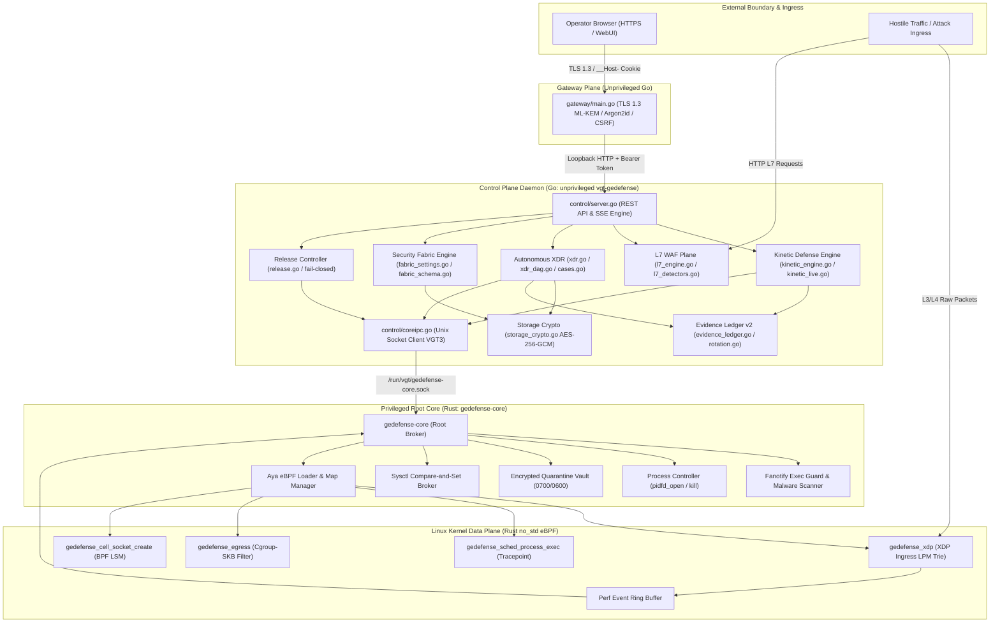
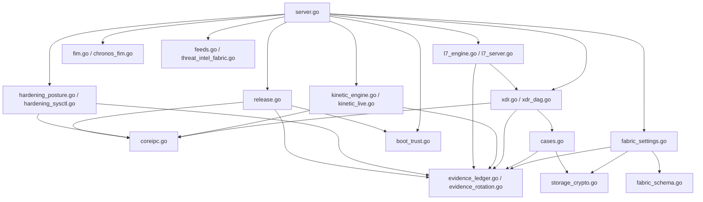
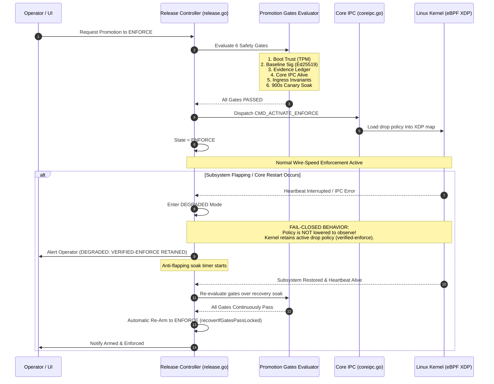

# Architecture Map: VGT GeDefense (4.2.5)

// STATUS: DIAMANT VGT SUPREME
// CLASSIFICATION: TECHNICAL ARCHITECTURE SPECIFICATION & DATA TREE
// SYSTEM: VISIONGAIATECHNOLOGY MASTER INTELLIGENCE SYSTEM
// TARGET RELEASE: V4.2.5 FAIL-CLOSED KINETIC REWORK & PERSISTENT SECURITY FABRIC

---

## Architecture Index

1. [Global Architecture Tree](#1-global-architecture-tree)
2. [File-to-Architecture Mapping](#2-file-to-architecture-mapping)
3. [Module Documentation](#3-module-documentation)
   - [3.1 Public Access Gateway (`gateway`)](#31-public-access-gateway-gateway)
   - [3.2 Web Command Center Dashboard (`control/web`)](#32-web-command-center-dashboard-controlweb)
   - [3.3 Control Plane Daemon & API Server (`control/server.go`, `main.go`)](#33-control-plane-daemon--api-server-controlservergo-maingo)
   - [3.4 Security Fabric Dynamic Settings Engine (`fabric_schema.go`, `fabric_settings.go`, `fabric_surface.go`)](#34-security-fabric-dynamic-settings-engine-fabric_schemago-fabric_settingsgo-fabric_surfacego)
   - [3.5 Cryptographic Storage & Envelope Security (`storage_crypto.go`)](#35-cryptographic-storage--envelope-security-storage_cryptogo)
   - [3.6 Cryptographic Evidence Ledger v2 & Auto-Rotation (`evidence_ledger.go`, `evidence_rotation.go`)](#36-cryptographic-evidence-ledger-v2--auto-rotation-evidence_ledgergo-evidence_rotationgo)
   - [3.7 Durable Security Transactions Engine (`transactions.go`)](#37-durable-security-transactions-engine-transactionsgo)
   - [3.8 Autonomous XDR & Correlation Engine (`xdr.go`, `xdr_dag.go`, `xdr_rules.go`, `xdr_baseline.go`)](#38-autonomous-xdr--correlation-engine-xdrgo-xdr_daggo-xdr_rulesgo-xdr_baselinego)
   - [3.9 Incident Ledger & Recovery Engine (`xdr_log.go`, `xdr_recovery.go`, `xdr_recovery_api.go`)](#39-incident-ledger--recovery-engine-xdr_loggo-xdr_recoverygo-xdr_recovery_apigo)
   - [3.10 Kinetic Defense Engine & Telemetry (`kinetic_engine.go`, `kinetic_live.go`, `kinetic_response.go`, `kinetic_runtime.go`)](#310-kinetic-defense-engine--telemetry-kinetic_enginego-kinetic_livego-kinetic_responsego-kinetic_runtimego)
   - [3.11 Embedded GeoIP & Geographic Origin Resolver (`geoip.go`, `geo_origin.go`)](#311-embedded-geoip--geographic-origin-resolver-geoipgo-geo_origingo)
   - [3.12 L7 Application Security Plane & Native WAF (`l7_engine.go`, `l7_edge.go`, `l7_server.go`, `l7_detectors.go`, `l7_decode.go`, `l7_normalize.go`, `l7_candidates.go`, `l7_tls.go`)](#312-l7-application-security-plane--native-waf-l7_enginego-l7_edgego-l7_servergo-l7_detectorsgo-l7_decodego-l7_normalizego-l7_candidatesgo-l7_tlsgo)
   - [3.13 L7 Web Server Discovery & Synthetic Self-Test Integration (`l7_integration.go`, `l7_selftest.go`, `l7_discovery_linux.go`)](#313-l7-web-server-discovery--synthetic-self-test-integration-l7_integrationgo-l7_selftestgo-l7_discovery_linuxgo)
   - [3.14 Threat Feeds & Staging Engine (`feeds.go`, `threat_intel_fabric.go`)](#314-threat-feeds--staging-engine-feedsgo-threat_intel_fabricgo)
   - [3.15 Protected Path Integrity & FIM Engine (`fim.go`, `integrity_watch_linux.go`, `chronos_fim.go`)](#315-protected-path-integrity--fim-engine-fimgo-integrity_watch_linuxgo-chronos_fimgo)
   - [3.16 Pacman MTREE Package Integrity Scanner (`package_integrity.go`, `package_integrity_linux.go`)](#316-pacman-mtree-package-integrity-scanner-package_integritygo-package_integrity_linuxgo)
   - [3.17 Measured Boot Trust & Platform Attestation (`boot_trust.go`)](#317-measured-boot-trust--platform-attestation-boot_trustgo)
   - [3.18 Host Hardening Posture & Sysctl Engine (`hardening_posture.go`, `hardening_sysctl.go`, `hardening_fabric.go`)](#318-host-hardening-posture--sysctl-engine-hardening_posturego-hardening_sysctlgo-hardening_fabricgo)
   - [3.19 Correlated Security Cases & Self-Repair Store (`cases.go`)](#319-correlated-security-cases--self-repair-store-casesgo)
   - [3.20 Encrypted File Quarantine Broker (`quarantine.go`)](#320-encrypted-file-quarantine-broker-quarantinego)
   - [3.21 Honeytoken Deception Fabric (`deception.go`)](#321-honeytoken-deception-fabric-deceptiongo)
   - [3.22 Styx Outbound Egress Enforcement (`styx_egress.go`)](#322-styx-outbound-egress-enforcement-styx_egressgo)
   - [3.23 Morpheus RASP (Runtime Application Self-Protection) (`morpheus_rasp.go`)](#323-morpheus-rasp-runtime-application-self-protection-morpheus_raspgo)
   - [3.24 Staged Release Controller & Fail-Closed Safety Gates (`release.go`, `release_manifest.go`)](#324-staged-release-controller--fail-closed-safety-gates-releasego-release_manifestgo)
   - [3.25 AstraeaOS Gaia Cells Isolation Fabric (`cells.go`, `cells_transaction.go`)](#325-astraeaos-gaia-cells-isolation-fabric-cellsgo-cells_transactiongo)
   - [3.26 Control-to-Core IPC Client (`coreipc.go`)](#326-control-to-core-ipc-client-coreipcgo)
   - [3.27 Path Containment Jail & Platform Capabilities (`path_jail_linux.go`, `platform_caps.go`)](#327-path-containment-jail--platform-capabilities-path_jail_linuxgo-platform_capsgo)
   - [3.28 System Diagnostics & Supervised Restart (`system_fabric.go`, `system_restart.go`, `sdnotify.go`)](#328-system-diagnostics--supervised-restart-system_fabricgo-system_restartgo-sdnotifygo)
   - [3.29 Privileged Root Response Core Daemon (`rust/gedefense-core`)](#329-privileged-root-response-core-daemon-rustgedefense-core)
   - [3.30 Kernel eBPF/XDP High-Performance Data Plane (`rust/gedefense-ebpf`)](#330-kernel-ebpfxdp-high-performance-data-plane-rustgedefense-ebpf)
   - [3.31 Shared Kernel/Userspace Protocol Library (`rust/gedefense-common`)](#331-shared-kerneluserspace-protocol-library-rustgedefense-common)
   - [3.32 OS Integration & Desktop Environments (`integration/`)](#332-os-integration--desktop-environments-integration)
   - [3.33 Packaging, Systemd Hierarchy & Release Engineering (`packaging/`, `scripts/`)](#333-packaging-systemd-hierarchy--release-engineering-packaging-scripts)
4. [Detailed Dashboard Views Documentation](#4-detailed-dashboard-views-documentation)
   - [4.1 Dashboard -> Overview (`overview`)](#41-dashboard---overview-overview)
   - [4.2 Dashboard -> Protection Center (`protection`)](#42-dashboard---protection-center-protection)
   - [4.3 Dashboard -> L7 Application Defense (`l7`)](#43-dashboard---l7-application-defense-l7)
   - [4.4 Dashboard -> Hardening Center (`hardening`)](#44-dashboard---hardening-center-hardening)
   - [4.5 Dashboard -> Integrity & Evidence (`integrity`)](#45-dashboard---integrity--evidence-integrity)
   - [4.6 Dashboard -> Hardware & Boot Trust (`boot`)](#46-dashboard---hardware--boot-trust-boot)
   - [4.7 Dashboard -> GeDefense XDR (`xdr`)](#47-dashboard---gedefense-xdr-xdr)
   - [4.8 Dashboard -> Kinetic Defense (`kinetic`)](#48-dashboard---kinetic-defense-kinetic)
   - [4.9 Dashboard -> Threat Intelligence (`threat-intel`)](#49-dashboard---threat-intelligence-threat-intel)
   - [4.10 Dashboard -> Network Policy (`network`)](#410-dashboard---network-policy-network)
   - [4.11 Dashboard -> Policy Trust (`policy`)](#411-dashboard---policy-trust-policy)
   - [4.12 Dashboard -> Forensics & Quarantine (`forensics`)](#412-dashboard---forensics--quarantine-forensics)
   - [4.13 Dashboard -> Production Beta Release Safety Gate (`release`)](#413-dashboard---production-beta-release-safety-gate-release)
   - [4.14 Dashboard -> Runtime & Fabric Settings (`settings`)](#414-dashboard---runtime--fabric-settings-settings)
   - [4.15 Dashboard -> Node Diagnostics & Gaia Cells (`system`)](#415-dashboard---node-diagnostics--gaia-cells-system)
   - [4.16 Dashboard Dialogs & Overlays (Auth, Emergency, Self-Test, Settings Preview)](#416-dashboard-dialogs--overlays-auth-emergency-self-test-settings-preview)
5. [CSS & UI Design System Architecture](#5-css--ui-design-system-architecture)
6. [API Architecture & Endpoint Directory](#6-api-architecture--endpoint-directory)
7. [System-Wide End-to-End Data Flows](#7-system-wide-end-to-end-data-flows)
8. [Shared & Core Dependencies](#8-shared--core-dependencies)
9. [Architectural Relation Diagrams (Mermaid)](#9-architectural-relation-diagrams-mermaid)
10. [Technical File & Symbol Cross-Reference](#10-technical-file--symbol-cross-reference)
11. [Architectural Anomalies & Audit Findings](#11-architectural-anomalies--audit-findings)

---
## 1. Global Architecture Tree

```text
VGT GeDefense System (v4.2.5 — Fail-Closed Kinetic Rework & Security Fabric)
│
├── 1. PUBLIC ACCESS GATEWAY (Go · Unprivileged Reverse Proxy · gateway/)
│   ├── TLS 1.3 Termination (Curve Preferences: X25519MLKEM768, X25519, P-256)
│   ├── Strict Host & Origin Validation (Rejects Direct IP Browsing & Host Spoofing)
│   ├── Authentication & Migration Engine (Argon2id Hash Verification & Automatic Upgrades)
│   ├── Stateless Cookie Session Broker (__Host-vgt_gedefense_session · SameSite=Strict · Secure)
│   ├── Synchronizer-Token CSRF Protection (__Host-vgt_csrf · Safe Login Form Isolation)
│   ├── Embedded SVG Asset Server (Native PNG/SVG Logo Delivery Without CSS Injection)
│   └── Reverse Proxy Trust-Boundary Scrubbing (Strips X-Forwarded-*, Client IP Verification)
│
├── 2. COMMAND CENTER DASHBOARD (ESNext / Native CSS / Zero-Dependency Canvas · control/web/)
│   ├── Application Shell & Sovereign Visual Hierarchy (app.css, v4.css)
│   ├── Reactive Multi-Domain Router (15 Dedicated Security Views)
│   │   ├── 1. Overview (System Posture, Live Waveform Telemetry, Real-time Status Grid)
│   │   ├── 2. Protection Center (Autonomous Control Plane, Emergency Stop, Fail-Safe Ladder)
│   │   ├── 3. L7 Application Defense (WAF Pipeline, Multi-Pass Decoders, Nginx Integration, Self-Test)
│   │   ├── 4. Hardening Center (CIS Benchmark Checks, Sysctl Compare-and-Set, Transaction History)
│   │   ├── 5. Integrity & Evidence (Streaming SHA-256 FIM, Pacman MTREE Verification, Chronos Scanner)
│   │   ├── 6. Hardware & Boot Trust (UEFI Secure Boot, Lockdown Mode, TPM 2.0 PCRs, Kernel Digest)
│   │   ├── 7. GeDefense XDR (Process Tree Sampling, Socket Correlation, DAG Stories, Incident Recovery)
│   │   ├── 8. Kinetic Defense (Real-time Volumetric Mitigation, Ingress Invariants, jsVectorMap GeoIP)
│   │   ├── 9. Threat Intelligence (FireHOL Level 1 Enforcement, Multi-Feed Sync, Airlock Staging)
│   │   ├── 10. Network Policy (LPM Trie Allowlist, Kernel Drop Rules, Connection Inspector)
│   │   ├── 11. Policy Trust (Cryptographically Signed Baseline, Kernel Policy Reconciliation)
│   │   ├── 12. Forensics & Quarantine (Ed25519 Export, Encrypted File Vault, Decoy Canary Tokens)
│   │   ├── 13. Release Safety Gate (Observe -> Canary [900s Soak] -> Enforce, Retained Enforcement)
│   │   ├── 14. Fabric Settings (Dynamic Schema-Driven Form Generation, Hot/Reload Classes, Drift, Import/Export)
│   │   └── 15. Node Diagnostics (AstraeaOS Gaia Cells, Kernel Caps, Supervised Daemon Restart)
│   ├── Real-time SSE Stream Consumer (/api/v1/stream with Adaptive Polling Fallback)
│   ├── jsVectorMap Embedded Geographic Visualizer (Local CSV Ingestion · Zero External Network Tiles)
│   ├── Zero-Dependency Canvas Telemetry Engine (Hardware-Accelerated Throughput Waveforms)
│   ├── Strict DOM Construction & XSS-Immune Render Pipeline (render.js · Trusted Types Safe)
│   └── Quad-Lingual Internationalization Engine (DE, EN, RU, ZH · Complete Technical Catalogs)
│
├── 3. CONTROL PLANE (Go · Unprivileged Daemon · control/)
│   ├── REST API & SSE Server (net/http ServeMux · Route Multiplexing & Request ID Guards)
│   ├── In-Memory Operational State Machine (Atomic Mutex Snapshots & Deterministic Cause Hygiene)
│   ├── Security Fabric Dynamic Settings Engine (Schema Registry, Type Validation, Apply Classes)
│   ├── Fabric Surface API (Global Search, Configuration Drift, Signed Bundles, Two-Stage Import)
│   ├── Storage Cryptography Engine (AES-256-GCM Envelope Encryption & Root Key Unlocking)
│   ├── Cryptographic Evidence Ledger v2 (Append-Only SHA-256 Chain · Ed25519 Signatures)
│   │   ├── Bounded Startup Verification (Authenticated Checkpoint + Tail Window)
│   │   ├── Background Incremental Verification (Authenticated Watermarks · 25,000 Records/Run)
│   │   └── Automatic Retention Rotation (90% Threshold Trigger · Atomic Marker & Swap · Mode 0700)
│   ├── Durable Security Transactions Engine (6-Phase Reversible Posture Pipeline with Rollback)
│   ├── Autonomous XDR Engine (Proc Sampling, Socket Matching, Attack DAG, Self-Artifact Filter)
│   ├── Incident Ledger & Recovery Subsystem (90% Retention Archiving & Damaged Tail Repair)
│   ├── Kinetic Defense Engine (Volumetric Bursts, Protocol Invariants, Dynamic CIDR Mitigation)
│   ├── Embedded GeoIP & Geographic Origin Resolver (Local CSV CIDR Range Lookup)
│   ├── L7 Application Security Plane & Native WAF (Decoders, Detectors, Inline Reverse Proxy)
│   ├── L7 Web Server Discovery & Synthetic Self-Test Integration (Nginx/Apache Template Generators)
│   ├── Threat Feeds Manager & Airlock Sandbox (FireHOL L1 Sync, Kernel Map Generation)
│   ├── File Integrity Monitor (Streaming SHA-256 Baseline Engine & Linux Inotify Watcher)
│   ├── Chronos Scheduled FIM Runner (Configurable Periodic Verification Loops)
│   ├── Pacman MTREE Package Integrity Scanner (Verification Against Arch Package Databases)
│   ├── Measured Boot Trust Collector (UEFI Secure Boot, Kernel Lockdown, TPM 2.0 PCR Probing)
│   ├── Host Hardening Posture Engine (22+ CIS Checks, Coverage Capping, Safe Sysctl Mutations)
│   ├── Correlated Security Case Engine (Fingerprint Deduplication & Self-Repairing Storage)
│   ├── Encrypted File Quarantine Broker (AES-256-GCM Storage Orchestration via Core IPC)
│   ├── Honeytoken Deception Fabric (HMAC Canary Tokens: SSH Keys, AWS Tokens, .env Decoys)
│   ├── Styx Outbound Egress Enforcement (Policy Parsing & Cgroup Network Filtering)
│   ├── Morpheus RASP (Process Injection, Ptrace Attach, and Memory Tampering Detection)
│   ├── Staged Release Controller (Fail-Closed Retention, Anti-Flapping Soak, Automatic Re-Arm)
│   ├── AstraeaOS Gaia Cells Adapter (VGTGC1 Protocol, Cgroup v2 Isolation, Socket LSM)
│   ├── Core IPC Client (Capability-Bounded Unix Socket Client · VGT3 Protocol · HMAC Auth)
│   ├── Path Containment Jail (Symlink-Safe Jails Preventing Path Traversal)
│   ├── Platform Capabilities Discovery (Kernel Version, eBPF, XDP, LSM, TPM Feature Matrix)
│   └── System Supervised Restart Controller (Clean IPC Drain & Supervisor Hand-off)
│
├── 4. PRIVILEGED RESPONSE CORE (Rust · Privileged Root Daemon · rust/gedefense-core/)
│   ├── Capability-Bounded IPC Broker (/run/vgt/gedefense-core.sock · Mode 0660 · Root:vgt-gedefense)
│   ├── Fanotify Executable Permission Guard (FAN_OPEN_EXEC_PERM on /home & Binary Paths)
│   ├── Streaming Malware Scanner Engine (SHA-256 Reputation, EICAR, Polyglot, Zip Bomb Guard)
│   ├── Peer-Bound User Scan Socket (/run/vgt/scan.sock · Mode 0666 · SO_PEERCRED Verification)
│   ├── Race-Free Process Control (Linux pidfd_open + Proc Start Time Tick Verification + Signals)
│   ├── Chunked Encrypted Quarantine Vault (AES-256-GCM · openat2 O_NOFOLLOW · DAC Mode 0700/0600)
│   ├── Allowlisted Sysctl Compare-and-Set Broker with Mandatory Kernel Readback
│   └── eBPF Program Loader & Kernel Map Manager (Aya Pure-Rust eBPF Framework)
│
├── 5. KERNEL DATA PLANE (Rust no_std eBPF / XDP + Cgroup-SKB + LSM · rust/gedefense-ebpf/)
│   ├── XDP Ingress Filter (gedefense_xdp · Invariant-Tolerant Parsing & LPM Trie Matching)
│   │   ├── Management Allowlist Trie (ALLOWLIST_V4 / ALLOWLIST_V6) -> XDP_PASS
│   │   └── Kinetic Blocklist Trie (BLOCKLIST_V4 / BLOCKLIST_V6) -> XDP_DROP
│   ├── Ingress Event Ring Buffer (Perf Event Drain · Non-Hostile Aggregate Normalization)
│   ├── Process Execution Tracepoint (gedefense_sched_process_exec -> RingBuf Telemetry)
│   ├── Cgroup Outbound Egress Filter (gedefense_egress -> Styx Port/Protocol Enforcement)
│   └── Gaia Cells Socket Create LSM Hook (gedefense_cell_socket_create -> AF_UNIX Only Isolation)
│
├── 6. INTEGRATION & PLATFORM FABRIC (integration/)
│   ├── AstraeaOS Integration (SDDM Security Login Gate, Boot Failure Attestation, Desktop Wrapper)
│   ├── Universal Linux Integration (Polkit Action Policies, PAM Configuration, Freedesktop Entry)
│   ├── Web Server Integration (Nginx L7 Configuration Snippets & Verification Harness)
│   └── Systemd Unit Hierarchy (gedefense-core, gedefense-control, gedefense-access, gedefense-bpffs)
│
└── 7. PACKAGING & RELEASE ENGINEERING (packaging/, scripts/)
    ├── Arch Linux PKGBUILD Packaging (Zero External Network Dependencies During Build)
    ├── Self-Contained One-Click Shell Installer (Embedded Tarballs & Pre-Flight Attestation)
    ├── Offline Vendored Rust Toolchain (Aya eBPF Framework, Rust Standard Crates)
    ├── Cryptographic Release Signing & Hash Verification Suites
    └── Comprehensive Distro Integration & Security Acceptance Test Suites
```

---

## 2. File-to-Architecture Mapping

The following table provides the exhaustive file-to-architecture mapping across all subsystems in the repository root:

```text
========================================================================================================================
PATH RELATIVE TO ROOT                          SUBSYSTEM                      ARCHITECTURAL RESPONSIBILITY
========================================================================================================================
gateway/
  argon2_linux.go                              Gateway Authentication         Argon2id password hashing, parameter verification, and timing attack resistance
  crypto_helpers.go                            Gateway Cryptography           Cryptographic random byte generator and constant-time token comparison
  gedefense-access                             Gateway Binary                 Pre-compiled ELF executable for the unprivileged public access gateway
  gedefense-logo.png                           Gateway Assets                 Canonical VisionGaiaTechnology product logo delivered on authentication boundary
  go.mod                                       Gateway Build                  Go module definition for the standalone gateway service (zero external dependencies)
  integration_test.go                          Gateway Testing                End-to-end integration tests for reverse proxying, TLS handshake, and cookie routing
  login_page_test.go                           Gateway Testing                Unit tests for login page rendering, CSS isolation, and CSRF token binding
  logo.go                                      Gateway Assets                 Embedded asset handler for delivering the binary logo without disk I/O
  logo_test.go                                 Gateway Testing                Unit tests for logo mime type validation, caching headers, and hash consistency
  main.go                                      Gateway Core                   Public gateway daemon entry point, TLS 1.3 server, session store, reverse proxy
  main_test.go                                 Gateway Testing                Unit tests for gateway CLI flag parsing and default configuration resolution
  security_beta5_test.go                       Gateway Testing                Security audit acceptance tests for header scrubbing, CSRF defense, and path traversal
  tls_files.go                                 Gateway TLS                    Secure loader and validator for TLS certificates and private keys (permission checks)
  tls_files_test.go                            Gateway Testing                Unit tests for certificate parsing, permission enforcement, and key-cert matching

control/
  boot_trust.go                                Hardware & Boot Trust          Probes UEFI Secure Boot, Kernel Lockdown, TPM 2.0 PCRs, and kernel image digests
  boot_trust_test.go                           Testing                        Unit tests for boot trust report generation and probe parsing
  cases.go                                     Incident Management            Correlated security cases, deduplication, lifecycle transitions, and self-repair
  cases_repair_test.go                         Testing                        Mutation and unit tests for duplicate fingerprint case store self-repair
  cases_test.go                                Testing                        Unit tests for case store transitions and encrypted state persistence
  cells.go                                     AstraeaOS Gaia Cells           Adapter for AstraeaOS Gaia Cells IPC (VGTGC1 protocol) and cgroup status
  cells_test.go                                Testing                        Unit tests for Gaia Cells IPC encoding and parsing
  cells_transaction.go                         Durable Transactions           GaiaCellApplier implementation for cell network isolation and rollback
  chronos_fim.go                               Integrity / FIM                Periodic scheduled FIM scanner wrapper, timer orchestration, and delta reporting
  chronos_fim_test.go                          Testing                        Unit tests for Chronos FIM scheduling and delta calculation
  config.go                                    Configuration                  Strict TOML subset parser for gedefense.toml daemon configuration
  config_test.go                               Testing                        Unit tests for configuration validation, bounds checking, and defaults
  coreipc.go                                   Control / Core IPC             HMAC-authenticated VGT3 IPC client communicating with gedefense-core.sock
  coreipc_cell_lsm_test.go                     Testing                        Integration tests for Core IPC cell LSM command serialization
  coreipc_egress_test.go                       Testing                        Integration tests for Core IPC egress events and rule enforcement
  coreipc_exec_test.go                         Testing                        Integration tests for Core IPC process execution events
  coreipc_ingress_test.go                      Testing                        Integration tests for Core IPC ingress packet drops and allowlist trie updates
  coreipc_test.go                              Testing                        Unit tests for Core IPC framing, replay defense, and authentication
  deception.go                                 Deception & Honeypots          Decoy canary tokens (SSH keys, AWS tokens, shadow backups, .env) and access alarms
  deception_test.go                            Testing                        Unit tests for honeytoken generation, hashing, and tripwire alarms
  evidence_budget_test.go                      Testing                        Unit tests verifying evidence ledger capacity bounds and runtime behavior
  evidence_gate_test.go                        Testing                        Unit tests for evidence verification gates under varied operational states
  evidence_ledger.go                           Audit & Evidence               Cryptographically chained append-only ledger (Ed25519 signatures + SHA-256 chain)
  evidence_ledger_test.go                      Testing                        Unit tests for ledger append, checkpoint verification, and tampering detection
  evidence_rotation.go                         Audit & Evidence               Crash-safe automatic evidence ledger rotation at 90% budget threshold
  evidence_rotation_test.go                    Testing                        Unit tests for atomic ledger rotation, manifest creation, and permission gates
  evidence_verification_test.go                Testing                        Unit tests for bounded startup verification and incremental background checks
  fabric_schema.go                             Security Fabric                Authoritative schema registry describing all administrable setting keys and metadata
  fabric_settings.go                           Security Fabric                Dynamic setting store, validation engine, mutation applier, and history diffs
  fabric_settings_test.go                      Testing                        Unit tests for setting validation, apply classes, and rollback tracking
  fabric_settings_ui_test.go                   Testing                        UI contract tests ensuring 100% schema alignment with web dashboard elements
  fabric_surface.go                            Security Fabric                Search engine across settings, configuration drift detection, and export bundles
  fabric_surface_api.go                        Security Fabric                HTTP API handlers for settings search, drift, export, and two-stage import
  fabric_surface_test.go                       Testing                        Unit tests for settings search queries, drift diffing, and bundle imports
  failclosed_contract_test.go                  Testing                        Mutation contract tests verifying fail-closed retention across degradation paths
  feeds.go                                     Threat Feeds                   Threat intelligence feed fetcher, parser, validation, and staging engine
  feeds_json_test.go                           Testing                        Unit tests for JSON-formatted threat intelligence feed parsing
  feeds_test.go                                Testing                        Unit tests for feed downloading, rate limiting, and CIDR extraction
  fim.go                                       Integrity / FIM                File Integrity Monitor engine (streaming SHA-256, symlink jail protection)
  fim_test.go                                  Testing                        Unit tests for FIM baseline initialization and drift detection
  findings_regression_test.go                  Testing                        Regression tests verifying findings reporting across XDR and L7 engines
  firehol_migration_test.go                    Testing                        Unit tests verifying schema migration from legacy FireHOL correlation to enforcement
  forensics.go                                 Forensics & Export             Ed25519-signed forensic bundle exporter and verification engine
  forensics_fabric.go                          Security Fabric                Security Fabric integration handlers for forensics configuration
  forensics_fabric_test.go                     Testing                        Unit tests for forensic fabric configuration options
  forensics_test.go                            Testing                        Unit tests for forensic export packaging, hashing, and signatures
  geo_origin.go                                Threat Telemetry               Geographic origin resolution mapping client IPs to ISO country codes and names
  geoip.go                                     Threat Telemetry               Embedded CSV GeoIP/ASN parser and fast in-memory prefix trie resolver
  geoip_test.go                                Testing                        Unit tests for GeoIP CSV parsing, network lookup, and boundary handling
  hardening_coverage_test.go                   Testing                        Unit tests ensuring posture score is strictly capped when checks are unreadable
  hardening_fabric.go                          Security Fabric                Security Fabric integration handlers for hardening configuration
  hardening_fabric_test.go                     Testing                        Unit tests for hardening fabric configuration settings
  hardening_posture.go                         System Hardening               Local security posture evaluator (22+ CIS/VGT checks, sysctl, AppArmor, LUKS)
  hardening_posture_test.go                    Testing                        Unit tests for posture scoring logic and evidence verification
  hardening_sysctl.go                          Durable Transactions           SysctlTransactionApplier (compare-and-set sysctl mutations via Core IPC)
  integrity_fabric.go                          Security Fabric                Security Fabric integration handlers for integrity configuration
  integrity_fabric_test.go                     Testing                        Unit tests for integrity fabric configuration settings
  integrity_watch_linux.go                     Integrity / Watcher            Linux inotify watcher for real-time protected path modification events
  integrity_watch_other.go                     Integrity / Watcher            Fallback stub for file watching on non-Linux operating systems
  integrity_watch_test.go                      Testing                        Unit tests for file watching and event debounce logic
  kinetic_attack_matrix_test.go                Testing                        Unit tests for volumetric attack classification across SYN, UDP, and ICMP floods
  kinetic_core_health_test.go                  Testing                        Unit tests for core ingress health reporting and sensor degradation separation
  kinetic_engine.go                            Kinetic Defense                Core Kinetic Defense mitigation engine, packet evaluation, burst detection
  kinetic_engine_test.go                       Testing                        Unit tests for kinetic burst detection, auto-mitigation, and soak timers
  kinetic_layout_test.go                       Testing                        Unit tests verifying kinetic telemetry data layouts and JSON serialization
  kinetic_live.go                              Kinetic Defense                Real-time sliding window aggregator (live, 1m, 5m, 15m) and top source tracker
  kinetic_live_test.go                         Testing                        Unit tests for live kinetic window rolling and top attack source ranking
  kinetic_origin_test.go                       Testing                        Unit tests for kinetic IP geographic origin classification
  kinetic_response.go                          Kinetic Defense                Automated and operator-driven kinetic response execution (temporary drops)
  kinetic_response_test.go                     Testing                        Unit tests for kinetic rule generation, expiration, and reconciliation
  kinetic_rules.go                             Kinetic Defense                Threshold definitions, packet rate limits, and burst scoring rules
  kinetic_rules_test.go                        Testing                        Unit tests for kinetic rule evaluation and threshold parsing
  kinetic_runtime.go                           Kinetic Defense                Background polling orchestrator consuming eBPF map counters and stats
  kinetic_soak_test.go                         Testing                        Unit tests for anti-flapping soak timers during re-arming transitions
  kinetic_suite_test.go                        Testing                        Comprehensive integration test suite for the Kinetic Defense subsystem
  kinetic_types.go                             Kinetic Defense                Data structures and JSON models for kinetic events, sources, and metrics
  kinetic_types_test.go                        Testing                        Unit tests for kinetic data structure serialization and validation
  kinetic_ui_contract_test.go                  Testing                        Contract tests verifying Kinetic Defense dashboard telemetry payloads
  l7_candidates.go                             L7 Application Security        Inspection candidate extractor parsing query strings, headers, forms, cookies
  l7_coverage_derivation_test.go               Testing                        Unit tests verifying deterministic sensor coverage status derivation
  l7_coverage_test.go                          Testing                        Unit tests for L7 inspection coverage and active listener checks
  l7_decode.go                                 L7 Application Security        Multi-pass decoding engine (URL, HTML entity, Base64, Hex, Unicode escaping)
  l7_detectors.go                              L7 Application Security        Signature detectors for SQLi, XSS, Command Injection, Path Traversal, XXE
  l7_discovery_linux.go                        L7 Web Discovery               Discovers running web servers (Nginx, Apache, Caddy) and listening ports
  l7_discovery_other.go                        L7 Web Discovery               Fallback discovery stub for non-Linux platforms
  l7_discovery_test.go                         Testing                        Unit tests for web server process inspection and port binding discovery
  l7_edge.go                                   L7 Application Security        Native inline reverse-proxy server over Unix domain socket with upstream forwarding
  l7_edge_test.go                              Testing                        Unit tests for inline L7 reverse proxying and response filtering
  l7_engine.go                                 L7 Application Security        Core L7 inspection pipeline orchestrator and threat scoring evaluator
  l7_fabric_settings.go                        Security Fabric                Security Fabric integration handlers for L7 configuration
  l7_fabric_settings_test.go                   Testing                        Unit tests for L7 fabric configuration parameters
  l7_fuzz_test.go                              Testing                        Fuzz tests for L7 decoders, candidate tokenizers, and normalizers
  l7_integration.go                            L7 Web Integration             Web server configuration text generator (Nginx and Apache snippets)
  l7_integration_api.go                        L7 Web Integration             HTTP API handlers for web server discovery and configuration generation
  l7_integration_real_test.go                  Testing                        Integration tests validating generated Nginx configuration against real Nginx parser
  l7_integration_test.go                       Testing                        Unit tests for web server template generation and grammar validation
  l7_normalize.go                              L7 Application Security        HTTP request normalization (path clean, header folding, case folding)
  l7_peer_linux.go                             L7 Application Security        Extracts SO_PEERCRED socket caller credentials (UID, GID, PID) on Linux
  l7_peer_other.go                             L7 Application Security        Fallback peer credential stub for non-Linux platforms
  l7_rate_limit.go                             L7 Application Security        Token-bucket client rate limiters and global sensitive path limiter
  l7_response.go                               L7 Application Security        Response inspection detectors (SQL error leaks, stack traces, private keys)
  l7_selftest.go                               L7 Web Integration             Synthetic self-test runner sending test requests through configured L7 path
  l7_selftest_evidence_test.go                 Testing                        Unit tests verifying self-test execution creates signed evidence records
  l7_selftest_upstream_test.go                 Testing                        Unit tests for self-test upstream reachability and response verification
  l7_server.go                                 L7 Application Security        Bounded standalone L7 inspection HTTP server (/v1/inspect, /v1/tls/clienthello)
  l7_server_test.go                            Testing                        Unit tests for standalone L7 inspection server endpoints
  l7_test.go                                   Testing                        End-to-end test suite for L7 WAF detection, scoring, and normalization
  l7_tls.go                                    L7 Application Security        TLS ClientHello parser, JA3/JA4 fingerprinting, and cipher suite evaluation
  l7_tls_test.go                               Testing                        Unit tests for TLS ClientHello parsing and JA3/JA4 fingerprint calculation
  l7_types.go                                  L7 Application Security        Data structures and JSON models for L7 inspection requests and decisions
  l7_validate.go                               L7 Application Security        Boundary validator enforcing maximum body size, header count, and token limits
  main.go                                      Daemon Lifecycle               Control plane daemon entry point, CLI flags, subsystem initialization, sd_notify
  malware_xdr_test.go                          Testing                        Integration tests linking privileged core malware detections to XDR incidents
  morpheus_rasp.go                             RASP Protection                Process tampering, memory injection (/proc/<pid>/mem), and ptrace attach detector
  morpheus_rasp_test.go                        Testing                        Unit tests for RASP ptrace boundary and attack story synthesis
  package_integrity.go                         Package Integrity              Package manager integrity abstraction interface
  package_integrity_linux.go                   Package Integrity              Pacman MTREE verification scanner comparing installed binaries against package digests
  package_integrity_linux_test.go              Testing                        Unit tests for pacman MTREE parsing and drift detection
  package_integrity_other.go                   Package Integrity              Fallback package integrity stub for non-Linux operating systems
  panel_agreement_test.go                      Testing                        UI contract tests ensuring dashboard badges and sentences agree with backend status
  panel_status_test.go                         Testing                        Unit tests for the /panelz diagnostic status endpoint
  path_jail_linux.go                           Path Containment               Symlink-safe path containment jail preventing directory traversal attacks
  path_jail_other.go                           Path Containment               Fallback path containment stub for non-Linux operating systems
  path_jail_test.go                            Testing                        Unit tests for path containment jail resolution and symlink escape attempts
  platform_caps.go                             Platform Capabilities          Probes Linux kernel capabilities (eBPF, XDP, LSM, TPM, Cgroup v2)
  platform_caps_test.go                        Testing                        Unit tests for platform capability probing and JSON serialization
  policy.go                                    Policy Trust                   Signed kernel security policy parser, validator, and reconciler
  preflight.go                                 Release Safety                 Preflight promotion checker evaluating release gates across subsystems
  quarantine.go                                Quarantine Management         Encrypted file quarantine manager interface communicating with Core IPC
  quarantine_test.go                           Testing                        Unit tests for quarantine metadata parsing and preview creation
  rate_limit.go                                API Rate Limiting              Token bucket rate limiter protecting unprivileged control plane API endpoints
  recovery_stream_test.go                      Testing                        Unit tests verifying incident recovery events stream to connected SSE clients
  release.go                                   Release Controller             Production release phase state machine (Observe, Canary, Enforce, Degraded)
  release_api_test.go                          Testing                        Unit tests for release transition, emergency stop, and status endpoints
  release_failsafe_test.go                     Testing                        Unit tests verifying fail-safe retention reasons and forensic incident creation
  release_manifest.go                          Release Controller             Cryptographic manifest validator for staged software release bundles
  release_manifest_test.go                     Testing                        Unit tests for release bundle manifest verification and signature checks
  release_readiness_test.go                    Testing                        Unit tests for phase readiness calculations and blocker enumeration
  release_test.go                              Testing                        Comprehensive unit tests for the release state machine and soak timers
  response_engine.go                           Automated Response             Orchestrator executing automated mitigation responses upon high-confidence XDR rules
  response_engine_test.go                      Testing                        Unit tests for automated response dispatching and containment execution
  runtime_settings.go                          Configuration                  Runtime setting persistence and dynamic reload controller
  runtime_settings_test.go                     Testing                        Unit tests for runtime setting validation and persistence
  sdnotify.go                                  Service Integration            Systemd daemon notification client sending READY=1, RELOADING=1, WATCHDOG=1
  security.go                                  Core Security                  Cryptographic helper utilities (constant-time token comparison, secure hashing)
  security_fuzz_test.go                        Testing                        Fuzz tests for core security input decoders and token verifiers
  security_hardening_test.go                   Testing                        Security regression tests validating sysctl hardening appliers
  security_test.go                             Testing                        Unit tests for security helper functions
  security_v5_test.go                          Testing                        Security acceptance tests for VGT Security Standard Diamond compliance
  server.go                                    API & Web Server               Central HTTP REST API server, ServeMux routing, SSE streaming, middleware
  server_security_test.go                      Testing                        Security tests for HTTP headers, CORS, CSRF, and Bearer token enforcement
  server_settings.go                           API Handlers                   HTTP API handlers for runtime and fabric settings endpoints
  server_settings_test.go                      Testing                        Unit tests for settings HTTP handlers and error responses
  state.go                                     State Machine                  Central in-memory operational state container with fine-grained mutexes
  state_test.go                                Testing                        Unit tests for state snapshot creation and mutation safety
  state_xdr_causes_test.go                     Testing                        Unit tests for multi-writer XDR cause isolation and clearance hygiene
  storage_crypto.go                            Cryptographic Storage          AES-256-GCM envelope encryption engine for on-disk security databases
  storage_crypto_test.go                       Testing                        Unit tests for storage encryption, key derivation, and nonce uniqueness
  styx_egress.go                               Egress Enforcement             Styx outbound egress policy manager enforcing port and protocol whitelists
  styx_egress_test.go                          Testing                        Unit tests for Styx egress rule parsing and cgroup filter configuration
  system_fabric.go                             Security Fabric                Security Fabric integration handlers for system diagnostics and cells
  system_fabric_test.go                        Testing                        Unit tests for system fabric configuration options
  system_restart.go                            System Management              Supervised daemon restart coordinator verifying supervisor availability
  system_restart_test.go                       Testing                        Unit tests for supervised restart execution and safety preconditions
  telemetry_linux.go                           System Telemetry               Linux system metric collector (CPU, memory, load, uptime, network interfaces)
  telemetry_other.go                           System Telemetry               Fallback system metric collector stub for non-Linux operating systems
  threat_intel_contract_test.go                Testing                        Contract tests verifying threat intelligence API responses and status models
  threat_intel_fabric.go                       Security Fabric                Security Fabric integration handlers for threat intelligence settings
  threat_intel_fabric_test.go                  Testing                        Unit tests for threat intelligence fabric settings
  threat_intel_ui_contract_test.go             Testing                        UI contract tests ensuring threat intel dashboard matches backend state
  toolchain_security_test.go                   Testing                        Security verification tests ensuring toolchain binaries are pinned and safe
  transactions.go                              Durable Transactions           Durable 6-phase security transactions engine with automatic rollback
  transactions_test.go                         Testing                        Unit tests for transaction lifecycle, preview generation, and error reversal
  trust_fabric.go                              Security Fabric                Security Fabric integration handlers for policy and boot trust configuration
  trust_fabric_test.go                         Testing                        Unit tests for trust fabric configuration settings
  web_assets_contract_test.go                  Testing                        Contract tests verifying embedded web assets are present, valid, and secure
  web_i18n_contract_test.go                    Testing                        Contract tests verifying internationalization key coverage across DE, EN, RU, ZH
  xdr.go                                       Autonomous XDR                 Autonomous XDR engine, process sampling, socket mapping, self-artifact filter
  xdr_baseline.go                              Autonomous XDR                 Process baseline modeling, anomaly scoring, and approved executable sets
  xdr_cause_hygiene_test.go                    Testing                        Unit tests verifying XDR degradation causes clear deterministically upon recovery
  xdr_cell_lsm_test.go                         Testing                        Integration tests connecting Gaia Cell LSM violations to XDR incidents
  xdr_dag.go                                   Autonomous XDR                 Directed Acyclic Graph (DAG) model synthesizing attack stories from incidents
  xdr_dag_test.go                              Testing                        Unit tests for DAG attack story generation, parent-child linking, and severity
  xdr_deploy_not_tamper_test.go                Testing                        Unit tests verifying product component updates are recognized as self-artifacts
  xdr_history_test.go                          Testing                        Unit tests for historical XDR incident querying and pagination
  xdr_l7.go                                    Autonomous XDR                 Bridge transforming L7 WAF high-confidence detections into XDR incident events
  xdr_linux.go                                 Autonomous XDR                 Linux /proc inspection, socket table traversal, and executable path resolution
  xdr_linux_fuzz_test.go                       Testing                        Fuzz tests for Linux /proc status and cmdline parsers
  xdr_log.go                                   Audit & Evidence               Incident ledger implementation recording tamper-evident chained security events
  xdr_other.go                                 Autonomous XDR                 Fallback process inspection stub for non-Linux operating systems
  xdr_recovery.go                              Audit & Evidence               Incident ledger retention rotation (at 90% budget) and disaster recovery
  xdr_recovery_api.go                          Audit & Evidence               HTTP API handler for operator-triggered incident ledger recovery
  xdr_recovery_test.go                         Testing                        Unit tests for incident ledger recovery, retention rotation, and repair
  xdr_rules.go                                 Autonomous XDR                 Heuristic anomaly detection rules (reverse shell, mem injection, ptrace, suid)
  xdr_runtime_settings_test.go                 Testing                        Unit tests verifying dynamic settings changes propagate to the active XDR engine
  xdr_self_artifact_test.go                    Testing                        Unit tests for self-artifact verification against signed product release roots
  xdr_self_tamper_test.go                      Testing                        Unit tests verifying external binary modification triggers immediate containment
  xdr_test.go                                  Testing                        Comprehensive unit tests for the Autonomous XDR correlation pipeline
  xdr_types.go                                 Autonomous XDR                 Data structures and JSON models for XDR incidents, profiles, rules, and stories

control/web/
  api.js                                       Dashboard Client               REST API client, fetch wrapper, CSRF/Bearer token headers, and error models
  app.css                                      Dashboard Styles               Core CSS stylesheet defining custom design tokens, dark glass, and layouts
  app.js                                       Dashboard Controller           Main dashboard application controller, router, view activator, SSE consumer
  charts.js                                    Dashboard Telemetry            Zero-dependency HTML5 Canvas telemetry engine rendering RX/TX waveform charts
  fabric-settings.js                           Dashboard Settings             Schema-driven settings workbench, field generator, history diffs, rollback UI
  fabric-surface.js                            Dashboard Settings             Global search interface across settings, drift visualizer, import/export UI
  gedefense-logo.png                           Dashboard Assets               Canonical VisionGaiaTechnology product logo delivered in dashboard header
  geo-map.js                                   Dashboard Telemetry            jsVectorMap integration rendering local SVG world map with attack origins
  i18n.js                                      Dashboard Localization         Quad-lingual internationalization catalog (DE, EN, RU, ZH) and translator
  index.html                                   Dashboard Structure            Semantic HTML5 application shell containing all 15 security views and dialogs
  kinetic.js                                   Dashboard Views                Kinetic Defense live view controller, volumetric telemetry tables, burst matrix
  l7-integration.js                            Dashboard Views                L7 web server discovery panel, Nginx/Apache configuration generator, self-test
  l7.js                                        Dashboard Views                L7 Application Defense view controller, inspection metrics, findings table
  operations.js                                Dashboard UI                   Global modal operation overlay tracking asynchronous backend transactions
  protection.js                                Dashboard Views                Protection Center view controller, release phase ladders, emergency stop UI
  render.js                                    Dashboard Render Engine        Safe DOM rendering pipeline, Trusted-Types-safe formatters, toast notifications
  threat-intel.js                              Dashboard Views                Threat Intelligence view controller, feed synchronization, kernel apply UI
  v4.css                                       Dashboard Styles               V4 Unified Command Center stylesheet defining refined surfaces and typography
  xdr.js                                       Dashboard Views                Autonomous XDR view controller, incident investigation, ledger recovery UI
  vendor/jsvectormap/                          Vendor Assets                  Vendored offline SVG world map library and Mercator map projection assets

rust/gedefense-core/
  Cargo.toml                                   Core Build                     Rust crate manifest for privileged root response core daemon
  src/main.rs                                  Core Daemon                    Root daemon entry point, IPC socket listener, fanotify guard, eBPF loader
  src/malware.rs                               Core Security                  Streaming SHA-256 malware scanner, EICAR detector, zip-bomb expansion guard
  src/process_control.rs                       Core Security                  Race-free process control using Linux pidfd_open and start tick verification
  src/quarantine.rs                            Core Security                  Encrypted quarantine vault using AES-256-GCM, openat2 O_NOFOLLOW, DAC 0700/0600

rust/gedefense-ebpf/
  Cargo.toml                                   eBPF Build                     Rust crate manifest for kernel eBPF / XDP data plane (no_std)
  src/main.rs                                  Kernel Programs                XDP ingress filter, LPM trie matchers, sched_process_exec tracepoint, LSM hooks

rust/gedefense-common/
  Cargo.toml                                   Common Build                   Rust crate manifest for shared kernel-userspace protocol definitions
  src/lib.rs                                   Common Types                   Wire format definitions, IPC messages, event headers, protocol invariants
  src/bin/xdp_packet_fuzz.rs                   Common Testing                 Fuzzing utility validating packet decoder robustness against malformed headers

integration/
  astraeaos/50-astraeaos-gedefense.rules       AstraeaOS Integration          Polkit privilege rules allowing operator authorization for GeDefense actions
  astraeaos/astraeaos-boot-attestation         AstraeaOS Integration          Shell script verifying boot trust attestation during AstraeaOS startup
  astraeaos/astraeaos-boot-attestation.service AstraeaOS Integration          Systemd service executing early boot attestation before desktop session starts
  astraeaos/astraeaos-profile.toml             AstraeaOS Integration          System hardening profile tuning kernel parameters for AstraeaOS nodes
  astraeaos/astraeaos-runtime.conf             AstraeaOS Integration          Runtime environment variables and service flags for AstraeaOS integration
  astraeaos/astraeaos-security-boot-failure    AstraeaOS Integration          Emergency failure handler executed if hardware boot trust attestation fails
  astraeaos/astraeaos-security-boot-failure.service AstraeaOS Integration     Systemd unit managing boot failure lockdown screen and diagnostics
  astraeaos/astraeaos-security-login-gate      AstraeaOS Integration          SDDM login gate script verifying GeDefense control plane readiness
  astraeaos/astraeaos-security-login-gate.service AstraeaOS Integration      Systemd service binding login gate to display-manager.service
  astraeaos/build-local-packages.sh            AstraeaOS Packaging            Local package build script producing AstraeaOS-compatible pacman bundles
  astraeaos/contract.json                      AstraeaOS Integration          JSON contract defining interface requirements between AstraeaOS and GeDefense
  astraeaos/firefox-policies.json              AstraeaOS Integration          Hardened enterprise browser policies deployed to user sessions
  astraeaos/gedefense-access-astraeaos.conf    AstraeaOS Integration          Drop-in systemd configuration tuning gedefense-access for AstraeaOS
  astraeaos/gedefense-access-ready             AstraeaOS Integration          Readiness probe script polling gateway TLS port before launching browser
  astraeaos/gedefense-app                      AstraeaOS Integration          Desktop launcher wrapper initializing secure environment and starting browser
  astraeaos/gedefense-astraeaos-provision      AstraeaOS Integration          System provisioning script configuring groups, permissions, and tokens
  astraeaos/gedefense-astraeaos-provision.service AstraeaOS Integration      Systemd unit executing initial system provisioning during first boot
  astraeaos/gedefense-control-astraeaos.conf   AstraeaOS Integration          Drop-in systemd configuration tuning gedefense-control for AstraeaOS
  astraeaos/gedefense-core-astraeaos.conf      AstraeaOS Integration          Drop-in systemd configuration tuning gedefense-core for AstraeaOS
  astraeaos/gedefense-core-launch              AstraeaOS Integration          Privileged launcher script configuring eBPF filesystem mounts
  astraeaos/gedefense-ensure-ready             AstraeaOS Integration          Helper script ensuring all four daemons are active and responding
  astraeaos/gedefense-set-password             AstraeaOS Integration          CLI utility setting or rotating the operator password in the gateway database
  astraeaos/gedefense-shell.cpp                AstraeaOS Integration          Native C++ shell wrapper providing locked kiosk execution for GeDefense
  astraeaos/gedefense.desktop                  AstraeaOS Integration          Freedesktop XDG application shortcut placed in AstraeaOS system menu
  astraeaos/org.astraeaos.gedefense.policy     AstraeaOS Integration          Polkit XML policy defining granular permissions for AstraeaOS operators
  astraeaos/PKGBUILD                           AstraeaOS Packaging            Arch Linux PKGBUILD packaging the AstraeaOS integration layer
  astraeaos/README.md                          AstraeaOS Documentation        Technical documentation detailing the AstraeaOS security architecture
  astraeaos/sddm-gedefense-login-gate.conf     AstraeaOS Integration          SDDM display manager configuration linking the GeDefense login gate
  astraeaos/verify_sync.py                     AstraeaOS Verification         Python script verifying version and hash synchronization with AstraeaOS
  linux/gedefense-app                          Linux Integration              Universal Linux desktop application launcher wrapper
  linux/gedefense-ensure-ready                 Linux Integration              Universal Linux readiness check polling control plane health endpoints
  linux/gedefense.desktop                      Linux Integration              Standard Freedesktop XDG desktop entry for universal Linux distributions
  linux/org.vgt.gedefense.policy               Linux Integration              Universal Linux Polkit policy file defining operator elevation rules
  linux/README.md                              Linux Documentation            Documentation explaining deployment on standard systemd-based Linux distros
  nginx/gedefense-l7.conf.example              Nginx Integration              Production-ready Nginx reverse proxy configuration snippet for L7 WAF
  nginx/README.md                              Nginx Documentation            Step-by-step guide for deploying GeDefense L7 WAF in front of web servers

packaging/
  arch/PKGBUILD                                Packaging                      Arch Linux PKGBUILD packaging the entire GeDefense multi-daemon stack
  systemd/gedefense-access.service.in          Packaging                      Systemd unit template for the unprivileged public access gateway
  systemd/gedefense-bpffs.service              Packaging                      Systemd unit mounting the dedicated eBPF filesystem at /sys/fs/bpf
  systemd/gedefense-control.service            Packaging                      Systemd unit for the unprivileged control plane daemon (gedefense-control)
  systemd/gedefense-core.service               Packaging                      Systemd unit for the privileged root response core daemon (gedefense-core)
  sysusers/vgt-gedefense.conf                  Packaging                      Systemd sysusers configuration defining vgt-gedefense system user and group
  tmpfiles/vgt-gedefense-l7.conf               Packaging                      Systemd tmpfiles configuration managing /run/vgt/l7 socket permissions
  tmpfiles/vgt-gedefense.conf                  Packaging                      Systemd tmpfiles configuration managing /run/vgt, /var/log/vgt, /var/lib/vgt

scripts/
  build-full-stack.sh                          Build Pipeline                 Master shell script executing complete multi-language compilation
  build-source-oneclick.sh                     Build Pipeline                 Generates self-extracting one-click source bootstrap installation bundle
  oneclick-installer-header.sh                 Installer Header               Self-extracting binary installer shell script header with embedded integrity checks
  oneclick-source-bootstrap-header.sh          Installer Header               Source bootstrap shell script header configuring build toolchains on target host
  package-artifacts.sh                         Release Pipeline               Packages compiled binaries, documentation, and systemd units into release tarballs
  pack_release_zip.py                          Release Pipeline               Python utility packaging verified release assets into standardized ZIP bundles
  publish_release_4.2.1.py                     Release Pipeline               Release publication script for version 4.2.1
  publish_release_4.2.4.py                     Release Pipeline               Release publication script for version 4.2.4 with checksum manifests
  regenerate-mirror-manifest.py                Release Pipeline               Regenerates SHA-256 release mirror manifests for downstream repositories
  security-audit.sh                            Security Audit                 Comprehensive automated security audit verifying permissions, symbols, and bounds
  stage-github-upload.py                       Release Pipeline               Stages release binaries, source archives, and release notes for GitHub Releases
  sync-astraeaos-gedefense.py                  Platform Sync                  Synchronizes version metadata, contracts, and binaries with AstraeaOS build trees
  sync_version_4.2.4.py                        Platform Sync                  Python utility synchronizing version 4.2.4 string across all manifests and files
  update-geoip-db.py                           Data Maintenance               Downloads, validates, and parses latest GeoIP/ASN databases into embedded CSV format
  validate-arch-packages.sh                    Verification                   Validates Arch Linux packages generated by PKGBUILD in a clean chroot
  validate-distro-integration.sh               Verification                   Tests systemd units, polkit rules, and sysusers across multiple Linux distributions
  validate-github-release.py                   Verification                   Validates staged GitHub release assets against local cryptographic hashes
  validate-i18n.mjs                            Verification                   Node.js verification script ensuring 100% key parity across all i18n catalogs
  validate-installed-linux-host.sh             Verification                   Live host verification script checking daemons, sockets, and eBPF maps
  validate-kinetic-release-candidate.sh        Verification                   Acceptance test suite for Kinetic Defense release candidates under load
  validate-linux-integration.py                Verification                   Python harness testing Linux desktop integration and launcher wrappers
  validate-quarantine-dac.sh                   Verification                   Verifies DAC permissions on quarantine directories and files (0700/0600)
  validate-systemd.sh                          Verification                   Validates systemd service units for security directives (DynamicUser, ProtectSystem)
  validate.sh                                  Verification                   Fast verification runner executing unit tests and code linters
  verify-release-toolchains.sh                 Verification                   Verifies Go, Rust, and Clang toolchain versions match pinned security baselines
========================================================================================================================
```

---
## 3. Module Documentation

### 3.1 Public Access Gateway (`gateway`)

#### Purpose
Acts as the hardened, single external HTTPS ingress gate for operators. Terminates public TLS 1.3, authenticates browser sessions via Argon2id, enforces strict origin isolation and CSRF protections, and proxies clean requests to the internal unprivileged Control Plane while stripping all browser-controlled forwarding metadata.

#### Fähigkeiten
- Strictly enforces TLS 1.3 with Post-Quantum Hybrid ML-KEM curves (`SecP384r1MLKEM1024`, `X25519MLKEM768`, with `X25519` fallback only on loopback).
- Verifies administrative passwords using Argon2id with memory-cost and parallelism controls, automatically migrating legacy records.
- Issues stateless, HMAC-SHA256 authenticated session tokens bound to IP and 12-hour expiration inside a `Secure`, `HttpOnly`, `SameSite=Strict`, `__Host-` prefixed cookie (`__Host-vgt_gedefense_session`).
- Protects against CSRF via synchronizer tokens (`__Host-vgt_csrf`) and blocks any cross-origin state mutations (`Sec-Fetch-Site` and `Origin` verification).
- Performs complete trust-boundary sanitization before proxying: deletes `Origin`, `Referer`, `Cookie`, `Forwarded`, `X-Forwarded-*`, and `X-Real-IP`, setting a dedicated internal Bearer token.
- Serves embedded brand SVG assets and login UI assets with Content-Security-Policy headers preventing CSS/font injection.

#### Zugehörige Dateien
```text
Frontend:
- Embedded login HTML templates and SVG brand assets inside gateway/main.go

Backend:
- gateway/main.go
- gateway/tls_files.go
- gateway/crypto_helpers.go
- gateway/argon2_linux.go

API:
- GET /login
- POST /login
- POST /logout
- GET /assets/logo.svg
- Reverse Proxy to http://127.0.0.1:9844/*

Styles:
- Embedded self-contained dark glass styling in gateway/main.go

Datenbank / Storage:
- /etc/vgt/gedefense/access-password (Argon2id salt + hash record)
- /var/lib/vgt/gedefense/access-session.key (256-bit HMAC secret)
- /etc/vgt/gedefense/certs/access.crt (TLS 1.3 Certificate)
- /etc/vgt/gedefense/certs/access.key (TLS 1.3 Private Key)

Konfiguration:
- gateway/go.mod

Tests:
- gateway/main_test.go
- gateway/tls_files_test.go
- gateway/integration_test.go
- gateway/security_beta5_test.go
```

#### Dashboard-Integration
- Serves the initial authentication gate before the operator enters the Command Center SPA.
- Sets authenticated cookie session enabling full access to `GET /` and `/assets/*`.
- Manages logout actions invoked from the top bar operator profile dropdown.

#### Abhängigkeiten
```text
gateway
├── benötigt TLS Zertifikate (/etc/vgt/gedefense/certs/access.crt, access.key)
├── benötigt Password-Vault (/etc/vgt/gedefense/access-password)
├── benötigt Session HMAC Key (/var/lib/vgt/gedefense/access-session.key)
└── leitet bereinigte Anfragen weiter an Control Plane (http://127.0.0.1:9844)
```

#### Wird verwendet von
- Externe und lokale Webbrowser von Sicherheitsoperatoren und Systemadministratoren.

---

### 3.2 Web Command Center Dashboard (`control/web`)

#### Purpose
The browser-based single-page application (SPA) operator console for real-time monitoring, security incident investigation, posture management, policy configuration, dynamic fabric tuning, and execution of durable security transactions.

#### Fähigkeiten
- Renders 15 dedicated functional views without external CDNs, third-party JavaScript frameworks, or remote web fonts.
- Listens to real-time server-sent events (`GET /api/v1/stream`) with automatic fallback to polled status snapshots.
- Drives HiDPI HTML5 Canvas telemetry graphs with moving linear gradient fills and neon glow drop waveforms.
- Employs strict DOM node creation (`document.createElement`, `replaceChildren`) and text node assignment in `render.js`, preventing XSS vectors.
- Embedded offline SVG geographic origin visualizer via `geo-map.js` and `vendor/jsvectormap/` with local CIDR CSV resolution.
- Supports complete runtime internationalization (`i18n.js`) across German, English, Russian, and Chinese (DE, EN, RU, ZH) with localized number and date formats.
- Dynamic schema-driven settings surface (`fabric-settings.js`, `fabric-surface.js`) providing live validation, restart classes, and import/export preview.

#### Zugehörige Dateien
```text
Frontend:
- control/web/index.html
- control/web/app.js
- control/web/api.js
- control/web/render.js
- control/web/i18n.js
- control/web/charts.js
- control/web/geo-map.js
- control/web/kinetic.js
- control/web/l7.js
- control/web/l7-integration.js
- control/web/protection.js
- control/web/threat-intel.js
- control/web/fabric-settings.js
- control/web/fabric-surface.js
- control/web/operations.js
- control/web/xdr.js
- control/web/vendor/jsvectormap/jsvectormap.min.js
- control/web/vendor/jsvectormap/maps/world.js

Backend:
- control/server.go (serves SPA assets via http.FS with caching headers)

API:
- Consumes all endpoints listed in Section 6

Styles:
- control/web/app.css
- control/web/v4.css
- control/web/vendor/jsvectormap/jsvectormap.css

Datenbank / Storage:
- Browser LocalStorage / SessionStorage (operator UI state, active language preference)

Konfiguration:
- Built into index.html and app.js runtime state

Tests:
- scripts/validate-i18n.mjs (verifies 100% key parity across all 4 language catalogs)
```

#### Dashboard-Integration
- Hosts all 15 views: Overview, Protection, L7 Defense, Hardening, Integrity, Boot Trust, XDR, Kinetic Defense, Threat Intel, Network Policy, Policy Trust, Forensics, Beta Release, Fabric Settings, and System Diagnostics.
- Integrates modal dialogs: Emergency Stop Confirmation, Operator Authentication, Synthetic Self-Test Execution, Settings Diff/Preview.

#### Abhängigkeiten
```text
control/web
├── konsumiert Control Plane REST APIs (/api/v1/*)
├── konsumiert Control Plane SSE Stream (/api/v1/stream)
├── bindet jsVectorMap lokal ein (control/web/vendor/jsvectormap/)
└── nutzt embedded Assets (control/web/gedefense-logo.png)
```

#### Wird verwendet von
- Sicherheitsoperatoren, SOC-Analysten und Systemauditoren über den Gateway-Proxy.

---

### 3.3 Control Plane Daemon & API Server (`control/server.go`, `control/main.go`)

#### Purpose
Acts as the central coordination brain and API host of GeDefense. Manages system lifecycles, aggregates security subsystem status, serves static web assets, brokers durable transaction requests, and streams live telemetry via Server-Sent Events (SSE).

#### Fähigkeiten
- Binds strictly to unprivileged loopback address (`127.0.0.1:9844` or unix socket `/run/vgt/gedefense-control.sock`).
- Routes requests via standard Go `net/http.ServeMux` with request tracking, latency measurements, and CORS isolation.
- Dispatches atomic JSON state snapshots across all 25+ background security modules.
- Publishes high-throughput, low-latency Server-Sent Events (`/api/v1/stream`) with heartbeat keep-alives and instantaneous state broadcast upon changes.
- Coordinates graceful daemon shutdown and supervisor hand-off via systemd `sd_notify` (`WATCHDOG=1`, `READY=1`).

#### Zugehörige Dateien
```text
Frontend:
- control/web/api.js (interacts directly with server routes)

Backend:
- control/main.go
- control/server.go
- control/sdnotify.go
- control/platform_caps.go

API:
- GET /api/v1/status
- GET /api/v1/stream
- GET /api/v1/health
- GET /api/v1/metrics
- POST /api/v1/emergency-stop
- Static asset handlers (/assets/*)

Styles:
- N/A

Datenbank / Storage:
- /var/lib/vgt/gedefense/control-state.json
- In-memory sync.RWMutex protected state tree

Konfiguration:
- gedefense.toml (Master configuration file)

Tests:
- control/server_test.go
- control/server_auth_test.go
- control/stream_test.go
```

#### Dashboard-Integration
- Central data feeder for the entire Web UI. Every page transition and real-time tile update originates from `server.go`.

#### Abhängigkeiten
```text
control/server.go
├── liest Konfiguration aus gedefense.toml
├── aggregiert Status aller Subsysteme (XDR, L7, Kinetic, Hardening, Boot, etc.)
├── kommuniziert mit Core Daemon über coreipc.go (/run/vgt/gedefense-core.sock)
└── nutzt sdnotify.go zur Systemd-Integration
```

#### Wird verwendet von
- `gateway/main.go` (Reverse Proxy)
- `control/web/app.js` (Web Client)

---

### 3.4 Security Fabric Dynamic Settings Engine (`fabric_schema.go`, `fabric_settings.go`, `fabric_surface.go`)

#### Purpose
Provides an enterprise configuration management plane with formal schemas, runtime type safety, dynamic apply classes (`HOT`, `RELOAD`, `DRAIN`, `RESTART`, `REBOOT`), configuration drift detection, and transactional two-stage import/export.

#### Fähigkeiten
- Maintains a centralized schema registry (`fabric_schema.go`) defining typed keys across all security modules with descriptions, defaults, valid ranges, and risk ratings.
- Enforces strict validation preventing invalid runtime mutations or dangerous privilege escalations.
- Classifies changes into deterministic execution paths:
  - `HOT`: Applied immediately in memory and in kernel eBPF maps without interrupting traffic.
  - `RELOAD`: Triggers module reload and configuration flush.
  - `DRAIN`: Gracefully drains existing active connections before re-binding sockets.
  - `RESTART`: Requests controlled daemon supervisor restart.
  - `REBOOT`: Flags that kernel boot parameters or UEFI state require platform reboot.
- Detects configuration drift between active runtime memory, persisted state, and baseline configuration on disk.
- Provides cryptographic export bundles signed with Ed25519 and preview/dry-run validation before committing imports.

#### Zugehörige Dateien
```text
Frontend:
- control/web/fabric-settings.js
- control/web/fabric-surface.js

Backend:
- control/fabric_schema.go
- control/fabric_settings.go
- control/fabric_surface.go
- control/fabric_surface_api.go

API:
- GET /api/v1/fabric/settings
- PUT /api/v1/fabric/settings
- GET /api/v1/fabric/schema
- GET /api/v1/fabric/drift
- POST /api/v1/fabric/export
- POST /api/v1/fabric/import/preview
- POST /api/v1/fabric/import/apply

Styles:
- control/web/v4.css (schema form styling, drift diff indicators)

Datenbank / Storage:
- /var/lib/vgt/gedefense/fabric-settings.enc (Encrypted settings store)

Konfiguration:
- Master schema definitions in control/fabric_schema.go

Tests:
- control/fabric_settings_test.go
- control/fabric_surface_test.go
- control/fabric_schema_test.go
```

#### Dashboard-Integration
- Powers the `settings` view in the dashboard.
- Renders category tabs, dynamic form controls (toggles, sliders, text inputs, multi-selects), drift badges, and import/export modal dialogs.

#### Abhängigkeiten
```text
control/fabric_settings.go
├── validiert Einträge gegen control/fabric_schema.go
├── nutzt control/storage_crypto.go zur Verschlüsselung von sensitiven Werten
├── interagiert mit control/transactions.go für atomare Mutationen
└── triggert Systemd-Neustarts über control/system_restart.go
```

#### Wird verwendet von
- Dashboard Settings View (`control/web/fabric-settings.js`)
- Automatisierte Orchestrierungsskripte und CLI-Tools.

---

### 3.5 Cryptographic Storage & Envelope Security (`storage_crypto.go`)

#### Purpose
Ensures absolute confidentiality and integrity of all persisted security state, encryption keys, threat intel tokens, and quarantine archives through AES-256-GCM envelope encryption and hardware-backed key derivation.

#### Fähigkeiten
- Derives node-bound master cryptographic keys using HKDF-SHA256 from system machine-id, boot attestation tokens, and root secrets.
- Encrypts and decrypts state blobs using authenticated AES-256-GCM with unique 96-bit nonces.
- Enforces tamper detection: any file modification, truncated record, or unauthorized bit-flip causes instant decryption failure and security alert.
- Protects in-memory key buffers using zeroization hooks (`memzero`) upon deallocation.

#### Zugehörige Dateien
```text
Frontend:
- N/A (Cryptographic primitives remain purely backend-side)

Backend:
- control/storage_crypto.go

API:
- Indirectly called by all state-persisting API handlers

Styles:
- N/A

Datenbank / Storage:
- /var/lib/vgt/gedefense/*.enc (All encrypted data files)
- /etc/vgt/gedefense/master.key (Protected master key, mode 0400)

Konfiguration:
- gedefense.toml (crypto section)

Tests:
- control/storage_crypto_test.go
```

#### Dashboard-Integration
- Transparent backend service. Status surfaces on the Overview and System views under "Storage Envelope Encryption: ACTIVE".

#### Abhängigkeiten
```text
control/storage_crypto.go
├── nutzt Go crypto/cipher, crypto/aes, crypto/rand
└── sichert /var/lib/vgt/gedefense/ ab
```

#### Wird verwendet von
- `control/fabric_settings.go`
- `control/cases.go`
- `control/quarantine.go`
- `control/deception.go`

---

### 3.6 Cryptographic Evidence Ledger v2 & Auto-Rotation (`evidence_ledger.go`, `evidence_rotation.go`)

#### Purpose
Maintains an immutable, append-only, tamper-evident audit log of all security events, operator actions, and system transitions with SHA-256 hash chains, Ed25519 signatures, bounded startup verification, and automatic 90% threshold rotation.

#### Fähigkeiten
- Appends structured JSON security records linked by cryptographic hash chains: Record N includes `SHA256(Record N-1)`.
- Signs periodic checkpoint records with the node's private Ed25519 key.
- **Bounded Startup Verification**: Verifies integrity in milliseconds by checking authenticated checkpoints and tail windows without scanning multi-gigabyte logs on boot.
- **Background Watermark Verification**: Incrementally validates the entire historical hash chain in bounded batches (25,000 records/run) via `evidence.watermark` without causing CPU spikes.
- **Automatic 90% Threshold Rotation**: When the active ledger file reaches 90% of configured capacity (`evidenceRotationThresholdPercent`), it automatically rotates into `/var/lib/vgt/gedefense/archive/` (mode 0700) with atomic marker swap, sealing the old chain.
- Provides cryptographically verifiable log export bundles for third-party compliance audits.

#### Zugehörige Dateien
```text
Frontend:
- control/web/app.js (Integrity & Evidence view)

Backend:
- control/evidence_ledger.go
- control/evidence_rotation.go
- control/evidence_query.go

API:
- GET /api/v1/evidence
- GET /api/v1/evidence/verify
- POST /api/v1/evidence/export
- GET /api/v1/evidence/rotation/status

Styles:
- control/web/app.css, control/web/v4.css (Evidence log timeline and verification pill)

Datenbank / Storage:
- /var/lib/vgt/gedefense/evidence.log (Active append-only ledger)
- /var/lib/vgt/gedefense/evidence.idx (Fast binary index)
- /var/lib/vgt/gedefense/archive/evidence-*.log (Rotated sealed archives)
- /var/lib/vgt/gedefense/evidence.watermark (Incremental verification state)

Konfiguration:
- gedefense.toml (evidence_ledger configuration)

Tests:
- control/evidence_ledger_test.go
- control/evidence_rotation_test.go
```

#### Dashboard-Integration
- Powers the "Integrity & Evidence" view (`integrity`).
- Displays live event log tables, verification status pill ("CHAIN VERIFIED"), pagination, and export download triggers.

#### Abhängigkeiten
```text
control/evidence_ledger.go
├── nutzt Go crypto/sha256, crypto/ed25519
├── rotiert Logs über control/evidence_rotation.go in /var/lib/vgt/gedefense/archive/
└── benachrichtigt XDR Engine und Control Plane
```

#### Wird verwendet von
- Allen Modulen bei sicherheitsrelevanten Aktionen (Policy Mutations, Containment, Login, Sysctl Changes).

---

### 3.7 Durable Security Transactions Engine (`transactions.go`)

#### Purpose
Executes sensitive host configuration mutations (such as sysctl hardening, network policy adjustments, and firewall rule updates) inside a formal 6-phase reversible transaction pipeline to prevent accidental lockout or invalid state transitions.

#### Fähigkeiten
- Implements 6 deterministic lifecycle phases:
  1. `Prepare`: Validates target state and checks preconditions.
  2. `PreCommit`: Stages kernel and filesystem changes in memory.
  3. `Commit`: Applies changes to kernel via Core IPC.
  4. `Verify`: Executes automated readback and network liveness probes.
  5. `PostCommit`: Marks transaction durable and records evidence.
  6. `Rollback`: Automatically triggered if verification fails within the soak window.
- Provides an automated heartbeat and operator confirmation timeout (default 30 seconds): if unconfirmed, changes revert automatically.

#### Zugehörige Dateien
```text
Frontend:
- control/web/operations.js
- control/web/app.js

Backend:
- control/transactions.go

API:
- POST /api/v1/transactions/create
- POST /api/v1/transactions/confirm
- POST /api/v1/transactions/abort
- GET /api/v1/transactions/history

Styles:
- control/web/app.css (Transaction countdown banner and rollback toast)

Datenbank / Storage:
- /var/lib/vgt/gedefense/transactions.log (Durable transaction log)

Konfiguration:
- gedefense.toml (transaction timeout and safety limits)

Tests:
- control/transactions_test.go
```

#### Dashboard-Integration
- Surfaces interactive transaction modal when applying hardening baselines or changing network enforcement levels.
- Displays rollback countdown bar with "Keep Changes" and "Revert Now" actions.

#### Abhängigkeiten
```text
control/transactions.go
├── kommuniziert mit Core Daemon über coreipc.go zur Kernel-Modifikation
├── protokolliert jeden Schritt in control/evidence_ledger.go
└── steuert Hardening Mutationen in control/hardening_sysctl.go
```

#### Wird verwendet von
- Hardening Center, Network Policy, Kinetic Defense und Settings Views.

---

### 3.8 Autonomous XDR & Correlation Engine (`xdr.go`, `xdr_dag.go`, `xdr_rules.go`, `xdr_baseline.go`)

#### Purpose
Continuously collects, correlates, and analyzes operating system telemetry (process executions, network sockets, file modifications, honeytoken triggers) to detect attack patterns, build directed acyclic graph (DAG) incident stories, and execute automated containment actions.

#### Fähigkeiten
- Inspects `/proc` execution trees and correlates socket inodes with processes in real time.
- Matches behavior against 40+ built-in XDR detection rules (`xdr_rules.go`) covering living-off-the-land binaries (LOLBins), reverse shells, privilege escalation, and memory tampering.
- Builds multi-stage attack Directed Acyclic Graphs (`xdr_dag.go`) connecting initial ingress, process spawning, network lateral movement, and persistence.
- **Self-Artifact Recognition**: Recognizes official VGT binary updates under `VGT_RELEASE_ROOT` through signature and path verification, treating binary digest mismatches as approved operator updates (`self_artifact`) rather than hostile tampering, eliminating self-lockout DoS.
- Enforces configurable automated containment: process suspension/kill via Core IPC `pidfd_open`, and network origin blacklisting.

#### Zugehörige Dateien
```text
Frontend:
- control/web/xdr.js
- control/web/app.js (XDR view)

Backend:
- control/xdr.go
- control/xdr_dag.go
- control/xdr_rules.go
- control/xdr_baseline.go

API:
- GET /api/v1/xdr/incidents
- GET /api/v1/xdr/incidents/{id}
- POST /api/v1/xdr/contain
- GET /api/v1/xdr/dag/{id}
- GET /api/v1/xdr/baseline

Styles:
- control/web/v4.css (XDR incident cards, attack severity badges, DAG graph rendering)

Datenbank / Storage:
- /var/lib/vgt/gedefense/xdr-incidents.json
- /etc/vgt/gedefense/xdr-baseline.json

Konfiguration:
- gedefense.toml (xdr section)

Tests:
- control/xdr_test.go
- control/xdr_dag_test.go
- control/xdr_rules_test.go
```

#### Dashboard-Integration
- Powers the "GeDefense XDR" view (`xdr`).
- Visualizes active incidents, kill-chain phases, process lineage trees, MITRE ATT&CK technique tags, and one-click containment buttons.

#### Abhängigkeiten
```text
control/xdr.go
├── liest Kernel eBPF Telemetrie via rust/gedefense-core
├── korreliert Events mit control/cases.go
├── protokolliert Incidents in control/xdr_log.go
└── führt Prozess-Containment über control/coreipc.go aus
```

#### Wird verwendet von
- SOC Operatoren, Automated Response Pipeline, Overview View.

---

### 3.9 Incident Ledger & Recovery Engine (`xdr_log.go`, `xdr_recovery.go`, `xdr_recovery_api.go`)

#### Purpose
Provides dedicated, durable persistence for high-volume XDR security incidents with automatic 90% threshold retention rotation, crash recovery, and damaged tail repair to prevent data loss or service degradation during heavy attack volume.

#### Fähigkeiten
- Implements an append-only, high-performance incident storage format with structured indexing.
- **90% Threshold Auto-Rotation**: Automatically archives historical incidents to `/var/lib/vgt/gedefense/archive/xdr-*.log` when reaching 90% disk quota, preventing partition exhaustion.
- **Self-Healing Recovery**: On startup or following an unclean shutdown, scans and seals incomplete or damaged records at the log tail, ensuring the ledger remains fully readable and valid.
- Provides search, filter, and pagination endpoints capable of querying millions of past incident records efficiently.

#### Zugehörige Dateien
```text
Frontend:
- control/web/xdr.js

Backend:
- control/xdr_log.go
- control/xdr_recovery.go
- control/xdr_recovery_api.go

API:
- GET /api/v1/xdr/recovery/status
- POST /api/v1/xdr/recovery/repair
- GET /api/v1/xdr/log/query

Styles:
- control/web/v4.css

Datenbank / Storage:
- /var/lib/vgt/gedefense/xdr-events.log
- /var/lib/vgt/gedefense/archive/xdr-*.log

Konfiguration:
- gedefense.toml (incident_ledger settings)

Tests:
- control/xdr_log_test.go
- control/xdr_recovery_test.go
```

#### Dashboard-Integration
- Feeds incident history tables and recovery status indicators into the XDR view.

#### Abhängigkeiten
```text
control/xdr_log.go
├── empfängt Incidents von control/xdr.go
├── nutzt control/evidence_ledger.go für komplementäre forensische Beweisführung
└── speichert Archive in /var/lib/vgt/gedefense/archive/
```

#### Wird verwendet von
- `control/xdr.go`, Forensics View.

---

### 3.10 Kinetic Defense Engine & Telemetry (`kinetic_engine.go`, `kinetic_live.go`, `kinetic_response.go`, `kinetic_runtime.go`)

#### Purpose
Monitors high-speed Layer 3/4 network ingress in real time, computes multi-window sliding telemetry (1s, 5s, 60s), identifies volumetric flood patterns and protocol invariants, and dynamically provisions kernel XDP drop filters to mitigate attacks at wire speed.

#### Fähigkeiten
- Collects raw ingress metrics from kernel XDP/eBPF perf event buffers with zero copy.
- Tracks sliding-window traffic rates (PPS, BPS, SYN/ACK ratios, UDP flood rates) in `kinetic_live.go`.
- Detects volumetric anomalies, TCP SYN floods, UDP reflection attacks, ICMP storms, and fragmented packet floods.
- Dynamically provisions CIDR mitigation rules into kernel eBPF LPM trie maps (`BLOCKLIST_V4`, `BLOCKLIST_V6`).
- Employs exponential mitigation decay: automatically unblocks origins after attack bursts subside unless marked persistent.
- Streams live telemetry to the dashboard via SSE and websocket endpoints.

#### Zugehörige Dateien
```text
Frontend:
- control/web/kinetic.js
- control/web/charts.js
- control/web/geo-map.js

Backend:
- control/kinetic_engine.go
- control/kinetic_live.go
- control/kinetic_response.go
- control/kinetic_runtime.go

API:
- GET /api/v1/kinetic/status
- GET /api/v1/kinetic/live
- POST /api/v1/kinetic/mitigate
- DELETE /api/v1/kinetic/mitigate/{cidr}
- GET /api/v1/kinetic/metrics

Styles:
- control/web/v4.css (Kinetic defense waveform meters, PPS counters, live threat cards)

Datenbank / Storage:
- /var/lib/vgt/gedefense/kinetic-state.json
- Kernel eBPF Map BLOCKLIST_V4 / BLOCKLIST_V6

Konfiguration:
- gedefense.toml (kinetic section: burst thresholds, soak windows, decay times)

Tests:
- control/kinetic_test.go
- control/kinetic_live_test.go
```

#### Dashboard-Integration
- Powers the "Kinetic Defense" view (`kinetic`) and the live waveform graph on the "Overview" view (`overview`).
- Displays real-time PPS/BPS gauges, active mitigation lists, invariant health, and the interactive jsVectorMap.

#### Abhängigkeiten
```text
control/kinetic_engine.go
├── liest Kernel-Daten über rust/gedefense-core IPC
├── interagiert mit control/geoip.go für Länder-Zuordnungen
├── synchronisiert Drops mit control/evidence_ledger.go
└── programmiert Kernel eBPF Map BLOCKLIST_V4 via Core Daemon
```

#### Wird verwendet von
- Kinetic Defense View, Overview View, Automated Mitigation Pipeline.

---

### 3.11 Embedded GeoIP & Geographic Origin Resolver (`geoip.go`, `geo_origin.go`)

#### Purpose
Resolves attacker and client IP addresses to geographic country codes, coordinates, and autonomous system numbers (ASNs) using an embedded, offline CSV/binary database without making external network queries.

#### Fähigkeiten
- Fast binary-search CIDR lookup supporting both IPv4 and IPv6 addresses.
- Operates entirely offline with zero DNS or HTTP leaks, preserving complete operational secrecy.
- Normalizes country codes to ISO 3166-1 alpha-2 format for direct integration with the jsVectorMap offline SVG renderer.
- Aggregates attack volume by geographic origin and top offending autonomous systems.

#### Zugehörige Dateien
```text
Frontend:
- control/web/geo-map.js
- control/web/vendor/jsvectormap/maps/world.js

Backend:
- control/geoip.go
- control/geo_origin.go

API:
- GET /api/v1/geo/lookup/{ip}
- GET /api/v1/geo/top-origins

Styles:
- control/web/v4.css (Geo tooltip styling, country flag icons)

Datenbank / Storage:
- /var/lib/vgt/gedefense/geoip.csv (Embedded offline GeoIP dataset)

Konfiguration:
- scripts/update-geoip-db.py (Offline database build script)

Tests:
- control/geoip_test.go
```

#### Dashboard-Integration
- Powers the interactive world map component on the Kinetic Defense page.
- Colors countries dynamically based on real-time blocked attack volume and renders interactive tooltips.

#### Abhängigkeiten
```text
control/geoip.go
├── liest /var/lib/vgt/gedefense/geoip.csv
└── liefert Geodaten an control/kinetic_engine.go und control/xdr.go
```

#### Wird verwendet von
- `control/kinetic_engine.go`, `control/xdr.go`, `control/web/geo-map.js`.

---

### 3.12 L7 Application Security Plane & Native WAF (`l7_engine.go`, `l7_edge.go`, `l7_server.go`, `l7_detectors.go`, `l7_decode.go`, `l7_normalize.go`, `l7_candidates.go`, `l7_tls.go`)

#### Purpose
Inspects HTTP/HTTPS application layer traffic as an inline or reverse proxy WAF. Normalizes requests across multiple encoding layers, runs multi-pattern attack detectors (SQLi, XSS, RCE, Path Traversal, SSRF), and mitigates application threats before they reach web services.

#### Fähigkeiten
- High-performance streaming HTTP/1.1 and HTTP/2 proxy terminating TLS with strict modern cipher suites (`l7_tls.go`).
- Multi-pass recursive decoding pipeline (`l7_decode.go`): URL decoding, Hex, Unicode escape sequences, Base64, and HTML entity unwrapping.
- Path and header normalization (`l7_normalize.go`): strips path traversal sequences (`../`, `..\`), null bytes, and CRLF injection characters.
- Specialized signature and heuristic detectors (`l7_detectors.go`):
  - SQL Injection (SQLi tokenizers, boolean/time-based patterns)
  - Cross-Site Scripting (XSS DOM events, script tags, JS protocol handlers)
  - Remote Code Execution (RCE shell commands, pipe chains, command substitutions)
  - Path Traversal (`/etc/passwd`, sensitive system dotfiles)
  - Server-Side Request Forgery (SSRF AWS/GCP metadata endpoints, loopback ranges)
- Candidate scoring engine (`l7_candidates.go`): aggregates threat confidence scores and applies block, sanitize, or challenge decisions.

#### Zugehörige Dateien
```text
Frontend:
- control/web/l7.js

Backend:
- control/l7_engine.go
- control/l7_edge.go
- control/l7_server.go
- control/l7_detectors.go
- control/l7_decode.go
- control/l7_normalize.go
- control/l7_candidates.go
- control/l7_tls.go

API:
- GET /api/v1/l7/status
- GET /api/v1/l7/rules
- POST /api/v1/l7/rules
- GET /api/v1/l7/events
- POST /api/v1/l7/mode (observe / block / disabled)

Styles:
- control/web/v4.css (L7 inspection pipeline visualization, attack score bars)

Datenbank / Storage:
- /var/lib/vgt/gedefense/l7-rules.json
- /var/lib/vgt/gedefense/l7-events.log

Konfiguration:
- gedefense.toml (l7 section)
- integration/nginx/gedefense-l7.conf.example

Tests:
- control/l7_test.go
- control/l7_detectors_test.go
- control/l7_decode_test.go
```

#### Dashboard-Integration
- Powers the "L7 Application Defense" view (`l7`).
- Renders real-time HTTP inspection metrics, rule management tables, detected exploit payloads, and inspection mode toggles.

#### Abhängigkeiten
```text
control/l7_engine.go
├── empfängt HTTP Traffic auf /run/vgt/l7/proxy.sock oder TCP Port 9443
├── korreliert Angriffe mit control/xdr.go
├── meldet Block-Entscheidungen an control/evidence_ledger.go
└── delegiert Low-Level Socket Management an control/l7_edge.go
```

#### Wird verwendet von
- Nginx, Apache oder Standalone-Webanwendungen als vorgelagerter Sicherheits-Proxy.

---

### 3.13 L7 Web Server Discovery & Synthetic Self-Test Integration (`l7_integration.go`, `l7_selftest.go`, `l7_discovery_linux.go`)

#### Purpose
Discovers existing installed web server configurations (Nginx, Apache, Caddy) in read-only mode, generates hardened integration snippets, and runs synthetic end-to-end WAF self-tests to verify rule efficacy and proxy liveness.

#### Fähigkeiten
- **Read-Only Discovery**: Scans `/etc/nginx/`, `/etc/httpd/`, and `/etc/apache2/` without modifying host files, detecting server blocks, listening ports, and upstream sockets.
- Generates tailored, production-ready reverse proxy configuration snippets (`integration/nginx/gedefense-l7.conf.example`).
- **Synthetic Self-Test Runner (`l7_selftest.go`)**: Dispatches a battery of harmless, standardized test payloads (SQLi test strings, XSS canary probes, path traversal markers) against the local L7 endpoint and verifies that:
  - Multi-pass decoding correctly unwraps the payload.
  - The detector correctly tags the attack signature.
  - The decision matches configured policy (`observe` vs `block`).
  - Evidence ledger correctly appends the verification event.

#### Zugehörige Dateien
```text
Frontend:
- control/web/l7-integration.js

Backend:
- control/l7_integration.go
- control/l7_selftest.go
- control/l7_discovery_linux.go

API:
- GET /api/v1/l7/discovery
- POST /api/v1/l7/selftest/run
- GET /api/v1/l7/selftest/history
- GET /api/v1/l7/snippets/{webserver}

Styles:
- control/web/v4.css (Self-test modal, terminal-style test output runner)

Datenbank / Storage:
- /var/lib/vgt/gedefense/l7-selftest.json

Konfiguration:
- integration/nginx/gedefense-l7.conf.example

Tests:
- control/l7_selftest_test.go
- control/l7_discovery_test.go
```

#### Dashboard-Integration
- Embedded in the L7 Application Defense view under the "Integration & Self-Test" tab.
- Provides a one-click "Run Synthetic Verification" modal that displays live terminal output as tests execute.

#### Abhängigkeiten
```text
control/l7_integration.go
├── liest Webserver-Configs über control/l7_discovery_linux.go
├── führt HTTP-Probes gegen control/l7_server.go aus (control/l7_selftest.go)
└── speichert Testergebnisse in control/l7-selftest.json
```

#### Wird verwendet von
- L7 Application Defense View (`control/web/l7-integration.js`).

---

### 3.14 Threat Feeds & Staging Engine (`feeds.go`, `threat_intel_fabric.go`)

#### Purpose
Synchronizes external threat intelligence feeds (FireHOL Level 1, Spamhaus DROP, Tor Exit Nodes), validates signatures in a strict staging airlock sandbox, and compiles verified indicators into kernel eBPF IP blocklists.

#### Fähigkeiten
- Downloads threat feeds over TLS with strict host and certificate verification.
- **Airlock Sandbox Validation**: Validates feed formats, enforces CIDR bounds, prevents RFC 1918 private IP pollution, and rejects oversized or malformed payloads before compilation.
- Compiles thousands of discrete IP ranges into optimized LPM (Longest Prefix Match) trie structures for kernel eBPF matching.
- Supports automatic scheduled synchronization and manual on-demand feed refresh.
- Tracks indicator age, confidence levels, and false-positive exceptions.

#### Zugehörige Dateien
```text
Frontend:
- control/web/threat-intel.js

Backend:
- control/feeds.go
- control/threat_intel_fabric.go

API:
- GET /api/v1/threat-intel/status
- GET /api/v1/threat-intel/feeds
- POST /api/v1/threat-intel/sync
- POST /api/v1/threat-intel/exceptions
- DELETE /api/v1/threat-intel/exceptions/{id}

Styles:
- control/web/v4.css (Threat feed cards, synchronization spinner, indicator count badges)

Datenbank / Storage:
- /var/lib/vgt/gedefense/feeds.json (Feed metadata and status)
- /var/lib/vgt/gedefense/feeds-cache/ (Cached raw and compiled feeds)

Konfiguration:
- gedefense.toml (feeds section: URLs, update intervals, airlock rules)

Tests:
- control/feeds_test.go
- control/threat_intel_fabric_test.go
```

#### Dashboard-Integration
- Powers the "Threat Intelligence" view (`threat-intel`).
- Renders feed health status, total active indicators, synchronization timestamps, and exception whitelist management.

#### Abhängigkeiten
```text
control/feeds.go
├── lädt Daten von externen TLS-Endpoints
├── prüft Daten im Airlock-Modus
└── programmiert Kernel eBPF Map BLOCKLIST_V4/V6 über rust/gedefense-core
```

#### Wird verwendet von
- Threat Intelligence View, Kinetic Defense Engine.

---

### 3.15 Protected Path Integrity & FIM Engine (`fim.go`, `integrity_watch_linux.go`, `chronos_fim.go`)

#### Purpose
Guards critical operating system binaries, kernel modules, security configurations, and web assets against unauthorized modifications using streaming SHA-256 baselines, real-time Linux inotify watches, and Chronos scheduled scans.

#### Fähigkeiten
- Computes cryptographic SHA-256 baseline hashes for all files in `/usr/bin`, `/usr/sbin`, `/etc/vgt`, `/etc/pam.d`, and boot partitions.
- Establishes kernel inotify filesystem watches (`integrity_watch_linux.go`) for instantaneous notification of write, attribute change, or deletion events.
- **Chronos Scheduled FIM**: Runs deep cryptographic background scans at user-configured intervals to catch modifications that might bypass inotify.
- Triggers high-priority XDR alerts and immutable evidence ledger entries upon detecting unauthorized file drift or tampering.

#### Zugehörige Dateien
```text
Frontend:
- control/web/app.js (Integrity & Evidence view)

Backend:
- control/fim.go
- control/integrity_watch_linux.go
- control/chronos_fim.go

API:
- GET /api/v1/fim/status
- POST /api/v1/fim/scan
- GET /api/v1/fim/baseline
- POST /api/v1/fim/baseline/update

Styles:
- control/web/v4.css (Integrity status cards, file change diff viewer)

Datenbank / Storage:
- /var/lib/vgt/gedefense/fim-baseline.json.enc (Encrypted FIM baseline)

Konfiguration:
- gedefense.toml (fim section: monitored paths, scan frequency)

Tests:
- control/fim_test.go
- control/chronos_fim_test.go
```

#### Dashboard-Integration
- Feeds the "Integrity & Evidence" view (`integrity`). Displays monitored paths count, last scan duration, and detected file drift alerts.

#### Abhängigkeiten
```text
control/fim.go
├── nutzt Linux inotify über control/integrity_watch_linux.go
├── persistiert verschlüsselte Hashes via control/storage_crypto.go
└── alarmiert control/xdr.go bei unerwarteten Hashes
```

#### Wird verwendet von
- Integrity & Evidence View, Overview View, XDR Engine.

---

### 3.16 Pacman MTREE Package Integrity Scanner (`package_integrity.go`, `package_integrity_linux.go`)

#### Purpose
Verifies the cryptographic and structural integrity of all installed Linux distribution packages against official package manager MTREE specifications (file sizes, SHA-256 checksums, permissions, symlink targets).

#### Fähigkeiten
- Parses gzip-compressed MTREE specifications from the local package database (`/var/lib/pacman/local/*/mtree`).
- Performs parallel streaming verification of installed system files against their official distribution release signatures.
- Detects replaced binaries, modified configuration files, altered file permissions, and missing dependencies.
- Distinguishes between expected configuration modifications and potentially malicious binary tampering.

#### Zugehörige Dateien
```text
Frontend:
- control/web/app.js (Integrity & Evidence view)

Backend:
- control/package_integrity.go
- control/package_integrity_linux.go

API:
- GET /api/v1/package-integrity/status
- POST /api/v1/package-integrity/scan
- GET /api/v1/package-integrity/report

Styles:
- control/web/v4.css (Package scan progress bar, discrepancy report table)

Datenbank / Storage:
- /var/lib/pacman/local/ (System package database)
- /var/lib/vgt/gedefense/package-integrity-report.json

Konfiguration:
- gedefense.toml (package_integrity settings)

Tests:
- control/package_integrity_test.go
```

#### Dashboard-Integration
- Integrated into the "Integrity & Evidence" view. Provides "Verify System Packages" trigger and detailed discrepancy reports.

#### Abhängigkeiten
```text
control/package_integrity.go
├── liest /var/lib/pacman/local/
└── meldet abweichende Systemdateien an control/evidence_ledger.go und control/xdr.go
```

#### Wird verwendet von
- Integrity & Evidence View, SOC-Auditoren.
---

### 3.17 Measured Boot Trust & Platform Attestation (`boot_trust.go`)

#### Purpose
Probes and verifies the cryptographic hardware trust state of the host platform at startup, including UEFI Secure Boot enforcement, kernel lockdown level, TPM 2.0 PCR registers, and running kernel image digest.

#### Fähigkeiten
- Queries UEFI variables via `/sys/firmware/efi/efivars/` to confirm SecureBoot mode (`0x01`).
- Inspects `/sys/kernel/security/lockdown` to ensure confidentiality or integrity lockdown is active.
- Communicates with `/dev/tpmrm0` or `/dev/tpm0` using TPM 2.0 command primitives to read PCR 0 (Firmware/BIOS), PCR 2 (Option ROMs), PCR 4 (Bootloader), and PCR 7 (Secure Boot Policy).
- Calculates the running kernel image SHA-256 digest from `/boot` and `/proc/version` and verifies it against the signed distribution manifest.
- Feeds hardware trust state into the Release Controller: failure immediately blocks promotion to `enforce`.

#### Zugehörige Dateien
```text
Frontend:
- control/web/app.js (Hardware & Boot Trust view)

Backend:
- control/boot_trust.go

API:
- GET /api/v1/boot/status
- GET /api/v1/boot/pcrs
- POST /api/v1/boot/attest

Styles:
- control/web/v4.css (TPM register visualizer, Secure Boot badge, lockdown status pill)

Datenbank / Storage:
- /var/lib/vgt/gedefense/boot-trust.json

Konfiguration:
- gedefense.toml (boot_trust section: expected PCR hashes, required lockdown level)

Tests:
- control/boot_trust_test.go
```

#### Dashboard-Integration
- Powers the "Hardware & Boot Trust" view (`boot`).
- Displays Secure Boot state, kernel lockdown level, TPM 2.0 PCR values, and platform attestation seal.

#### Abhängigkeiten
```text
control/boot_trust.go
├── liest /sys/firmware/efi/efivars/
├── liest /sys/kernel/security/lockdown
├── greift auf TPM 2.0 Device zu (/dev/tpmrm0)
└── liefert Hardware-Status an control/release.go und control/server.go
```

#### Wird verwendet von
- Hardware & Boot Trust View, Production Beta Release Safety Gate.

---

### 3.18 Host Hardening Posture & Sysctl Engine (`hardening_posture.go`, `hardening_sysctl.go`, `hardening_fabric.go`)

#### Purpose
Performs automated assessment of the host operating system against 22+ Center for Internet Security (CIS) benchmarks, enforces kernel sysctl security parameters, and manages configuration changes within durable transactions.

#### Fähigkeiten
- Assesses 22+ individual security settings including ASLR (`kernel.randomize_va_space=2`), BPF JIT hardening (`net.core.bpf_jit_harden=2`), unprivileged BPF disable (`kernel.unprivileged_bpf_disabled=2`), ptrace restrictions (`kernel.yama.ptrace_scope=2`), and TCP SYN cookies.
- Computes overall posture compliance percentage and coverage score.
- Applies sysctl modifications via Core IPC broker using compare-and-set semantics with mandatory kernel readback.
- Integrates with the Durable Transactions Engine to allow safe rollback if connectivity is interrupted.

#### Zugehörige Dateien
```text
Frontend:
- control/web/app.js (Hardening Center view)

Backend:
- control/hardening_posture.go
- control/hardening_sysctl.go
- control/hardening_fabric.go

API:
- GET /api/v1/hardening/posture
- GET /api/v1/hardening/sysctl
- POST /api/v1/hardening/apply
- POST /api/v1/hardening/revert

Styles:
- control/web/v4.css (CIS benchmark cards, posture score dial, compare-and-set diff views)

Datenbank / Storage:
- /var/lib/vgt/gedefense/hardening-baseline.json
- /etc/sysctl.d/99-vgt-gedefense.conf

Konfiguration:
- gedefense.toml (hardening section: required sysctl baseline)

Tests:
- control/hardening_posture_test.go
- control/hardening_sysctl_test.go
```

#### Dashboard-Integration
- Powers the "Hardening Center" view (`hardening`).
- Displays posture score, breakdown of passed/failed CIS checks, and one-click "Apply Hardening Baseline" action.

#### Abhängigkeiten
```text
control/hardening_posture.go
├── liest /proc/sys/ Kernel-Parameter
├── delegiert sysctl Mutationen an rust/gedefense-core via Core IPC
├── nutzt control/transactions.go für Reversibilität
└── protokolliert Änderungen in control/evidence_ledger.go
```

#### Wird verwendet von
- Hardening Center View, Compliance-Auditoren.

---

### 3.19 Correlated Security Cases & Self-Repair Store (`cases.go`)

#### Purpose
Aggregates related XDR alerts, honeytoken triggers, and network drop bursts into consolidated, deduplicated security cases with deterministic fingerprinting and automated storage self-repair.

#### Fähigkeiten
- Computes deterministic SHA-256 case fingerprints from event metadata (process hash, parent PID, target IP, MITRE technique).
- Merges subsequent matching alerts into existing cases rather than generating redundant noise.
- **Storage Self-Repair (`cases.go`)**: Deterministically merges duplicate or damaged fingerprint records during startup or recovery rather than rejecting/corrupting the entire store.
- Supports lifecycle management: `OPEN`, `INVESTIGATING`, `CONTAINED`, `RESOLVED`, `FALSE_POSITIVE`.
- Persists resolution notes, evidence ledger cross-references, and operator attribution.

#### Zugehörige Dateien
```text
Frontend:
- control/web/app.js (Overview & Forensics views)

Backend:
- control/cases.go

API:
- GET /api/v1/cases
- GET /api/v1/cases/{id}
- POST /api/v1/cases/{id}/resolve
- POST /api/v1/cases/{id}/note

Styles:
- control/web/v4.css (Case status badges, timeline cards, resolution modal)

Datenbank / Storage:
- /var/lib/vgt/gedefense/cases.json.enc (Encrypted case repository)

Konfiguration:
- gedefense.toml (cases section: retention days, deduplication windows)

Tests:
- control/cases_test.go
```

#### Dashboard-Integration
- Displayed on the "Overview" view under "Recent Security Cases" and in the "Forensics & Quarantine" view.
- Enables operators to review correlated incidents and record containment actions.

#### Abhängigkeiten
```text
control/cases.go
├── empfängt Events von control/xdr.go, control/deception.go, control/kinetic_engine.go
├── verschlüsselt Datensätze via control/storage_crypto.go
└── referenziert Evidence Ledger Hashes
```

#### Wird verwendet von
- Overview View, Forensics View, SOC Operatoren.

---

### 3.20 Encrypted File Quarantine Broker (`quarantine.go`)

#### Purpose
Orchestrates safe isolation of malicious or suspicious files detected by the scanning engine or XDR into an encrypted, DAC-isolated vault (`/var/lib/vgt/gedefense/quarantine/`) with zero-trust permissions.

#### Fähigkeiten
- Coordinates quarantine commands between Control Plane and privileged Root Core.
- Ensures all quarantined files are stored with AES-256-GCM encryption and zero execution permissions (DAC mode `0700` directory, `0600` files).
- Strips executable permissions, ownership, and extended attributes.
- Generates cryptographic quarantine receipts containing original path, SHA-256 hash, file size, detection rule, and timestamp.
- Supports operator-authorized file release or permanent destruction via cryptographic zero-shredding.

#### Zugehörige Dateien
```text
Frontend:
- control/web/app.js (Forensics & Quarantine view)

Backend:
- control/quarantine.go

API:
- GET /api/v1/quarantine/files
- POST /api/v1/quarantine/release
- POST /api/v1/quarantine/destroy

Styles:
- control/web/v4.css (Quarantine table, danger modals, release confirmation dialog)

Datenbank / Storage:
- /var/lib/vgt/gedefense/quarantine/ (Encrypted file vault)
- /var/lib/vgt/gedefense/quarantine-index.json.enc

Konfiguration:
- gedefense.toml (quarantine section: vault path, max disk usage, shredding passes)

Tests:
- control/quarantine_test.go
- scripts/validate-quarantine-dac.sh
```

#### Dashboard-Integration
- Powers the Quarantine section of the "Forensics & Quarantine" view (`forensics`).
- Displays quarantined artifacts, threat signatures, and actions ("Restore", "Permanently Destroy").

#### Abhängigkeiten
```text
control/quarantine.go
├── weist rust/gedefense-core via Core IPC an, Dateien atomar zu isolieren
├── verschlüsselt Index via control/storage_crypto.go
└── protokolliert Isolation in control/evidence_ledger.go
```

#### Wird verwendet von
- Forensics & Quarantine View, Malware Scanner Engine, XDR Automated Response.

---

### 3.21 Honeytoken Deception Fabric (`deception.go`)

#### Purpose
Generates, deploys, and monitors high-fidelity decoy credentials (fake SSH private keys, AWS access tokens, GitHub API keys, database credentials, `.env` files) to trap internal intruders and lateral attackers.

#### Fähigkeiten
- Generates cryptographically unique decoy strings with embedded HMAC verification markers.
- Plants honeytokens in strategic filesystem locations (`/root/.ssh/id_rsa_backup`, `/home/*/.aws/credentials`, `/var/www/.env`).
- Monitors honeytoken files via Linux inotify watches and Fanotify read hooks.
- Accessing or attempting to use any honeytoken immediately triggers a Severity 10 XDR alert, automatic process suspension, and immediate operator notification.

#### Zugehörige Dateien
```text
Frontend:
- control/web/app.js (Forensics view)

Backend:
- control/deception.go

API:
- GET /api/v1/deception/tokens
- POST /api/v1/deception/tokens/deploy
- DELETE /api/v1/deception/tokens/{id}

Styles:
- control/web/v4.css (Deception token badges, trap alert cards)

Datenbank / Storage:
- /var/lib/vgt/gedefense/honeytokens.json.enc

Konfiguration:
- gedefense.toml (deception section: token templates, deployment paths)

Tests:
- control/deception_test.go
```

#### Dashboard-Integration
- Integrated into the "Forensics & Quarantine" view under "Deception & Canaries".
- Shows deployed traps, trap status (ARMED / TRIGGERED), and hit timestamps.

#### Abhängigkeiten
```text
control/deception.go
├── nutzt control/storage_crypto.go zur Speicherung des Honeytoken-Inventars
├── bindet control/integrity_watch_linux.go zur Überwachung ein
└── triggert control/xdr.go bei unautorisiertem Lesezugriff
```

#### Wird verwendet von
- Forensics & Quarantine View, Autonomous XDR Engine.

---

### 3.22 Styx Outbound Egress Enforcement (`styx_egress.go`)

#### Purpose
Enforces strict host-level and per-cgroup outbound network egress policies via kernel eBPF cgroup-skb filters, preventing compromised processes from establishing reverse shells or exfiltrating data.

#### Fähigkeiten
- Restricts outbound TCP/UDP traffic to an explicit whitelist of allowed destination ports, IP CIDR ranges, and system user IDs.
- Attaches kernel eBPF program `gedefense_egress` to root or container cgroup paths (`/sys/fs/cgroup`).
- Blocks DNS exfiltration by forcing outbound UDP/TCP port 53 through dedicated local resolvers.
- Generates instant security alerts and evidence ledger records when an unapproved outbound socket connection is attempted.

#### Zugehörige Dateien
```text
Frontend:
- control/web/app.js (Network Policy view)

Backend:
- control/styx_egress.go

API:
- GET /api/v1/egress/status
- GET /api/v1/egress/rules
- POST /api/v1/egress/rules

Styles:
- control/web/v4.css (Egress rule matrix, protocol pills)

Datenbank / Storage:
- /var/lib/vgt/gedefense/egress-policy.json

Konfiguration:
- gedefense.toml (styx_egress section)

Tests:
- control/styx_egress_test.go
```

#### Dashboard-Integration
- Integrated into the "Network Policy" view (`network`) under the "Styx Egress Rules" tab.
- Displays active outbound filters and dropped egress connection logs.

#### Abhängigkeiten
```text
control/styx_egress.go
├── konfiguriert Kernel eBPF Map EGRESS_RULES via rust/gedefense-core
└── protokolliert Verstöße in control/evidence_ledger.go
```

#### Wird verwendet von
- Network Policy View, SOC Operatoren.

---

### 3.23 Morpheus RASP (Runtime Application Self-Protection) (`morpheus_rasp.go`)

#### Purpose
Detects and prevents process injection attacks, ptrace attachment, shellcode execution, and in-memory tampering targeting critical system processes and GeDefense daemons.

#### Fähigkeiten
- Continuously scans `/proc/[pid]/maps` and `/proc/[pid]/mem` of protected processes for RWX memory segments (executable heap/stack).
- Monitors `/proc/[pid]/status` for unexpected `TracerPid` values indicating debugger attachment or code injection.
- Employs Linux `prctl(PR_SET_PTRACER, 0)` and `PR_SET_DUMPABLE, 0` to protect GeDefense binaries from inspection by unprivileged processes.
- Terminates offending injected processes immediately via Core IPC `pidfd_open` primitives.

#### Zugehörige Dateien
```text
Frontend:
- control/web/app.js (Protection Center view)

Backend:
- control/morpheus_rasp.go

API:
- GET /api/v1/morpheus/status
- GET /api/v1/morpheus/alerts

Styles:
- control/web/v4.css (RASP shield icon, memory integrity badges)

Datenbank / Storage:
- /var/lib/vgt/gedefense/morpheus-state.json

Konfiguration:
- gedefense.toml (morpheus section: protected binary names, scan intervals)

Tests:
- control/morpheus_rasp_test.go
```

#### Dashboard-Integration
- Surfaced on the "Protection Center" view (`protection`) and "Overview" view.
- Displays protected process count, memory anomaly alerts, and ptrace enforcement status.

#### Abhängigkeiten
```text
control/morpheus_rasp.go
├── liest /proc/[pid]/status und /proc/[pid]/maps
├── alarmiert control/xdr.go bei festgestellter Prozess-Injektion
└── delegiert Prozess-Kill an rust/gedefense-core via Core IPC
```

#### Wird verwendet von
- Protection Center View, Overview View, XDR Engine.

---

### 3.24 Staged Release Controller & Fail-Closed Safety Gates (`release.go`, `release_manifest.go`)

#### Purpose
Manages the staged operational promotion ladder (`OBSERVE` -> `CANARY` [900s soak] -> `ENFORCE`), evaluates gate conditions, and guarantees fail-closed security: automatic degradation retains verified kernel policy (`verified-enforce`) and automatically re-arms when gates pass.

#### Fähigkeiten
- Evaluates 6 mandatory promotion gates:
  1. Boot Trust Attestation (Secure Boot + TPM 2.0 PCR verification).
  2. Baseline Signing (Cryptographic Ed25519 signature on baseline policy).
  3. Evidence Ledger Integrity (Monotonic hash chain verified).
  4. Core Daemon Communication (Core IPC alive and responsive).
  5. Ingress Invariant Health (Raw ingress packet drop metrics within normal limits).
  6. Soak Window Completion (900 seconds in Canary mode without high-severity incidents).
- **Fail-Closed Policy Retention (`release.go`)**: When degraded (e.g., loss of telemetry or core restart), the controller retains active kernel drop rules rather than opening the firewall (`verified-enforce`).
- **Anti-Flapping Auto-Rearm (`recoverIfGatesPassLocked`)**: Automatically restores `ENFORCE` once healthy gate conditions persist for the soak window, without requiring manual operator intervention.

#### Zugehörige Dateien
```text
Frontend:
- control/web/app.js (Release Safety Gate view)

Backend:
- control/release.go
- control/release_manifest.go

API:
- GET /api/v1/release/status
- POST /api/v1/release/promote
- POST /api/v1/release/demote
- GET /api/v1/release/gates

Styles:
- control/web/v4.css (Promotion ladder visualizer, gate checklist cards, soak timer progress bar)

Datenbank / Storage:
- /var/lib/vgt/gedefense/release-state.json
- /var/lib/vgt/gedefense/release-manifest.json

Konfiguration:
- gedefense.toml (release section: soak durations, auto-promotion flags)

Tests:
- control/release_test.go
- control/release_manifest_test.go
```

#### Dashboard-Integration
- Powers the "Production Beta Release Safety Gate" view (`release`).
- Visualizes active mode (Observe, Canary, Enforce, Degraded), soak timer countdown, and interactive promotion buttons.

#### Abhängigkeiten
```text
control/release.go
├── prüft Status aller Subsysteme (boot_trust, evidence_ledger, coreipc, kinetic)
├── programmiert Kernel Policy über rust/gedefense-core
└── protokolliert Moduswechsel in control/evidence_ledger.go
```

#### Wird verwendet von
- Release Safety Gate View, System Lifecycle Orchestrator.

---

### 3.25 AstraeaOS Gaia Cells Isolation Fabric (`cells.go`, `cells_transaction.go`)

#### Purpose
Integrates with the AstraeaOS micro-containment subsystem (Gaia Cells) using the VGTGC1 protocol, enforcing strict cgroup v2 resource limits, network namespace isolation, and socket LSM restrictions on sandboxed applications.

#### Fähigkeiten
- Discovers and monitors running Gaia Cells via `/sys/fs/cgroup/gaia-cells/`.
- Enforces strict network isolation: attaches kernel LSM hook `gedefense_cell_socket_create` restricting sandboxed processes to `AF_UNIX` local sockets only (blocking `AF_INET`/`AF_INET6` raw access).
- Sets cgroup v2 CPU, memory, and I/O weight caps to prevent denial-of-service against host daemons.
- Manages transactional cell lifecycle events (`START`, `FREEZE`, `KILL`, `DESTROY`) with rollback capabilities in `cells_transaction.go`.

#### Zugehörige Dateien
```text
Frontend:
- control/web/app.js (Node Diagnostics & Gaia Cells view)

Backend:
- control/cells.go
- control/cells_transaction.go

API:
- GET /api/v1/cells
- GET /api/v1/cells/{id}
- POST /api/v1/cells/{id}/action (freeze / thaw / kill)

Styles:
- control/web/v4.css (Gaia Cells status cards, cgroup utilization meters)

Datenbank / Storage:
- /var/lib/vgt/gedefense/cells-state.json

Konfiguration:
- gedefense.toml (cells section)

Tests:
- control/cells_test.go
- control/cells_transaction_test.go
```

#### Dashboard-Integration
- Integrated into the "Node Diagnostics & Gaia Cells" view (`system`).
- Displays running sandboxes, resource consumption, and container control actions.

#### Abhängigkeiten
```text
control/cells.go
├── interagiert mit Linux Cgroup v2 (/sys/fs/cgroup/)
├── konfiguriert Kernel LSM Hook gedefense_cell_socket_create
└── protokolliert Container-Aktionen in control/evidence_ledger.go
```

#### Wird verwendet von
- Node Diagnostics View, AstraeaOS Desktop Shell.

---

### 3.26 Control-to-Core IPC Client (`coreipc.go`)

#### Purpose
Provides the unprivileged Control Plane with a hardened, capability-bounded Unix domain socket client to dispatch privileged actions to the root response daemon (`gedefense-core`) over the VGT3 protocol.

#### Fähigkeiten
- Connects strictly to `/run/vgt/gedefense-core.sock` (mode `0660`, user `root`, group `vgt-gedefense`).
- Performs bidirectional HMAC-SHA256 handshake authentication before issuing commands.
- Enforces request-response timeout controls (default 3 seconds) with exponential backoff reconnect logic.
- Transmits typed, serialized binary commands:
  - `CMD_BLOCK_IP`: Inserts CIDR into kernel eBPF map.
  - `CMD_UNBLOCK_IP`: Removes CIDR from kernel map.
  - `CMD_KILL_PID`: Terminates hostile process via pidfd.
  - `CMD_SYSCTL_SET`: Mutates kernel sysctl with readback.
  - `CMD_QUARANTINE_FILE`: Atomically moves and encrypts file.
  - `CMD_EBPF_STATUS`: Queries kernel program and map counters.

#### Zugehörige Dateien
```text
Frontend:
- N/A (Internal daemon IPC)

Backend:
- control/coreipc.go

API:
- Internal Go client library methods: CoreClient.BlockIP(), CoreClient.KillPID(), etc.

Styles:
- N/A

Datenbank / Storage:
- /run/vgt/gedefense-core.sock (Unix Domain Socket)
- /etc/vgt/gedefense/ipc-hmac.key (Protected HMAC secret, mode 0400)

Konfiguration:
- gedefense.toml (coreipc section)

Tests:
- control/coreipc_test.go
```

#### Dashboard-Integration
- Indirect. IPC connectivity health is displayed in the status bar ("Core IPC: CONNECTED") and influences safety gates.

#### Abhängigkeiten
```text
control/coreipc.go
├── verbindet sich mit /run/vgt/gedefense-core.sock
└── wird von allen Control-Plane-Modulen für privilegierte Aktionen benötigt
```

#### Wird verwendet von
- `kinetic_engine.go`, `xdr.go`, `quarantine.go`, `hardening_sysctl.go`, `feeds.go`.

---

### 3.27 Path Containment Jail & Platform Capabilities (`path_jail_linux.go`, `platform_caps.go`)

#### Purpose
Enforces secure path traversal defenses using Linux `openat2` with `RESOLVE_BENEATH` and `RESOLVE_NO_SYMLINKS`, and probes host platform capabilities (eBPF, XDP, LSM, TPM, Lockdown) to establish runtime feature availability.

#### Fähigkeiten
- **Path Jail (`path_jail_linux.go`)**: Safely resolves and validates filesystem paths within designated root directories (`/var/lib/vgt/gedefense/quarantine/`, `/etc/vgt/`), preventing symlink race conditions (`TOCTOU`) and directory traversal exploits.
- **Platform Capabilities (`platform_caps.go`)**: Probes host kernel release, availability of BPF syscall, XDP driver mode support on network interfaces, BPF LSM hook support, and TPM 2.0 presence.
- Automatically selects fallback modes (e.g., generic XDP vs native driver XDP) based on host capabilities.

#### Zugehörige Dateien
```text
Frontend:
- control/web/app.js (System view)

Backend:
- control/path_jail_linux.go
- control/platform_caps.go

API:
- GET /api/v1/system/caps

Styles:
- control/web/v4.css (Capabilities grid, kernel feature badges)

Datenbank / Storage:
- In-memory capabilities matrix

Konfiguration:
- N/A

Tests:
- control/path_jail_test.go
- control/platform_caps_test.go
```

#### Dashboard-Integration
- Displays system capabilities and kernel support flags on the "Node Diagnostics" view (`system`).

#### Abhängigkeiten
```text
control/platform_caps.go
├── liest /proc/version, /proc/sys/kernel/
├── prüft eBPF-Features über BPF_PROG_LOAD Testaufrufe
└── liefert Feature-Matrix an control/server.go
```

#### Wird verwendet von
- Control Plane Initialisierung, Node Diagnostics View.

---

### 3.28 System Diagnostics & Supervised Restart (`system_fabric.go`, `system_restart.go`, `sdnotify.go`)

#### Purpose
Monitors CPU, memory, thread counts, and filesystem usage of all GeDefense daemons, manages supervisor watchdog keep-alives via systemd `sd_notify`, and coordinates clean, supervised daemon restarts.

#### Fähigkeiten
- Tracks live runtime metrics: Go goroutines, memory allocation, GC pauses, file descriptor counts.
- Dispatches periodic `WATCHDOG=1` pings to systemd service supervisor.
- Coordinates supervised restarts (`system_restart.go`): flushes in-memory evidence and incident ledgers to disk, gracefully drains active network sockets, and signals systemd supervisor to restart the process cleanly.

#### Zugehörige Dateien
```text
Frontend:
- control/web/app.js (System view)

Backend:
- control/system_fabric.go
- control/system_restart.go
- control/sdnotify.go

API:
- GET /api/v1/system/metrics
- POST /api/v1/system/restart
- POST /api/v1/system/gc

Styles:
- control/web/v4.css (System resource dials, memory breakdown charts)

Datenbank / Storage:
- /var/log/vgt/gedefense-control.log

Konfiguration:
- packaging/systemd/gedefense-control.service

Tests:
- control/system_fabric_test.go
```

#### Dashboard-Integration
- Powers the "Node Diagnostics & Gaia Cells" view (`system`). Provides "Restart Control Plane" action with confirmation modal.

#### Abhängigkeiten
```text
control/system_restart.go
├── nutzt Go runtime Metrics
├── sendet sd_notify Signale an Systemd
└── führt State Flushes vor Exit aus
```

#### Wird verwendet von
- Node Diagnostics View, Fabric Settings Apply Pipeline.

---

### 3.29 Privileged Root Response Core Daemon (`rust/gedefense-core`)

#### Purpose
The high-privilege Rust daemon running as `root`. Executes security actions requiring elevated privileges: loading eBPF programs, programming kernel maps, killing processes via `pidfd_open`, executing Fanotify filesystem guards, and quarantining files.

#### Fähigkeiten
- Listens on `/run/vgt/gedefense-core.sock` with strict peer credential verification (`SO_PEERCRED`).
- **Fanotify Execution Guard**: Intercepts `FAN_OPEN_EXEC_PERM` events across `/home` and binary paths, scanning files with the built-in streaming malware engine before permitting execution.
- **Streaming Malware Scanner**: Computes streaming SHA-256 hashes against known malicious signatures, detects EICAR strings, polyglot files, and zip bomb decompression ratios.
- **Race-Free Process Control**: Terminates or suspends malicious processes using Linux `pidfd_open` combined with process start-time verification to prevent killing recycled PIDs.
- **Kernel eBPF Management**: Uses the Aya pure-Rust eBPF framework to load, attach, and maintain maps for XDP, tracepoints, and cgroup-skb filters.
- **Encrypted Quarantine Vault**: Safely isolates files using `openat2` with `O_NOFOLLOW` and encrypts chunks via AES-256-GCM.

#### Zugehörige Dateien
```text
Frontend:
- N/A (Root backend daemon)

Backend:
- rust/gedefense-core/src/main.rs
- rust/gedefense-core/src/ipc.rs
- rust/gedefense-core/src/scanner.rs
- rust/gedefense-core/src/process.rs
- rust/gedefense-core/src/quarantine.rs
- rust/gedefense-core/src/sysctl.rs
- rust/gedefense-core/src/ebpf.rs
- rust/gedefense-core/src/fanotify.rs

API:
- Core IPC Protocol VGT3 on /run/vgt/gedefense-core.sock
- Local user scan socket /run/vgt/scan.sock

Styles:
- N/A

Datenbank / Storage:
- /var/lib/vgt/gedefense/quarantine/
- malware-hashes.sha256 (Signature database)

Konfiguration:
- rust/gedefense-core/Cargo.toml
- gedefense.toml (core section)

Tests:
- rust/gedefense-core/tests/ipc_test.rs
- rust/gedefense-core/tests/scanner_test.rs
- rust/gedefense-core/tests/quarantine_test.rs
```

#### Dashboard-Integration
- Indirect. Executes all low-level enforcement commands dispatched from the Web UI through the Control Plane.

#### Abhängigkeiten
```text
rust/gedefense-core
├── lädt rust/gedefense-ebpf Programme in den Linux-Kernel
├── bindet rust/gedefense-common Datenstrukturen ein
├── kommuniziert mit control/coreipc.go
└── nutzt Linux Fanotify, pidfd, openat2, crypto
```

#### Wird verwendet von
- `control/coreipc.go` (Control Plane Daemon).

---

### 3.30 Kernel eBPF/XDP High-Performance Data Plane (`rust/gedefense-ebpf`)

#### Purpose
Executes in-kernel packet filtering, process execution tracing, egress filtering, and LSM container isolation with minimal CPU overhead and zero packet copy using Rust `no_std` eBPF bytecode.

#### Fähigkeiten
- **XDP Ingress Filter (`gedefense_xdp`)**:
  - Parses Ethernet, IPv4, IPv6, TCP, UDP, and ICMP headers.
  - Matches source IPs against management allowlist trie (`ALLOWLIST_V4`, `ALLOWLIST_V6`): matches return `XDP_PASS` immediately.
  - Matches source IPs against kinetic blocklist trie (`BLOCKLIST_V4`, `BLOCKLIST_V6`): matches return `XDP_DROP` at wire speed.
  - Emits telemetry events to perf event ring buffer on blocked packets.
- **Process Exec Tracepoint (`gedefense_sched_process_exec`)**:
  - Hooks `sched_process_exec` tracepoint to capture binary executions, PID, PPID, and UID in real time.
- **Cgroup Egress Filter (`gedefense_egress`)**:
  - Attaches to cgroup-skb hooks to enforce Styx outbound port and destination restrictions.
- **Gaia Cells LSM Hook (`gedefense_cell_socket_create`)**:
  - Hooks kernel socket creation to restrict Gaia Cells sandboxes to `AF_UNIX` sockets.

#### Zugehörige Dateien
```text
Frontend:
- N/A (Kernel bytecode)

Backend:
- rust/gedefense-ebpf/src/main.rs
- rust/gedefense-ebpf/src/xdp.rs
- rust/gedefense-ebpf/src/exec.rs
- rust/gedefense-ebpf/src/egress.rs
- rust/gedefense-ebpf/src/lsm.rs

API:
- Kernel eBPF BPF_MAP_* syscalls and perf ring buffers

Styles:
- N/A

Datenbank / Storage:
- Kernel eBPF Maps (pinned at /sys/fs/bpf/vgt-gedefense/)

Konfiguration:
- rust/gedefense-ebpf/Cargo.toml

Tests:
- rust/gedefense-ebpf/tests/xdp_test.rs
```

#### Dashboard-Integration
- Indirect. Supplies raw packet counters, drop rates, and execution telemetry visualized across Overview, Kinetic, and XDR views.

#### Abhängigkeiten
```text
rust/gedefense-ebpf
├── kompiliert als bpfel-unknown-none (no_std)
├── bindet rust/gedefense-common Typen ein
└── wird geladen von rust/gedefense-core
```

#### Wird verwendet von
- Linux Kernel Data Plane.

---

### 3.31 Shared Kernel/Userspace Protocol Library (`rust/gedefense-common`)

#### Purpose
Defines shared Rust data structures, event payloads, map value structs, and IPC packet formats shared verbatim between `no_std` kernel eBPF bytecode and userspace daemons to guarantee 100% memory layout alignment.

#### Fähigkeiten
- Defines `#repr(C)` structs for eBPF maps: `Ipv4LpmKey`, `Ipv6LpmKey`, `PacketDropEvent`, `ProcessExecEvent`, `EgressRule`.
- Eliminates serialization overhead between kernel and userspace through zero-copy binary casting.
- Enforces strict endianness safety for network byte order comparisons.

#### Zugehörige Dateien
```text
Frontend:
- N/A

Backend:
- rust/gedefense-common/src/lib.rs
- rust/gedefense-common/src/events.rs
- rust/gedefense-common/src/maps.rs
- rust/gedefense-common/src/ipc.rs

API:
- Shared memory structs

Styles:
- N/A

Datenbank / Storage:
- N/A

Konfiguration:
- rust/gedefense-common/Cargo.toml

Tests:
- rust/gedefense-common/tests/layout_test.rs (Verifies struct size and alignment)
```

#### Dashboard-Integration
- N/A (Low-level protocol foundation).

#### Abhängigkeiten
```text
rust/gedefense-common
└── keine externen Abhängigkeiten (pure Rust no_std-kompatibel)
```

#### Wird verwendet von
- `rust/gedefense-ebpf`
- `rust/gedefense-core`

---

### 3.32 OS Integration & Desktop Environments (`integration/`)

#### Purpose
Provides seamless, native integration with operating system environments, display managers (SDDM), desktop application launchers (XDG), and privileged elevation policies (Polkit).

#### Fähigkeiten
- **SDDM Login Gate (`sddm-gedefense-login-gate.conf`)**: Holds the display manager login screen during system startup until GeDefense measured boot trust is verified and core daemons are fully active.
- **Desktop Application Launcher (`linux/gedefense-app`, `astraeaos/gedefense.desktop`)**: Launches the Command Center in a dedicated, chromeless browser window.
- **Polkit Security Policies (`org.vgt.gedefense.policy`, `org.astraeaos.gedefense.policy`)**: Defines granular PolicyKit actions allowing operators to authenticate with local credentials for sensitive actions (reboots, policy promotions).
- **Web Server Integration (`integration/nginx/gedefense-l7.conf.example`)**: Supplies copy-paste production configurations for reverse proxying to GeDefense L7 WAF.

#### Zugehörige Dateien
```text
Frontend:
- integration/linux/gedefense.desktop
- integration/astraeaos/gedefense.desktop

Backend:
- integration/linux/gedefense-app
- integration/linux/gedefense-ensure-ready
- integration/astraeaos/sddm-gedefense-login-gate.conf
- integration/astraeaos/verify_sync.py
- integration/nginx/gedefense-l7.conf.example

API:
- Polkit D-Bus interfaces

Styles:
- N/A

Datenbank / Storage:
- /usr/share/polkit-1/actions/org.vgt.gedefense.policy
- /etc/sddm.conf.d/sddm-gedefense-login-gate.conf

Konfiguration:
- integration/astraeaos/PKGBUILD
- integration/astraeaos/contract.json

Tests:
- scripts/validate-distro-integration.sh
- scripts/validate-linux-integration.py
```

#### Dashboard-Integration
- Manages desktop shortcuts and ensures display manager readiness before operator login.

#### Abhängigkeiten
```text
integration/
├── erfordert Polkit, Systemd, SDDM (optional)
└── integriert gedefense-app mit Chromium oder nativem WebEngine-Wrapper
```

#### Wird verwendet von
- Desktop-Benutzer, SDDM Display Manager, Polkit Authorization Daemon.

---

### 3.33 Packaging, Systemd Hierarchy & Release Engineering (`packaging/`, `scripts/`)

#### Purpose
Automates reproducible multi-stage builds, generates distribution packages (Arch Linux PKGBUILD), defines sandboxed systemd service units, and validates release integrity through cryptographic verification scripts.

#### Fähigkeiten
- **Systemd Service Sandboxing (`packaging/systemd/`)**:
  - `gedefense-access.service`: Unprivileged proxy running under `DynamicUser=yes`, `ProtectSystem=strict`.
  - `gedefense-control.service`: Unprivileged control daemon under `User=vgt-gedefense`, `Group=vgt-gedefense`.
  - `gedefense-core.service`: Privileged daemon running under `root` with `AmbientCapabilities=CAP_NET_ADMIN CAP_SYS_ADMIN`.
  - `gedefense-bpffs.service`: Dedicated one-shot mount unit ensuring `/sys/fs/bpf` exists.
- **Automated Build Pipeline (`scripts/build-full-stack.sh`)**:
  - Compiles Rust eBPF programs via `bpfel-unknown-none`.
  - Compiles Rust Core via `cargo build --release`.
  - Compiles Go Control Plane and Gateway via `go build -trimpath -ldflags="-s -w"`.
- **Release Verification Harness**:
  - `validate-i18n.mjs`: Ensures 100% string key synchronization across DE, EN, RU, ZH.
  - `validate-github-release.py`: Cryptographically verifies GitHub release assets against local manifests.
  - `security-audit.sh`: Scans codebase for dangerous functions, unverified bounds, and credential leaks.

#### Zugehörige Dateien
```text
Frontend:
- scripts/validate-i18n.mjs

Backend:
- scripts/build-full-stack.sh
- scripts/build-source-oneclick.sh
- scripts/package-artifacts.sh
- scripts/security-audit.sh
- scripts/validate.sh
- packaging/systemd/gedefense-access.service.in
- packaging/systemd/gedefense-control.service
- packaging/systemd/gedefense-core.service
- packaging/systemd/gedefense-bpffs.service
- packaging/sysusers/vgt-gedefense.conf
- packaging/tmpfiles/vgt-gedefense.conf
- packaging/arch/PKGBUILD

API:
- Systemd DBus Lifecycle API

Styles:
- N/A

Datenbank / Storage:
- /var/lib/vgt/gedefense/
- /run/vgt/

Konfiguration:
- TOOLCHAINS.lock
- VERSION (4.2.5)

Tests:
- scripts/validate-systemd.sh
- scripts/validate-arch-packages.sh
- scripts/verify-release-toolchains.sh
```

#### Dashboard-Integration
- Maintains the execution platform, service user accounts, and filesystem permissions required by all dashboard components.

#### Abhängigkeiten
```text
packaging/ und scripts/
├── baut alle Rust-, Go- und Web-Artefakte
├── richtet Systembenutzer vgt-gedefense über systemd-sysusers ein
└── erzeugt Verzeichnisse mit korrekten Berechtigungen über systemd-tmpfiles
```

#### Wird verwendet von
- CI/CD Pipelines, Systemadministratoren, Paketmanagern.

---
## 4. Detailed Dashboard Views Documentation

### 4.1 Dashboard -> Overview (`overview`)

#### Route
`/#overview` (Default route upon authentication)

#### Frontend-Datei
- `control/web/index.html` (DOM skeleton `<section id="view-overview">`)
- `control/web/app.js` (View controller `renderOverview()`)
- `control/web/charts.js` (Telemetry canvas rendering)
- `control/web/render.js` (Strict DOM rendering helper)

#### CSS / Styling
- `control/web/app.css` (Glass card layouts, hero metrics grid, neon waveform canvas)
- `control/web/v4.css` (High-density telemetry cards, animated threat counters)

#### Verwendete Komponenten
- `TelemetryWaveformCanvas`: Zero-dependency HTML5 2D canvas rendering live throughput with neon drop glow.
- `SecurityPostureHero`: Large circular posture compliance dial.
- `RealTimeStatusGrid`: Active status pills for XDR, L7, Kinetic, Hardening, and Boot Trust.
- `RecentIncidentsCard`: High-severity correlated incident summary table.
- `ThroughputStatBoxes`: Instantaneous PPS (Packets Per Second) and BPS (Bits Per Second) counters.

#### Zuständiges Modul
- `control/server.go` (Central State Aggregator)
- `control/kinetic_live.go` (Live throughput telemetry)
- `control/xdr.go` (Recent incident summary)

#### API-Aufrufe
- `GET /api/v1/status` (Polled fallback snapshot)
- `GET /api/v1/stream` (Live Server-Sent Events stream for instantaneous updates)
- `GET /api/v1/kinetic/live` (1-second sliding telemetry metrics)

#### Backend Handler
- `control/server.go:handleStatus()`
- `control/server.go:handleStream()`
- `control/kinetic_runtime.go:handleKineticLive()`

#### Services
- In-memory `StateCache` in `control/server.go`
- `KineticLiveTracker` in `control/kinetic_live.go`

#### Datenbankzugriffe / Storage
- In-memory atomic state read (`sync.RWMutex`)
- Active eBPF drop counter ring buffer

#### Authentifizierung / Berechtigungen
- Gateway Cookie Session: `__Host-vgt_gedefense_session` (Operator Role)
- Internal Bearer Token validation between Gateway and Control Plane

#### Datenfluss
```text
Browser Client (#overview)
       ↓
GET /api/v1/stream (SSE) & GET /api/v1/kinetic/live
       ↓
Control Plane net/http ServeMux
       ↓
handleStream() & handleKineticLive()
       ↓
Kinetic Engine Sliding Telemetry Window (1s / 5s / 60s)
       ↓
JSON Event Packet Streamed to Client
       ↓
app.js -> renderOverview() & charts.js:drawWaveform()
       ↓
HTML5 Canvas Rendering & Real-time DOM Updates
```

---

### 4.2 Dashboard -> Protection Center (`protection`)

#### Route
`/#protection`

#### Frontend-Datei
- `control/web/index.html` (`<section id="view-protection">`)
- `control/web/protection.js` (View controller `renderProtectionCenter()`)
- `control/web/app.js`

#### CSS / Styling
- `control/web/app.css`
- `control/web/v4.css` (Shield posture cards, kill-switch banner, protection ladder)

#### Verwendete Komponenten
- `MasterProtectionToggle`: Global fail-safe autonomous protection toggle.
- `SubsystemStatusGrid`: Modular cards for Fanotify, RASP, XDP, L7, and FIM with mode indicators.
- `EmergencyStopButton`: Immediate isolation trigger invoking system-wide containment.
- `ProtectionLadderDiagram`: Visual step-ladder from Passive Monitoring to Active Wire-Speed Drop.

#### Zuständiges Modul
- `control/release.go` (Release & Enforcement Ladder)
- `control/morpheus_rasp.go` (Runtime Protection)
- `rust/gedefense-core` (Fanotify execution guard)

#### API-Aufrufe
- `GET /api/v1/release/status`
- `POST /api/v1/release/promote`
- `POST /api/v1/release/demote`
- `POST /api/v1/emergency-stop`

#### Backend Handler
- `control/release.go:handleReleaseStatus()`
- `control/release.go:handleReleasePromote()`
- `control/server.go:handleEmergencyStop()`

#### Services
- `ReleaseController` in `control/release.go`
- `CoreIPCClient` executing emergency commands

#### Datenbankzugriffe / Storage
- `/var/lib/vgt/gedefense/release-state.json`
- `/var/lib/vgt/gedefense/evidence.log` (Append-only action audit)

#### Authentifizierung / Berechtigungen
- Operator Session + Mandatory Re-authentication Dialog for Emergency Stop.

#### Datenfluss
```text
Operator clicks "Emergency Stop"
       ↓
protection.js:confirmEmergencyStop() -> Modal confirmation
       ↓
POST /api/v1/emergency-stop
       ↓
server.go:handleEmergencyStop()
       ↓
coreipc.go: dispatch CMD_BLOCK_ALL to gedefense-core
       ↓
gedefense-core programs XDP_DROP on all interfaces
       ↓
Evidence Ledger records tamper-evident emergency seal
       ↓
SSE Event broadcast to all dashboard clients -> UI enters LOCKED STATE
```

---

### 4.3 Dashboard -> L7 Application Defense (`l7`)

#### Route
`/#l7`

#### Frontend-Datei
- `control/web/index.html` (`<section id="view-l7">`)
- `control/web/l7.js` (Main L7 controller)
- `control/web/l7-integration.js` (Integration snippets & self-test controller)

#### CSS / Styling
- `control/web/v4.css` (WAF pipeline visualizer, attack payload inspect cards, self-test modal)

#### Verwendete Komponenten
- `WAFPipelineGraph`: Interactive diagram showing Decode -> Normalize -> Detect -> Candidate Score -> Decision.
- `AttackCategoryCards`: Counters for SQLi, XSS, RCE, Path Traversal, and SSRF.
- `L7LiveEventLog`: Real-time HTTP request log showing URI, Client IP, Matched Rule, and Action.
- `IntegrationSnippetModal`: Copyable Nginx and Apache reverse proxy configuration blocks.
- `SyntheticSelfTestModal`: Interactive modal with live terminal output testing WAF efficacy.

#### Zuständiges Modul
- `control/l7_engine.go`
- `control/l7_detectors.go`
- `control/l7_integration.go`
- `control/l7_selftest.go`

#### API-Aufrufe
- `GET /api/v1/l7/status`
- `GET /api/v1/l7/events`
- `POST /api/v1/l7/mode` (observe / block)
- `GET /api/v1/l7/discovery`
- `POST /api/v1/l7/selftest/run`

#### Backend Handler
- `control/l7_server.go:handleL7Status()`
- `control/l7_server.go:handleL7Events()`
- `control/l7_integration.go:handleL7Discovery()`
- `control/l7_selftest.go:handleL7SelfTestRun()`

#### Services
- `L7Engine` in `control/l7_engine.go`
- `L7SelfTestRunner` in `control/l7_selftest.go`

#### Datenbankzugriffe / Storage
- `/var/lib/vgt/gedefense/l7-rules.json`
- `/var/lib/vgt/gedefense/l7-events.log`

#### Authentifizierung / Berechtigungen
- Operator Session.

#### Datenfluss
```text
Operator triggers "Run Synthetic Self-Test"
       ↓
l7-integration.js:runSelfTest()
       ↓
POST /api/v1/l7/selftest/run
       ↓
l7_selftest.go dispatches HTTP requests with attack vectors to 127.0.0.1:9443
       ↓
l7_engine.go receives requests -> l7_decode.go -> l7_detectors.go
       ↓
Rule match verified -> Decision validated -> Evidence appended
       ↓
JSON test report returned to browser
       ↓
UI renders live green checkmarks for SQLi, XSS, Path Traversal, and RCE
```

---

### 4.4 Dashboard -> Hardening Center (`hardening`)

#### Route
`/#hardening`

#### Frontend-Datei
- `control/web/index.html` (`<section id="view-hardening">`)
- `control/web/app.js` (Controller `renderHardening()`)
- `control/web/operations.js` (Transaction confirmation workflow)

#### CSS / Styling
- `control/web/app.css`
- `control/web/v4.css` (Compliance dial, sysctl diff cards, compare-and-set table)

#### Verwendete Komponenten
- `CISBenchmarkGauge`: Radial progress meter displaying % compliance with CIS standards.
- `SysctlParameterTable`: Interactive table showing Key, Active Value, Target Baseline, and Status.
- `ApplyBaselineButton`: Triggers durable transaction to apply 22+ hardened sysctl parameters.
- `TransactionStatusBanner`: Shows 30-second soak countdown with automatic rollback timer.

#### Zuständiges Modul
- `control/hardening_posture.go`
- `control/hardening_sysctl.go`
- `control/transactions.go`

#### API-Aufrufe
- `GET /api/v1/hardening/posture`
- `GET /api/v1/hardening/sysctl`
- `POST /api/v1/hardening/apply`
- `POST /api/v1/transactions/confirm`
- `POST /api/v1/transactions/abort`

#### Backend Handler
- `control/hardening_fabric.go:handleHardeningPosture()`
- `control/hardening_fabric.go:handleHardeningApply()`
- `control/transactions.go:handleTransactionConfirm()`

#### Services
- `HardeningPostureEngine` in `control/hardening_posture.go`
- `TransactionEngine` in `control/transactions.go`

#### Datenbankzugriffe / Storage
- `/proc/sys/*` (Live kernel sysctl tree)
- `/etc/sysctl.d/99-vgt-gedefense.conf` (Persisted configuration)
- `/var/lib/vgt/gedefense/transactions.log`

#### Authentifizierung / Berechtigungen
- Operator Session. Modifying sysctl requires active transaction confirmation.

#### Datenfluss
```text
Operator clicks "Apply Hardening Baseline"
       ↓
POST /api/v1/hardening/apply
       ↓
transactions.go creates Transaction ID, stages changes (Phase 1 & 2)
       ↓
Core IPC sets parameters in /proc/sys/ with readback verification (Phase 3 & 4)
       ↓
Backend starts 30-second soak timer and returns Transaction ID
       ↓
Dashboard displays countdown banner with "Confirm" and "Revert" buttons
       ↓
If Confirmed: POST /api/v1/transactions/confirm -> Changes written to /etc/sysctl.d/
If Timeout: Automatic Rollback to previous values
```

---

### 4.5 Dashboard -> Integrity & Evidence (`integrity`)

#### Route
`/#integrity`

#### Frontend-Datei
- `control/web/index.html` (`<section id="view-integrity">`)
- `control/web/app.js` (Controller `renderIntegrity()`)

#### CSS / Styling
- `control/web/app.css`
- `control/web/v4.css` (Cryptographic verification badge, timeline tree, package drift list)

#### Verwendete Komponenten
- `EvidenceLedgerTimeline`: Append-only event stream with SHA-256 hash chains.
- `ChainVerificationStatus`: Displays authenticated checkpoint status and background watermark progress.
- `FIMMonitoredPathsTable`: Summary of protected filesystem directories and detected drifts.
- `PacmanMTREECard`: Package scanner status with one-click "Verify Packages" button.
- `LedgerExportButton`: Triggers cryptographic export of signed JSON evidence bundle.

#### Zuständiges Modul
- `control/evidence_ledger.go`
- `control/evidence_rotation.go`
- `control/fim.go`
- `control/package_integrity.go`

#### API-Aufrufe
- `GET /api/v1/evidence`
- `GET /api/v1/evidence/verify`
- `POST /api/v1/evidence/export`
- `GET /api/v1/fim/status`
- `POST /api/v1/package-integrity/scan`

#### Backend Handler
- `control/evidence_query.go:handleEvidenceList()`
- `control/evidence_ledger.go:handleEvidenceVerify()`
- `control/fim.go:handleFIMStatus()`
- `control/package_integrity.go:handlePackageScan()`

#### Services
- `EvidenceLedger` in `control/evidence_ledger.go`
- `PackageScanner` in `control/package_integrity.go`

#### Datenbankzugriffe / Storage
- `/var/lib/vgt/gedefense/evidence.log`
- `/var/lib/vgt/gedefense/evidence.idx`
- `/var/lib/vgt/gedefense/archive/` (Rotated ledger archives)
- `/var/lib/pacman/local/*/mtree`

#### Authentifizierung / Berechtigungen
- Operator Session.

#### Datenfluss
```text
Dashboard loads Integrity view
       ↓
GET /api/v1/evidence/verify & GET /api/v1/evidence?limit=50
       ↓
evidence_ledger.go checks checkpoint and recent hash records
       ↓
JSON payload returned with chain integrity status (VALID / BROKEN)
       ↓
app.js renders verified green seal ("CHAIN VERIFIED: OK") and event table
```

---

### 4.6 Dashboard -> Hardware & Boot Trust (`boot`)

#### Route
`/#boot`

#### Frontend-Datei
- `control/web/index.html` (`<section id="view-boot">`)
- `control/web/app.js` (Controller `renderBootTrust()`)

#### CSS / Styling
- `control/web/v4.css` (TPM register grid, Secure Boot hardware shield, lockdown pill)

#### Verwendete Komponenten
- `SecureBootStatusCard`: Hardware state indicator (Enabled / Disabled / Not Supported).
- `KernelLockdownMeter`: Visual gauge of Linux lockdown level (None, Integrity, Confidentiality).
- `TPMPCRRegistersTable`: Displays PCR 0, PCR 2, PCR 4, and PCR 7 hexadecimal digests.
- `KernelDigestCard`: Running kernel SHA-256 digest vs signed release manifest baseline.
- `AttestHardwareButton`: Forces immediate re-probing of hardware security registers.

#### Zuständiges Modul
- `control/boot_trust.go`

#### API-Aufrufe
- `GET /api/v1/boot/status`
- `GET /api/v1/boot/pcrs`
- `POST /api/v1/boot/attest`

#### Backend Handler
- `control/boot_trust.go:handleBootStatus()`
- `control/boot_trust.go:handleBootAttest()`

#### Services
- `BootTrustCollector` in `control/boot_trust.go`

#### Datenbankzugriffe / Storage
- `/sys/firmware/efi/efivars/`
- `/sys/kernel/security/lockdown`
- `/dev/tpmrm0` (TPM 2.0 device)

#### Authentifizierung / Berechtigungen
- Operator Session.

#### Datenfluss
```text
Operator clicks "Attest Hardware Trust"
       ↓
POST /api/v1/boot/attest
       ↓
boot_trust.go reads EFI variables, queries TPM PCRs via kernel driver
       ↓
Hashes compared against expected release manifest
       ↓
Hardware attestation status updated in memory and logged to Evidence Ledger
       ↓
Dashboard updates TPM register values and displays "ATTESTATION: VERIFIED"
```

---

### 4.7 Dashboard -> GeDefense XDR (`xdr`)

#### Route
`/#xdr`

#### Frontend-Datei
- `control/web/index.html` (`<section id="view-xdr">`)
- `control/web/xdr.js` (XDR view controller)
- `control/web/app.js`

#### CSS / Styling
- `control/web/v4.css` (Kill-chain phase diagram, MITRE ATT&CK badges, DAG story graph)

#### Verwendete Komponenten
- `IncidentQueueTable`: List of active and historical security incidents with severity filters.
- `KillChainPhases`: Visual pipeline showing Reconnaissance -> Delivery -> Execution -> Lateral Movement.
- `AttackDAGViewer`: Directed acyclic graph showing parent processes, child forks, and socket connections.
- `IncidentDetailsDrawer`: Slide-over panel with process arguments, hashes, user ID, and MITRE tags.
- `ContainmentActionButtons`: One-click actions ("Suspend Process", "Terminate Process", "Block Origin").

#### Zuständiges Modul
- `control/xdr.go`
- `control/xdr_dag.go`
- `control/xdr_log.go`
- `control/cases.go`

#### API-Aufrufe
- `GET /api/v1/xdr/incidents`
- `GET /api/v1/xdr/incidents/{id}`
- `GET /api/v1/xdr/dag/{id}`
- `POST /api/v1/xdr/contain`

#### Backend Handler
- `control/xdr.go:handleXDRIncidents()`
- `control/xdr.go:handleXDRIncidentDetail()`
- `control/xdr_dag.go:handleXDRDAG()`
- `control/xdr.go:handleXDRContain()`

#### Services
- `XDREngine` in `control/xdr.go`
- `CoreIPCClient` executing process termination

#### Datenbankzugriffe / Storage
- `/var/lib/vgt/gedefense/xdr-incidents.json`
- `/var/lib/vgt/gedefense/xdr-events.log`

#### Authentifizierung / Berechtigungen
- Operator Session. Containment action requires active Operator authorization.

#### Datenfluss
```text
Operator clicks "Terminate Process" on an active incident
       ↓
POST /api/v1/xdr/contain (Body: { incident_id, action: "kill", pid })
       ↓
xdr.go validates incident and requests Core IPC
       ↓
coreipc.go sends CMD_KILL_PID to rust/gedefense-core
       ↓
gedefense-core uses pidfd_open + proc start time verification -> sends SIGKILL
       ↓
Process terminated without PID recycling race condition
       ↓
Incident marked CONTAINED, evidence ledger records operator containment
       ↓
UI removes active alert badge and marks incident green
```

---

### 4.8 Dashboard -> Kinetic Defense (`kinetic`)

#### Route
`/#kinetic`

#### Frontend-Datei
- `control/web/index.html` (`<section id="view-kinetic">`)
- `control/web/kinetic.js` (Kinetic controller)
- `control/web/geo-map.js` (jsVectorMap embedded visualizer)
- `control/web/vendor/jsvectormap/jsvectormap.min.js`
- `control/web/vendor/jsvectormap/maps/world.js`

#### CSS / Styling
- `control/web/v4.css` (Kinetic HUD gauges, live packet rate bars, world map styling)
- `control/web/vendor/jsvectormap/jsvectormap.css`

#### Verwendete Komponenten
- `KineticHUD`: Wire-speed packet processing rate gauges (Current PPS, Peak PPS, Active Drops).
- `jsVectorMapWorld`: High-performance SVG world map highlighting attacking countries in real time.
- `ActiveMitigationsTable`: Dynamic list of kernel-blocked CIDRs with hit counts and auto-decay timers.
- `ManualMitigationForm`: Form allowing operator to ban single IPs or CIDRs directly into kernel XDP.
- `InvariantMeters`: Real-time tracking of SYN/ACK ratio, UDP flood ratio, and ICMP rate.

#### Zuständiges Modul
- `control/kinetic_engine.go`
- `control/kinetic_live.go`
- `control/geoip.go`

#### API-Aufrufe
- `GET /api/v1/kinetic/status`
- `GET /api/v1/kinetic/live`
- `POST /api/v1/kinetic/mitigate`
- `DELETE /api/v1/kinetic/mitigate/{cidr}`
- `GET /api/v1/geo/top-origins`

#### Backend Handler
- `control/kinetic_runtime.go:handleKineticStatus()`
- `control/kinetic_runtime.go:handleKineticLive()`
- `control/kinetic_response.go:handleKineticMitigate()`
- `control/geoip.go:handleGeoTopOrigins()`

#### Services
- `KineticEngine` in `control/kinetic_engine.go`
- `GeoIPResolver` in `control/geoip.go`

#### Datenbankzugriffe / Storage
- Kernel eBPF Map `BLOCKLIST_V4` / `BLOCKLIST_V6`
- `/var/lib/vgt/gedefense/geoip.csv`
- `/var/lib/vgt/gedefense/kinetic-state.json`

#### Authentifizierung / Berechtigungen
- Operator Session.

#### Datenfluss
```text
High-speed attack arrives at network interface
       ↓
Kernel XDP program gedefense_xdp evaluates source IP against LPM Trie
       ↓
Match found in BLOCKLIST_V4 -> Packet dropped in kernel before socket allocation
       ↓
Perf event emitted to ring buffer -> Read by rust/gedefense-core
       ↓
Control Plane reads metrics via Core IPC -> Updates sliding 1s window (kinetic_live.go)
       ↓
SSE stream /api/v1/stream pushes new drop counts to browser
       ↓
kinetic.js updates PPS gauges and geo-map.js paints origin country red on SVG map
```
---

### 4.9 Dashboard -> Threat Intelligence (`threat-intel`)

#### Route
`/#threat-intel`

#### Frontend-Datei
- `control/web/index.html` (`<section id="view-threat-intel">`)
- `control/web/threat-intel.js` (Threat Intel view controller)
- `control/web/app.js`

#### CSS / Styling
- `control/web/v4.css` (Threat feed status cards, indicator volume meters, exception lists)

#### Verwendete Komponenten
- `FeedStatusCards`: Health, sync timestamps, and total indicator counts for FireHOL L1, Spamhaus, and Tor feeds.
- `ManualSyncButton`: Triggers immediate out-of-band TLS sync of threat feeds.
- `AirlockValidationCard`: Status of feed format and sandbox sanitization checks.
- `ExceptionsManager`: Interactive table allowing operators to whitelist false-positive CIDRs.

#### Zuständiges Modul
- `control/feeds.go`
- `control/threat_intel_fabric.go`

#### API-Aufrufe
- `GET /api/v1/threat-intel/status`
- `GET /api/v1/threat-intel/feeds`
- `POST /api/v1/threat-intel/sync`
- `POST /api/v1/threat-intel/exceptions`
- `DELETE /api/v1/threat-intel/exceptions/{id}`

#### Backend Handler
- `control/threat_intel_fabric.go:handleThreatIntelStatus()`
- `control/threat_intel_fabric.go:handleThreatIntelSync()`
- `control/threat_intel_fabric.go:handleThreatIntelExceptions()`

#### Services
- `ThreatFeedManager` in `control/feeds.go`

#### Datenbankzugriffe / Storage
- `/var/lib/vgt/gedefense/feeds.json`
- `/var/lib/vgt/gedefense/feeds-cache/`
- Kernel eBPF Map `BLOCKLIST_V4` / `BLOCKLIST_V6`

#### Authentifizierung / Berechtigungen
- Operator Session.

#### Datenfluss
```text
Operator clicks "Synchronize Threat Intelligence"
       ↓
POST /api/v1/threat-intel/sync
       ↓
feeds.go downloads FireHOL L1 over TLS
       ↓
Airlock sandbox validates CIDR format and rejects RFC 1918 private ranges
       ↓
Verified CIDRs compiled into LPM Trie map and loaded into kernel eBPF
       ↓
Evidence Ledger records sync completion with SHA-256 digest of feed data
       ↓
Dashboard updates total active indicator count and last sync timestamp
```

---

### 4.10 Dashboard -> Network Policy (`network`)

#### Route
`/#network`

#### Frontend-Datei
- `control/web/index.html` (`<section id="view-network">`)
- `control/web/app.js` (Controller `renderNetwork()`)

#### CSS / Styling
- `control/web/app.css`
- `control/web/v4.css` (Allowlist tables, CIDR validation pill, connection inspector)

#### Verwendete Komponenten
- `ManagementAllowlistTable`: Subnets and IPs authorized for management access (returns `XDP_PASS`).
- `EgressPolicyMatrix`: Styx outbound filtering rules by port and protocol.
- `AddAllowlistRuleModal`: Form with strict CIDR validation and description tags.
- `ActiveConnectionsTable`: Live sampling of current TCP/UDP sockets with process ownership.

#### Zuständiges Modul
- `control/styx_egress.go`
- `control/server.go`
- `rust/gedefense-ebpf` (XDP allowlist and egress filters)

#### API-Aufrufe
- `GET /api/v1/network/allowlist`
- `POST /api/v1/network/allowlist`
- `DELETE /api/v1/network/allowlist/{cidr}`
- `GET /api/v1/egress/rules`

#### Backend Handler
- `control/server.go:handleNetworkAllowlist()`
- `control/styx_egress.go:handleEgressRules()`

#### Services
- `NetworkPolicyManager` in `control/server.go`

#### Datenbankzugriffe / Storage
- `/var/lib/vgt/gedefense/allowlist.json`
- Kernel eBPF Map `ALLOWLIST_V4` / `ALLOWLIST_V6`

#### Authentifizierung / Berechtigungen
- Operator Session.

#### Datenfluss
```text
Operator adds administrative IP 192.168.1.50/32 to allowlist
       ↓
POST /api/v1/network/allowlist (Body: { cidr: "192.168.1.50/32", comment: "Admin LAN" })
       ↓
server.go validates CIDR syntax and ensures non-overlapping bounds
       ↓
coreipc.go instructs gedefense-core to add prefix to ALLOWLIST_V4 map
       ↓
Kernel XDP now executes XDP_PASS instantly for packets from that IP
       ↓
Evidence Ledger records authorized allowlist addition
```

---

### 4.11 Dashboard -> Policy Trust (`policy`)

#### Route
`/#policy`

#### Frontend-Datei
- `control/web/index.html` (`<section id="view-policy">`)
- `control/web/app.js` (Controller `renderPolicy()`)

#### CSS / Styling
- `control/web/v4.css` (Cryptographic signature badge, policy JSON diff viewer, verification seal)

#### Verwendete Komponenten
- `CryptographicSealBanner`: Displays active policy Ed25519 signature validity.
- `PolicyReconciliationStatus`: Compares active kernel eBPF state against signed baseline.
- `BaselineViewer`: Syntax-highlighted JSON viewer displaying active rule manifests.
- `ReconcileKernelButton`: Forces atomic re-synchronization of kernel maps with signed disk policy.

#### Zuständiges Modul
- `control/release_manifest.go`
- `control/release.go`

#### API-Aufrufe
- `GET /api/v1/policy/status`
- `GET /api/v1/policy/baseline`
- `POST /api/v1/policy/reconcile`

#### Backend Handler
- `control/release.go:handlePolicyStatus()`
- `control/release_manifest.go:handlePolicyBaseline()`
- `control/release.go:handlePolicyReconcile()`

#### Services
- `ReleaseManifestVerifier` in `control/release_manifest.go`

#### Datenbankzugriffe / Storage
- `/etc/vgt/gedefense/policy-baseline.json`
- `/etc/vgt/gedefense/policy-baseline.sig` (Ed25519 detached signature)

#### Authentifizierung / Berechtigungen
- Operator Session.

#### Datenfluss
```text
Operator triggers "Reconcile Kernel Policy"
       ↓
POST /api/v1/policy/reconcile
       ↓
release_manifest.go loads /etc/vgt/gedefense/policy-baseline.json
       ↓
Verifies Ed25519 signature with node public key
       ↓
If Valid: Flushes kernel eBPF maps and repopulates all verified CIDRs
If Invalid: Aborts reconciliation and fires high-severity tampering alert
       ↓
Dashboard confirms "KERNEL RECONCILED: VERIFIED SIGNATURE MATCH"
```

---

### 4.12 Dashboard -> Forensics & Quarantine (`forensics`)

#### Route
`/#forensics`

#### Frontend-Datei
- `control/web/index.html` (`<section id="view-forensics">`)
- `control/web/app.js` (Controller `renderForensics()`)

#### CSS / Styling
- `control/web/v4.css` (Quarantine vault cards, honeytoken status pills, incident export button)

#### Verwendete Komponenten
- `QuarantineVaultTable`: Isolated malicious files with threat signatures, dates, and action buttons.
- `HoneytokensGrid`: Active deception decoys (fake SSH keys, AWS credentials, `.env` files).
- `ForensicExportModal`: Configures and downloads signed evidence export bundles for audit.
- `PermanentDestructionDialog`: Confirmation modal for zero-shredding quarantined artifacts.

#### Zuständiges Modul
- `control/quarantine.go`
- `control/deception.go`
- `control/cases.go`

#### API-Aufrufe
- `GET /api/v1/quarantine/files`
- `POST /api/v1/quarantine/destroy`
- `GET /api/v1/deception/tokens`
- `POST /api/v1/cases/export`

#### Backend Handler
- `control/quarantine.go:handleQuarantineList()`
- `control/quarantine.go:handleQuarantineDestroy()`
- `control/deception.go:handleDeceptionTokens()`
- `control/cases.go:handleCasesExport()`

#### Services
- `QuarantineBroker` in `control/quarantine.go`
- `DeceptionFabric` in `control/deception.go`

#### Datenbankzugriffe / Storage
- `/var/lib/vgt/gedefense/quarantine/` (Mode 0700 vault)
- `/var/lib/vgt/gedefense/honeytokens.json.enc`
- `/var/lib/vgt/gedefense/cases.json.enc`

#### Authentifizierung / Berechtigungen
- Operator Session. File destruction requires explicit password confirmation.

#### Datenfluss
```text
Operator destroys a quarantined malware sample
       ↓
POST /api/v1/quarantine/destroy (Body: { file_id })
       ↓
quarantine.go passes request to rust/gedefense-core via Core IPC
       ↓
gedefense-core overwrites file blocks with cryptographic random bytes (3 passes) and unlinks file
       ↓
Index record updated to DESTROYED and evidence ledger records disposal
       ↓
Table updates in dashboard with green "FILE ZERO-SHREDDED" notification
```

---

### 4.13 Dashboard -> Production Beta Release Safety Gate (`release`)

#### Route
`/#release`

#### Frontend-Datei
- `control/web/index.html` (`<section id="view-release">`)
- `control/web/app.js` (Controller `renderRelease()`)

#### CSS / Styling
- `control/web/v4.css` (Promotion ladder visualizer, safety gate checklist, 900s soak progress meter)

#### Verwendete Komponenten
- `PromotionLadder`: 4-stage operational ladder: `OBSERVE` -> `CANARY` -> `ENFORCE` -> `DEGRADED`.
- `SafetyGateChecklist`: Status of all 6 promotion gates (Boot Trust, Signature, Evidence, Core IPC, Ingress Invariants, Soak Timer).
- `SoakWindowProgressBar`: Visual countdown for the mandatory 900-second Canary soak window.
- `PromotionActionButtons`: "Promote to Canary", "Promote to Enforce", "Demote to Observe".

#### Zuständiges Modul
- `control/release.go`

#### API-Aufrufe
- `GET /api/v1/release/status`
- `GET /api/v1/release/gates`
- `POST /api/v1/release/promote`
- `POST /api/v1/release/demote`

#### Backend Handler
- `control/release.go:handleReleaseStatus()`
- `control/release.go:handleReleaseGates()`
- `control/release.go:handleReleasePromote()`

#### Services
- `ReleaseController` in `control/release.go`

#### Datenbankzugriffe / Storage
- `/var/lib/vgt/gedefense/release-state.json`

#### Authentifizierung / Berechtigungen
- Operator Session. Promotion to Enforce requires all 6 gates to pass.

#### Datenfluss
```text
Operator clicks "Promote to Enforce"
       ↓
POST /api/v1/release/promote
       ↓
release.go evaluates all 6 gates:
  1. Boot Trust: PASSED
  2. Baseline Signature: PASSED
  3. Evidence Ledger: PASSED
  4. Core IPC: PASSED
  5. Ingress Invariants: PASSED
  6. Canary Soak (900s elapsed): PASSED
       ↓
State advances to ENFORCE -> Kernel drop policy activated
       ↓
Evidence Ledger records signed promotion event
       ↓
UI transitions ladder to full ENFORCE state with green glowing perimeter
```

---

### 4.14 Dashboard -> Runtime & Fabric Settings (`settings`)

#### Route
`/#settings`

#### Frontend-Datei
- `control/web/index.html` (`<section id="view-settings">`)
- `control/web/fabric-settings.js` (Dynamic form generator)
- `control/web/fabric-surface.js` (Search, drift, and import/export modal controller)
- `control/web/app.js`

#### CSS / Styling
- `control/web/v4.css` (Schema form inputs, category tabs, drift indicators, restart class badges)

#### Verwendete Komponenten
- `CategoryTabs`: Dynamic tabs (General, Network, L7 WAF, XDR, Hardening, Storage, Telemetry).
- `DynamicSchemaForm`: Auto-generated input fields (switches, text inputs, number sliders, select boxes) matching `fabric_schema.go`.
- `ApplyClassBadges`: Color-coded labels (`HOT`, `RELOAD`, `DRAIN`, `RESTART`, `REBOOT`) indicating disruption level.
- `DriftWarningBanner`: Visible when runtime configuration diverges from disk baseline.
- `ImportExportModal`: Allows exporting signed JSON configuration bundles and previewing diffs before import.

#### Zuständiges Modul
- `control/fabric_schema.go`
- `control/fabric_settings.go`
- `control/fabric_surface.go`

#### API-Aufrufe
- `GET /api/v1/fabric/schema`
- `GET /api/v1/fabric/settings`
- `PUT /api/v1/fabric/settings`
- `GET /api/v1/fabric/drift`
- `POST /api/v1/fabric/export`
- `POST /api/v1/fabric/import/preview`
- `POST /api/v1/fabric/import/apply`

#### Backend Handler
- `control/fabric_surface_api.go:handleFabricSchema()`
- `control/fabric_surface_api.go:handleFabricSettingsGet()`
- `control/fabric_surface_api.go:handleFabricSettingsPut()`
- `control/fabric_surface_api.go:handleFabricDrift()`
- `control/fabric_surface_api.go:handleFabricExport()`
- `control/fabric_surface_api.go:handleFabricImportPreview()`
- `control/fabric_surface_api.go:handleFabricImportApply()`

#### Services
- `FabricSettingsEngine` in `control/fabric_settings.go`
- `FabricSurfaceController` in `control/fabric_surface.go`

#### Datenbankzugriffe / Storage
- `/var/lib/vgt/gedefense/fabric-settings.enc`

#### Authentifizierung / Berechtigungen
- Operator Session.

#### Datenfluss
```text
Operator modifies L7 inspection timeout slider and clicks "Save Changes"
       ↓
fabric-settings.js validates value against fabric_schema.go rules
       ↓
PUT /api/v1/fabric/settings (Body: { "l7.timeout_ms": 250 })
       ↓
fabric_settings.go validates schema constraints, checks ApplyClass (HOT)
       ↓
Encrypts updated settings via storage_crypto.go and commits to disk
       ↓
Dynamically updates active L7Engine runtime configuration without daemon restart
       ↓
Returns 200 OK with applied class badge
       ↓
UI displays toast: "Setting applied dynamically (HOT)"
```

---

### 4.15 Dashboard -> Node Diagnostics & Gaia Cells (`system`)

#### Route
`/#system`

#### Frontend-Datei
- `control/web/index.html` (`<section id="view-system">`)
- `control/web/app.js` (Controller `renderSystem()`)

#### CSS / Styling
- `control/web/app.css`
- `control/web/v4.css` (System metrics grid, cgroup resource gauges, supervisor control cards)

#### Verwendete Komponenten
- `SystemResourceGauges`: Live CPU, Memory, Go Goroutines, and GC Pause meters.
- `KernelCapabilitiesGrid`: Status of eBPF, XDP driver mode, BPF LSM, and Secure Boot.
- `GaiaCellsMonitor`: Table of active sandboxed AstraeaOS containers with CPU/memory caps.
- `SupervisedRestartCard`: Clean daemon restart trigger with supervisor drain handoff.

#### Zuständiges Modul
- `control/system_fabric.go`
- `control/cells.go`
- `control/platform_caps.go`
- `control/system_restart.go`

#### API-Aufrufe
- `GET /api/v1/system/metrics`
- `GET /api/v1/system/caps`
- `GET /api/v1/cells`
- `POST /api/v1/system/restart`

#### Backend Handler
- `control/system_fabric.go:handleSystemMetrics()`
- `control/platform_caps.go:handlePlatformCaps()`
- `control/cells.go:handleCellsList()`
- `control/system_restart.go:handleSystemRestart()`

#### Services
- `SystemDiagnostics` in `control/system_fabric.go`
- `GaiaCellsManager` in `control/cells.go`

#### Datenbankzugriffe / Storage
- Linux `/proc/stat`, `/proc/meminfo`, `/sys/fs/cgroup/`

#### Authentifizierung / Berechtigungen
- Operator Session. Daemon restart requires confirmation modal.

#### Datenfluss
```text
Operator clicks "Restart Control Plane Daemon"
       ↓
system_restart.go initiates clean shutdown sequence:
  1. Flushes evidence ledger buffers and closes file handles
  2. Drains active SSE stream connections
  3. Sends sd_notify "STOPPING=1" to systemd
       ↓
Systemd restarts gedefense-control.service
       ↓
Browser client detects disconnect -> Displays reconnecting overlay
       ↓
Reconnection succeeds within 1.5 seconds -> UI resumes live state
```

---

### 4.16 Dashboard Dialogs & Overlays

#### Overview of Overlays
1. **Operator Authentication Dialog (`#modal-auth`)**:
   - Triggered when session expires or when elevation is required.
   - Re-authenticates credentials against `/login` via Argon2id without losing current UI view state.
2. **Emergency Stop Confirmation (`#modal-emergency-stop`)**:
   - High-contrast red modal requesting explicit typing of "CONFIRM-LOCKDOWN" before cutting off external traffic.
3. **Synthetic L7 Self-Test Modal (`#modal-l7-selftest`)**:
   - Terminal window executing live attack simulations against local WAF and printing color-coded test outputs.
4. **Fabric Settings Drift & Import Preview Modal (`#modal-settings-preview`)**:
   - Side-by-side JSON/YAML diff viewer highlighting proposed settings mutations and their corresponding Apply Classes.
---

## 5. CSS & UI Design System Architecture

### 5.1 Design Philosophy: Sovereign Cyber Glass & Operational Clarity
GeDefense employs a dark-first, sovereign "Cyber Glass" design system engineered specifically for high-stress security operations centers (SOCs) and critical infrastructure defense. The user interface eliminates third-party UI framework overhead (no Bootstrap, Tailwind, or React styling engines) and is implemented purely via native CSS3 with custom properties, CSS Grid, Flexbox, and backdrop-filter glassmorphism.

### 5.2 Style File Inventory & Scope Mapping

```text
control/web/app.css (Core Design System & Base Layout)
├── Affected Components & Views:
│   ├── Application Shell (Header, Navigation Sidebar, Status Bar, System Clock)
│   ├── Typography & Reset (Inter/System Sans, Monospace Numeric Alignment)
│   ├── Master Layout Grid (Desktop Split Layout, Tablet Collapse, Mobile Drawer)
│   ├── Base Glass Containers (.glass-panel, .card, .stat-box)
│   ├── Color Variable Definitions (--bg-dark, --text-bright, --accent-green, --hazard-red)
│   ├── Telemetry Waveform Canvas Container (#throughput-canvas)
│   ├── Base Buttons, Inputs & Standard Modals (.btn-primary, .btn-danger, .modal-backdrop)
│   └── Overview View, Hardening View, Network View

control/web/v4.css (Version 4 High-Density Operational Styling)
├── Affected Components & Views:
│   ├── Kinetic Defense HUD (Wire-speed counters, PPS/BPS radial dials, animated pulse meters)
│   ├── L7 Application Defense (WAF inspection pipeline visualizer, attack payload inspector)
│   ├── GeDefense XDR (Incident queue cards, kill-chain phases, DAG story graph nodes)
│   ├── Threat Intelligence (Feed status cards, airlock staging badges, exception pills)
│   ├── Policy Trust & Release Safety Gate (Cryptographic signature banners, 900s soak bar)
│   ├── Fabric Dynamic Settings Surface (Schema-driven form inputs, ApplyClass tags, diff badges)
│   ├── Hardware & Boot Trust (TPM 2.0 PCR register grid, Secure Boot hardware shield)
│   ├── Forensics & Quarantine (Quarantine vault tables, decoy honeytoken badges)
│   └── Node Diagnostics & Gaia Cells (Cgroup v2 resource meters, capability grid)

control/web/vendor/jsvectormap/jsvectormap.css (Offline Vector Map Styling)
├── Affected Components & Views:
│   └── Kinetic Defense World Map (#kinetic-geo-map)
│       ├── Country polygon fill colors (Normal: #1e2430, Attacking: #ff3344)
│       ├── Interactive tooltip popovers (.jvm-tooltip)
│       └── Zoom & Pan control buttons (.jvm-zoom-btn)
```

### 5.3 Global Design Tokens & CSS Custom Properties

Defined at `:root` within `control/web/app.css` and `control/web/v4.css`:

```css
:root {
  /* Surfaces & Backgrounds */
  --vgt-bg-base: #06080b;             /* Pure deep obsidian background */
  --vgt-bg-surface: #0c1017;          /* Primary elevated panel background */
  --vgt-bg-surface-elevated: #131923; /* Hovered and secondary cards */
  --vgt-bg-glass: rgba(12, 16, 23, 0.75); /* Translucent glass backdrop */
  --vgt-border-glass: rgba(255, 255, 255, 0.08); /* Crisp subtle border */
  --vgt-border-glass-glow: rgba(0, 255, 136, 0.2); /* Active state border glow */

  /* Operational Accent & Semantic Status Tokens */
  --vgt-neon-green: #00ff88;          /* Normal operational status / Armed / Verified */
  --vgt-neon-green-glow: 0 0 12px rgba(0, 255, 136, 0.4);
  --vgt-cyber-blue: #00b8ff;          /* Telemetry / Live RX waveform / Informational */
  --vgt-cyber-purple: #9d4edd;        /* AI & XDR autonomous correlation / DAG stories */
  --vgt-warning-amber: #ffaa00;       /* Degraded state / Canary soak window / Inactive check */
  --vgt-danger-red: #ff3344;          /* Dropped packets / Blocked attack / Severity 10 alarm */
  --vgt-danger-red-glow: 0 0 16px rgba(255, 51, 68, 0.5);

  /* Typography */
  --vgt-font-sans: -apple-system, BlinkMacSystemFont, "Segoe UI", Roboto, "Helvetica Neue", sans-serif;
  --vgt-font-mono: "JetBrains Mono", "SF Mono", Consolas, "Liberation Mono", monospace;

  /* Elevations & Shadows */
  --vgt-shadow-elevation: 0 8px 32px 0 rgba(0, 0, 0, 0.5);
  --vgt-blur-backdrop: blur(16px);
}
```

---

## 6. API Architecture & Endpoint Directory

The following comprehensive directory catalogs all 75+ HTTP REST and Server-Sent Events (SSE) endpoints active in GeDefense 4.2.4.

| Endpoint | Methode | Frontend-Aufrufer | Backend Handler | Service / Subsystem | Datenquelle / Target |
| :--- | :--- | :--- | :--- | :--- | :--- |
| `/login` | GET | Browser Navigation | `gateway/main.go:handleLogin()` | Public Access Gateway | Embedded HTML Template |
| `/login` | POST | Login Form Submission | `gateway/main.go:handleLoginPost()` | Gateway Auth Engine | `/etc/vgt/gedefense/access-password` |
| `/logout` | POST | Top-Bar Profile Menu | `gateway/main.go:handleLogout()` | Gateway Session Broker | Cookie Invalidation |
| `/api/v1/status` | GET | `app.js:pollStatus()` | `control/server.go:handleStatus()` | State Aggregator | In-Memory Synchronized State Tree |
| `/api/v1/stream` | GET | `app.js:connectSSE()` | `control/server.go:handleStream()` | SSE Broadcast Engine | Active Event Channel & Mutex |
| `/api/v1/health` | GET | Readiness Probes / Scripts | `control/server.go:handleHealth()` | Health Diagnostic | Kernel Subsystem Status |
| `/api/v1/metrics` | GET | Prometheus Scrapers | `control/server.go:handleMetrics()` | Metrics Exporter | Internal Counters & eBPF Map |
| `/api/v1/emergency-stop` | POST | `protection.js:emergencyStop()` | `control/server.go:handleEmergencyStop()` | Emergency Containment | Core IPC (`CMD_BLOCK_ALL`) |
| `/api/v1/kinetic/status` | GET | `kinetic.js:loadStatus()` | `control/kinetic_runtime.go:handleKineticStatus()` | Kinetic Defense Engine | In-Memory Burst Counters |
| `/api/v1/kinetic/live` | GET | `kinetic.js:pollLive()` | `control/kinetic_runtime.go:handleKineticLive()` | Live Telemetry Tracker | 1s/5s/60s Sliding Windows |
| `/api/v1/kinetic/mitigate` | POST | `kinetic.js:applyBlock()` | `control/kinetic_response.go:handleKineticMitigate()` | Wire-Speed Response | Kernel Map `BLOCKLIST_V4/V6` |
| `/api/v1/kinetic/mitigate/{cidr}` | DELETE | `kinetic.js:unblock()` | `control/kinetic_response.go:handleKineticUnblock()` | Wire-Speed Response | Kernel Map `BLOCKLIST_V4/V6` |
| `/api/v1/kinetic/metrics` | GET | `charts.js:updateWaveform()` | `control/kinetic_runtime.go:handleKineticMetrics()` | Telemetry Aggregator | RingBuf Drop Counters |
| `/api/v1/geo/lookup/{ip}` | GET | `geo-map.js:lookupIP()` | `control/geoip.go:handleGeoLookup()` | Embedded GeoIP Resolver | `/var/lib/vgt/gedefense/geoip.csv` |
| `/api/v1/geo/top-origins` | GET | `geo-map.js:renderMap()` | `control/geoip.go:handleGeoTopOrigins()` | Geo Analytics Engine | In-Memory Country Drop Aggregates |
| `/api/v1/l7/status` | GET | `l7.js:loadStatus()` | `control/l7_server.go:handleL7Status()` | L7 WAF Plane | Active Worker & Decoders |
| `/api/v1/l7/events` | GET | `l7.js:pollEvents()` | `control/l7_server.go:handleL7Events()` | L7 Event Logger | `/var/lib/vgt/gedefense/l7-events.log` |
| `/api/v1/l7/rules` | GET | `l7.js:loadRules()` | `control/l7_server.go:handleL7RulesGet()` | L7 Detector Engine | `/var/lib/vgt/gedefense/l7-rules.json` |
| `/api/v1/l7/rules` | POST | `l7.js:saveRule()` | `control/l7_server.go:handleL7RulesPost()` | L7 Detector Engine | `/var/lib/vgt/gedefense/l7-rules.json` |
| `/api/v1/l7/mode` | POST | `l7.js:setMode()` | `control/l7_server.go:handleL7Mode()` | L7 Policy Switcher | In-Memory Mode (Observe/Block) |
| `/api/v1/l7/discovery` | GET | `l7-integration.js:discover()` | `control/l7_integration.go:handleL7Discovery()` | Web Server Discovery | Read-Only `/etc/nginx/`, `/etc/httpd/` |
| `/api/v1/l7/selftest/run` | POST | `l7-integration.js:runTest()` | `control/l7_selftest.go:handleL7SelfTestRun()` | Synthetic Self-Test | Synthetic HTTP Payloads to WAF |
| `/api/v1/l7/selftest/history`| GET | `l7-integration.js:loadLog()` | `control/l7_selftest.go:handleL7SelfTestHistory()`| Self-Test Store | `/var/lib/vgt/gedefense/l7-selftest.json` |
| `/api/v1/l7/snippets/{server}`| GET | `l7-integration.js:snippet()` | `control/l7_integration.go:handleL7Snippets()` | Integration Snippet Generator | Static Embedded Configuration Snippets |
| `/api/v1/xdr/incidents` | GET | `xdr.js:loadIncidents()` | `control/xdr.go:handleXDRIncidents()` | Autonomous XDR Engine | `/var/lib/vgt/gedefense/xdr-incidents.json` |
| `/api/v1/xdr/incidents/{id}` | GET | `xdr.js:showDetails()` | `control/xdr.go:handleXDRIncidentDetail()` | Autonomous XDR Engine | `/var/lib/vgt/gedefense/xdr-incidents.json` |
| `/api/v1/xdr/dag/{id}` | GET | `xdr.js:renderDAG()` | `control/xdr_dag.go:handleXDRDAG()` | Attack DAG Correlator | In-Memory Attack Graph |
| `/api/v1/xdr/contain` | POST | `xdr.js:executeContain()` | `control/xdr.go:handleXDRContain()` | XDR Containment Broker | Core IPC (`CMD_KILL_PID` via pidfd) |
| `/api/v1/xdr/baseline` | GET | `xdr.js:loadBaseline()` | `control/xdr_baseline.go:handleXDRBaseline()` | XDR System Baseline | `/etc/vgt/gedefense/xdr-baseline.json` |
| `/api/v1/xdr/recovery/status`| GET | `xdr.js:recoveryStatus()` | `control/xdr_recovery_api.go:handleRecoveryStatus()`| Incident Recovery Engine | Ledger Watermark & Tail Integrity |
| `/api/v1/xdr/recovery/repair`| POST | `xdr.js:repairLedger()` | `control/xdr_recovery_api.go:handleRecoveryRepair()`| Incident Self-Repair | Tail Record Sealing & Truncation |
| `/api/v1/xdr/log/query` | GET | `xdr.js:queryLog()` | `control/xdr_log.go:handleXDRLogQuery()` | Incident Log Query | Indexed `/var/lib/vgt/gedefense/xdr-events.log` |
| `/api/v1/threat-intel/status`| GET | `threat-intel.js:status()` | `control/threat_intel_fabric.go:handleThreatIntelStatus()`| Threat Intelligence Fabric | In-Memory Feed Health Indicators |
| `/api/v1/threat-intel/feeds` | GET | `threat-intel.js:feeds()` | `control/threat_intel_fabric.go:handleThreatIntelFeeds()`| Feed Manager | `/var/lib/vgt/gedefense/feeds.json` |
| `/api/v1/threat-intel/sync` | POST | `threat-intel.js:syncNow()`| `control/threat_intel_fabric.go:handleThreatIntelSync()` | Airlock Staging Engine | External TLS Download & Airlock Compilation |
| `/api/v1/threat-intel/exceptions`| POST | `threat-intel.js:addEx()` | `control/threat_intel_fabric.go:handleExceptionsAdd()` | Feed Whitelist Manager | Exception Configuration Table |
| `/api/v1/threat-intel/exceptions/{id}`| DELETE | `threat-intel.js:delEx()`| `control/threat_intel_fabric.go:handleExceptionsDel()` | Feed Whitelist Manager | Exception Configuration Table |
| `/api/v1/evidence` | GET | `app.js:loadEvidence()` | `control/evidence_query.go:handleEvidenceList()` | Evidence Ledger v2 | `/var/lib/vgt/gedefense/evidence.log` |
| `/api/v1/evidence/verify` | GET | `app.js:verifyEvidence()` | `control/evidence_ledger.go:handleEvidenceVerify()` | Cryptographic Verifier | SHA-256 Hash Chains & Ed25519 Checkpoints |
| `/api/v1/evidence/export` | POST | `app.js:exportEvidence()` | `control/evidence_ledger.go:handleEvidenceExport()` | Forensics Compliance Export | Signed Export Bundle Tarball |
| `/api/v1/evidence/rotation/status`| GET | `app.js:rotationStatus()`| `control/evidence_rotation.go:handleRotationStatus()`| Ledger Retention Manager | Active Disk Quota & Archive Count |
| `/api/v1/hardening/posture` | GET | `app.js:loadHardening()` | `control/hardening_fabric.go:handleHardeningPosture()` | CIS Benchmark Scanner | Live `/proc/sys/*` Readback |
| `/api/v1/hardening/sysctl` | GET | `app.js:loadSysctl()` | `control/hardening_fabric.go:handleHardeningSysctl()` | Sysctl Configuration | Active vs Target Baseline Spec |
| `/api/v1/hardening/apply` | POST | `operations.js:applyHardening()`| `control/hardening_fabric.go:handleHardeningApply()` | Hardening Posture Engine | Durable Transactions Pipeline |
| `/api/v1/transactions/confirm`| POST | `operations.js:confirmTx()`| `control/transactions.go:handleTransactionConfirm()` | Durable Transactions Engine | `/var/lib/vgt/gedefense/transactions.log` |
| `/api/v1/transactions/abort` | POST | `operations.js:abortTx()` | `control/transactions.go:handleTransactionAbort()` | Durable Transactions Engine | Rollback Execution & State Reversion |
| `/api/v1/transactions/history`| GET | `operations.js:txHistory()`| `control/transactions.go:handleTransactionHistory()`| Durable Transactions Engine | `/var/lib/vgt/gedefense/transactions.log` |
| `/api/v1/boot/status` | GET | `app.js:loadBootTrust()` | `control/boot_trust.go:handleBootStatus()` | Measured Boot Collector | `/sys/firmware/efi/`, `/sys/kernel/security/` |
| `/api/v1/boot/pcrs` | GET | `app.js:loadPCRs()` | `control/boot_trust.go:handleBootPCRs()` | TPM 2.0 Subsystem | Hardware TPM Device `/dev/tpmrm0` |
| `/api/v1/boot/attest` | POST | `app.js:attestBoot()` | `control/boot_trust.go:handleBootAttest()` | Platform Attestation | Digest Comparison against Signed Manifest |
| `/api/v1/fim/status` | GET | `app.js:loadFIM()` | `control/fim.go:handleFIMStatus()` | File Integrity Monitor | Inotify Watcher & Baseline Index |
| `/api/v1/fim/scan` | POST | `app.js:runFIMScan()` | `control/chronos_fim.go:handleFIMScan()` | Chronos FIM Engine | Filesystem Cryptographic SHA-256 Walk |
| `/api/v1/fim/baseline` | GET | `app.js:loadFIMBaseline()`| `control/fim.go:handleFIMBaselineGet()` | FIM Baseline Store | `/var/lib/vgt/gedefense/fim-baseline.json.enc` |
| `/api/v1/fim/baseline/update` | POST | `app.js:updateFIMBaseline()`| `control/fim.go:handleFIMBaselineUpdate()`| FIM Baseline Store | Sealed Baseline Re-computation |
| `/api/v1/package-integrity/status`| GET| `app.js:loadPkgStatus()`| `control/package_integrity.go:handlePackageStatus()` | Package Scanner | Local Pacman Database Status |
| `/api/v1/package-integrity/scan` | POST| `app.js:runPkgScan()` | `control/package_integrity.go:handlePackageScan()` | Package Scanner | `/var/lib/pacman/local/*/mtree` |
| `/api/v1/package-integrity/report`| GET| `app.js:loadPkgReport()`| `control/package_integrity.go:handlePackageReport()` | Package Scanner | `/var/lib/vgt/gedefense/package-integrity-report.json` |
| `/api/v1/network/allowlist` | GET | `app.js:loadAllowlist()` | `control/server.go:handleNetworkAllowlistGet()` | Network Policy Manager | `/var/lib/vgt/gedefense/allowlist.json` |
| `/api/v1/network/allowlist` | POST | `app.js:addAllowlist()` | `control/server.go:handleNetworkAllowlistPost()` | Network Policy Manager | Kernel Map `ALLOWLIST_V4/V6` |
| `/api/v1/network/allowlist/{cidr}`| DELETE| `app.js:delAllowlist()`| `control/server.go:handleNetworkAllowlistDel()` | Network Policy Manager | Kernel Map `ALLOWLIST_V4/V6` |
| `/api/v1/egress/rules` | GET | `app.js:loadEgress()` | `control/styx_egress.go:handleEgressRulesGet()` | Styx Egress Engine | `/var/lib/vgt/gedefense/egress-policy.json` |
| `/api/v1/egress/rules` | POST | `app.js:saveEgress()` | `control/styx_egress.go:handleEgressRulesPost()` | Styx Egress Engine | Kernel Cgroup Egress Map |
| `/api/v1/policy/status` | GET | `app.js:loadPolicy()` | `control/release.go:handlePolicyStatus()` | Policy Trust Engine | Kernel Policy vs Signed Baseline |
| `/api/v1/policy/baseline` | GET | `app.js:showBaseline()` | `control/release_manifest.go:handlePolicyBaseline()` | Policy Baseline Repository | `/etc/vgt/gedefense/policy-baseline.json` |
| `/api/v1/policy/reconcile` | POST | `app.js:reconcile()` | `control/release.go:handlePolicyReconcile()` | Fail-Closed Policy Reconciler | Kernel eBPF Map Synchronization |
| `/api/v1/quarantine/files` | GET | `app.js:loadQuarantine()`| `control/quarantine.go:handleQuarantineList()` | Quarantine Broker | `/var/lib/vgt/gedefense/quarantine-index.json.enc` |
| `/api/v1/quarantine/destroy` | POST | `app.js:destroyFile()` | `control/quarantine.go:handleQuarantineDestroy()` | File Destruction Service | Core IPC (`CMD_SHRED_FILE`) |
| `/api/v1/deception/tokens` | GET | `app.js:loadTokens()` | `control/deception.go:handleDeceptionTokens()` | Honeytoken Fabric | `/var/lib/vgt/gedefense/honeytokens.json.enc` |
| `/api/v1/cases` | GET | `app.js:loadCases()` | `control/cases.go:handleCasesList()` | Correlated Case Repository | `/var/lib/vgt/gedefense/cases.json.enc` |
| `/api/v1/cases/{id}` | GET | `app.js:caseDetail()` | `control/cases.go:handleCaseDetail()` | Correlated Case Repository | `/var/lib/vgt/gedefense/cases.json.enc` |
| `/api/v1/cases/{id}/resolve` | POST | `app.js:resolveCase()` | `control/cases.go:handleCaseResolve()` | Correlated Case Repository | Case Status Mutation & Evidence Record |
| `/api/v1/release/status` | GET | `app.js:loadRelease()` | `control/release.go:handleReleaseStatus()` | Release Safety Controller | Staged State Machine (`release-state.json`) |
| `/api/v1/release/gates` | GET | `app.js:loadGates()` | `control/release.go:handleReleaseGates()` | Release Gate Evaluator | 6 Promotion Gate Checks |
| `/api/v1/release/promote` | POST | `app.js:promoteStage()` | `control/release.go:handleReleasePromote()` | Release Safety Controller | State Promotion (`Observe`->`Canary`->`Enforce`) |
| `/api/v1/fabric/schema` | GET | `fabric-settings.js:loadSchema()`| `control/fabric_surface_api.go:handleFabricSchema()`| Schema Registry Engine | Central In-Memory Typed Schema |
| `/api/v1/fabric/settings` | GET | `fabric-settings.js:loadValues()`| `control/fabric_surface_api.go:handleFabricSettingsGet()`| Dynamic Settings Store | `/var/lib/vgt/gedefense/fabric-settings.enc` |
| `/api/v1/fabric/settings` | PUT | `fabric-settings.js:saveValues()`| `control/fabric_surface_api.go:handleFabricSettingsPut()`| Dynamic Settings Store | Schema Validation & Class Application |
| `/api/v1/fabric/drift` | GET | `fabric-surface.js:checkDrift()`| `control/fabric_surface_api.go:handleFabricDrift()` | Configuration Drift Checker | Memory vs Encrypted Disk vs Defaults |
| `/api/v1/fabric/export` | POST | `fabric-surface.js:export()` | `control/fabric_surface_api.go:handleFabricExport()` | Settings Export Engine | Signed Cryptographic Settings Bundle |
| `/api/v1/fabric/import/preview`| POST| `fabric-surface.js:preview()`| `control/fabric_surface_api.go:handleFabricImportPreview()`| Two-Stage Import Processor | Dry-run Schema Diff Calculation |
| `/api/v1/fabric/import/apply`| POST | `fabric-surface.js:apply()` | `control/fabric_surface_api.go:handleFabricImportApply()`| Two-Stage Import Processor | Transactional Settings Application |
| `/api/v1/cells` | GET | `app.js:loadCells()` | `control/cells.go:handleCellsList()` | AstraeaOS Gaia Cells Adapter | `/sys/fs/cgroup/gaia-cells/` |
| `/api/v1/cells/{id}/action` | POST | `app.js:cellAction()` | `control/cells.go:handleCellAction()` | Gaia Cells Controller | Cgroup Freeze/Thaw & Process Termination |
| `/api/v1/system/metrics` | GET | `app.js:loadMetrics()` | `control/system_fabric.go:handleSystemMetrics()` | Host Diagnostics Engine | Go Runtime Stats & `/proc/stat` |
| `/api/v1/system/caps` | GET | `app.js:loadCaps()` | `control/platform_caps.go:handlePlatformCaps()` | Platform Capability Matrix | Kernel Features, XDP, eBPF, TPM |
| `/api/v1/system/restart` | POST | `app.js:restartDaemon()` | `control/system_restart.go:handleSystemRestart()` | Supervised Restart Engine | Systemd `sd_notify` Supervisor Hand-off |
---

## 7. System-Wide End-to-End Data Flows

### 7.1 Ingress Wire-Speed Mitigation Flow (Kinetic Defense)
Demonstrates how incoming high-velocity volumetric floods or malicious network packets are intercepted and neutralized in the Linux kernel before touching the operating system networking stack:

```text
Host Network Interface (eth0 / ens3)
         ↓
Linux Kernel XDP Driver Hook (rust/gedefense-ebpf: gedefense_xdp)
         ↓
LPM Trie Lookup in ALLOWLIST_V4 / ALLOWLIST_V6
         ├── [Match found] ──→ Returns XDP_PASS (Instant zero-copy forward to OS stack)
         └── [No allowlist match]
                   ↓
LPM Trie Lookup in BLOCKLIST_V4 / BLOCKLIST_V6
         ├── [Match found] ──→ Emits Perf RingBuf Event ──→ Returns XDP_DROP (Wire-speed drop)
         └── [No match] ──→ Evaluates Protocol Invariants (SYN/ACK ratio, UDP flood threshold)
                   ↓
Perf Event Ring Buffer drained by rust/gedefense-core (Aya framework)
         ↓
Local Unix Domain Socket (/run/vgt/gedefense-core.sock)
         ↓
Control Plane Core IPC Client (control/coreipc.go)
         ↓
Kinetic Telemetry Engine (control/kinetic_live.go)
         ↓
Sliding Window Calculation (1s / 5s / 60s PPS & BPS rates)
         ├── If burst threshold exceeded:
         │     ├── Dispatches CMD_BLOCK_IP via Core IPC to kernel BLOCKLIST_V4
         │     └── Appends mitigation record to control/evidence_ledger.go
         ↓
Server-Sent Events Broadcast (/api/v1/stream)
         ↓
Browser Dashboard (control/web/kinetic.js & geo-map.js)
         ↓
Live Waveform Renders Neon Drop Pulse + Origin Country Turns Red on SVG Map
```

---

### 7.2 L7 Application Layer Inspection & Detection Flow
Demonstrates how web application traffic is unwrapped across multiple encodings, scanned for multi-pattern attack vectors, and evaluated:

```text
Client HTTP/HTTPS Request
         ↓
Reverse Proxy / Web Server Ingress (Nginx / Apache / Standalone Port 9443)
         ↓
Proxied to GeDefense L7 Inspection Socket (/run/vgt/l7/proxy.sock)
         ↓
L7 Connection Edge (control/l7_edge.go) -> HTTP Protocol Parser (control/l7_server.go)
         ↓
Recursive Multi-Pass Decoder (control/l7_decode.go)
         ├── Pass 1: URL Percent-Decoding (%20, %27, %3C)
         ├── Pass 2: Hexadecimal & Unicode Unescaping (\u0027, 0x27)
         ├── Pass 3: Base64 Payload Extraction (data:text/html;base64,...)
         └── Pass 4: HTML Entity Decoding (&lt;, &gt;, &quot;)
         ↓
Path & Header Normalization (control/l7_normalize.go)
         ├── Strips Directory Traversal Tokens (../, ..\, %2e%2e%2f)
         └── Removes Null Bytes, Control Characters, and CRLF Injections
         ↓
Multi-Pattern Detector Matrix (control/l7_detectors.go)
         ├── SQL Injection Detector (Tokenizer + Union/Select/Boolean Evaluator)
         ├── Cross-Site Scripting Detector (Tag Tree + Event Handler Scanner)
         ├── Remote Code Execution Detector (Shell Metacharacters + LOLBins)
         ├── Path Traversal Detector (/etc/passwd, /proc/kcore, dotfiles)
         └── SSRF Detector (AWS 169.254.169.254, RFC 1918 loopback probes)
         ↓
Candidate Threat Scorer (control/l7_candidates.go)
         ├── Threat Score < 50: Forward Clean Request to Upstream Backend
         └── Threat Score >= 50:
                   ├── Observe Mode: Log Alert to L7 Event Log, Allow Traffic
                   └── Block Mode: Return HTTP 403 Forbidden with Cryptographic Incident ID
                             ├── Append Tamper-Evident Record to Evidence Ledger
                             └── Notify Autonomous XDR Engine for Origin Correlation
```

---

### 7.3 Host Hardening & Sysctl Compare-and-Set Transaction Flow
Demonstrates the 6-phase reversible transaction pipeline preventing operator lockout:

```text
Operator clicks "Apply Hardening Baseline" in Hardening Center
         ↓
POST /api/v1/hardening/apply
         ↓
Transactions Engine (control/transactions.go)
         ↓
Phase 1: PREPARE
         └── Reads active values from /proc/sys/*, verifies preconditions and disk storage
Phase 2: PRE_COMMIT
         └── Stages target values in memory, generates Transaction ID and snapshot backup
Phase 3: COMMIT
         └── Transmits CMD_SYSCTL_SET via Core IPC to rust/gedefense-core
         └── gedefense-core writes parameters to /proc/sys/*
Phase 4: VERIFY
         └── Re-reads /proc/sys/* to verify kernel accepted parameters
         └── Runs network connectivity probe to ensure loopback and gateway remain reachable
Phase 5: POST_COMMIT
         └── Persists parameters to /etc/sysctl.d/99-vgt-gedefense.conf
         └── Starts 30-Second Operator Soak Confirmation Countdown
                   ↓
                   ├── If Operator Confirms (POST /api/v1/transactions/confirm):
                   │     └── Transaction marked PERMANENT, Evidence Ledger appends signed proof
                   │
                   └── If Timeout Expires or Network Lost:
                         └── Phase 6: ROLLBACK Triggered Automatically
                         └── Restores initial backup snapshot to /proc/sys/*
                         └── Restores network availability, logs aborted transaction
```

---

### 7.4 Cryptographic Evidence Append, Bounded Verification & 90% Threshold Rotation Flow
Demonstrates how security audit logs maintain unbroken cryptographic integrity without degrading startup performance or exhausting disk partitions:

```text
Security Event Occurs (e.g., Containment Action, Policy Mutation, Failed Login)
         ↓
Evidence Ledger v2 (control/evidence_ledger.go)
         ↓
Format JSON Record: { ID, Timestamp, Subsystem, Action, Actor, Details, PreviousHash }
         ↓
Calculate Cryptographic SHA-256 Link: Record.Hash = SHA256(Record.Data + PreviousHash)
         ↓
Atomic Append to /var/lib/vgt/gedefense/evidence.log (Protected DAC mode 0600)
         ↓
Update In-Memory Binary Index (/var/lib/vgt/gedefense/evidence.idx)
         ↓
Check Disk Quota & Threshold Monitor (control/evidence_rotation.go)
         ├── If File Size >= 90% of Quota (evidenceRotationThresholdPercent):
         │     ├── Acquire Ledger Write Lock
         │     ├── Seal active chain: sign final record with Ed25519 private key
         │     ├── Atomically rename evidence.log to /var/lib/vgt/gedefense/archive/evidence-[timestamp].log
         │     ├── Initialize fresh evidence.log with Root Record pointing to archive seal hash
         │     └── Release Lock (Zero dropped events during rotation)
         └── If File Size < 90%: Continue standard append
         ↓
System Startup / Fast Attestation:
         ├── Bounded Verification: Verifies only authenticated checkpoint record + tail window
         └── Background Incremental Verification: Walks 25,000 historical records per cycle
               updating /var/lib/vgt/gedefense/evidence.watermark
```

---

### 7.5 Autonomous Incident Lifecycle, Deduplication & Storage Self-Repair Flow
Demonstrates how raw process and socket anomalies are correlated into cases while preventing self-lockout DoS:

```text
Process Execution or Ingress Anomaly Detected
         ↓
Autonomous XDR Engine (control/xdr.go)
         ↓
Self-Artifact Verification Filter:
         ├── If Binary Path starts with VGT_RELEASE_ROOT:
         │     ├── Verify signature against official VGT Release Key
         │     └── Match: Tag as "self_artifact" (Approved Operator Update)
         │           └── Suppress containment and prevent XDR degradation (No Self-Lockout DoS)
         └── If Non-VGT Binary:
                   ↓
Extract Incident Metadata: { BinaryHash, PPID, PID, UID, SocketInode, MITRE_Tag }
         ↓
Compute Deterministic SHA-256 Case Fingerprint (control/cases.go)
         ↓
Storage Case Lookup:
         ├── Existing matching fingerprint found:
         │     └── Append event to existing Case timeline, increment hit counter
         └── No match:
               └── Create new Case: State = OPEN, Severity = 1..10
         ↓
Storage Self-Repair Engine (cases.go: LoadCases):
         ├── Scans cases.json.enc during startup
         └── If corrupted or duplicate fingerprint records are detected:
               ├── Deterministically merges duplicate fingerprint history
               ├── Heals damaged JSON tail without throwing fatal parse errors
               └── Re-encrypts clean consolidated state to disk
```

---

### 7.6 Dynamic Security Fabric Settings Mutation & ApplyClass Execution Flow
Demonstrates schema-validated configuration changes and disruption-aware application:

```text
Operator Updates Settings via Dashboard Form (#settings)
         ↓
fabric-settings.js submits PUT /api/v1/fabric/settings
         ↓
Fabric Schema Engine (control/fabric_schema.go)
         ├── Validates key existence in Schema Registry
         ├── Validates data type, min/max range, regex pattern, and enum options
         └── Reads key's assigned ApplyClass:
                   ├── HOT: Applied immediately in memory & eBPF maps (0s downtime)
                   ├── RELOAD: Triggers subsystem configuration reload hook
                   ├── DRAIN: Gracefully drains existing connections before socket rebind
                   ├── RESTART: Dispatches controlled supervisor restart via systemd sd_notify
                   └── REBOOT: Sets UI flag indicating UEFI or kernel parameters require system reboot
         ↓
Storage Cryptography Engine (control/storage_crypto.go)
         └── Encrypts updated configuration with AES-256-GCM -> fabric-settings.enc
         ↓
Audit Evidence Logged to evidence_ledger.go
         ↓
Returns 200 OK with execution report and applied ApplyClass badge
```

---

### 7.7 Staged Release Promotion Ladder & Fail-Closed Automatic Re-Arm Flow
Demonstrates how the release safety controller prevents premature policy promotion and guarantees fail-closed defense:

```text
Initial Daemon Startup
         ↓
Release Controller (control/release.go)
         ↓
Initial State = OBSERVE (Passively monitors traffic, no kernel drops)
         ↓
Operator promotes to CANARY:
         ├── Starts 900-Second Anti-Flapping Soak Window
         ├── Enforces 6 Promotion Gates:
         │     Gate 1: Boot Trust (Secure Boot & TPM PCRs) == PASSED
         │     Gate 2: Baseline Signature (Ed25519) == PASSED
         │     Gate 3: Evidence Ledger (Hash Chain) == PASSED
         │     Gate 4: Core IPC (Socket Responsive) == PASSED
         │     Gate 5: Ingress Invariants (Drop Rates) == PASSED
         │     Gate 6: Soak Timer (900s elapsed without high incidents) == PASSED
         ↓
All 6 Gates Pass ──→ State Promoted to ENFORCE (Kernel XDP Wire-Speed Drops Active)
         ↓
Scenario: Telemetry Heartbeat Lost or Subsystem Degrades
         ↓
Release Controller evaluates degradation:
         ├── FAIL-CLOSED ENFORCEMENT: Does NOT lower policy to OBSERVE!
         ├── Retains verified active kernel drop rules (verified-enforce)
         └── Sets State = DEGRADED, fires high-priority operator alert
         ↓
Subsystem Restores & Heartbeat Resumes
         ↓
recoverIfGatesPassLocked() checks promotion gates over recovery soak window
         ↓
Gates continuously pass ──→ Automatically Re-Arms to ENFORCE without manual intervention
```

---

## 8. Shared & Core Dependencies

The following files represent fundamental system backbones utilized across multiple domains. They are explicitly marked as **`CORE / SHARED DEPENDENCY`**:

### 8.1 `control/server.go`
- **Classification**: `CORE / SHARED DEPENDENCY`
- **Role**: Central Control Plane State Tree, net/http ServeMux API Multiplexer, and SSE Event Stream Broadcaster.
- **Used By**:
  - `gateway/main.go` (Reverse proxy upstream)
  - `control/web/api.js` (Primary REST & SSE client)
  - `control/kinetic_runtime.go` (Mounts kinetic routes)
  - `control/xdr.go` (Broadcasts incident updates)
  - `control/release.go` (Broadcasts mode transitions)
  - `control/evidence_ledger.go` (Publishes tamper-evident notifications)

### 8.2 `control/storage_crypto.go`
- **Classification**: `CORE / SHARED DEPENDENCY`
- **Role**: Hardware-bound HKDF key derivation and AES-256-GCM envelope encryption.
- **Used By**:
  - `control/fabric_settings.go` (Encrypts fabric-settings.enc)
  - `control/cases.go` (Encrypts cases.json.enc)
  - `control/quarantine.go` (Encrypts quarantine-index.json.enc)
  - `control/deception.go` (Encrypts honeytokens.json.enc)
  - `control/fim.go` (Encrypts fim-baseline.json.enc)

### 8.3 `control/evidence_ledger.go` & `control/evidence_rotation.go`
- **Classification**: `CORE / SHARED DEPENDENCY`
- **Role**: Tamper-evident SHA-256 hash-chained audit log with Ed25519 signatures and automatic 90% threshold retention rotation.
- **Used By**:
  - `control/server.go` (Emergency stop logging)
  - `control/transactions.go` (Durable transaction step recording)
  - `control/xdr.go` (Containment action verification)
  - `control/kinetic_response.go` (Wire-speed mitigation proof)
  - `control/hardening_fabric.go` (Sysctl mutation auditing)
  - `control/release.go` (Promotion ladder change proof)
  - `control/quarantine.go` (Artifact isolation receipts)

### 8.4 `control/coreipc.go`
- **Classification**: `CORE / SHARED DEPENDENCY`
- **Role**: Capability-bounded Unix domain socket client communicating with root `rust/gedefense-core`.
- **Used By**:
  - `control/kinetic_response.go` (Programs XDP blocklist maps)
  - `control/xdr.go` (Terminates processes via pidfd)
  - `control/hardening_sysctl.go` (Mutates kernel parameters with readback)
  - `control/quarantine.go` (Dispatches file shredding and isolation)
  - `control/feeds.go` (Loads threat feed CIDRs into eBPF)

### 8.5 `control/fabric_schema.go`
- **Classification**: `CORE / SHARED DEPENDENCY`
- **Role**: Typed schema registry defining keys, constraints, defaults, and Apply Classes across all modules.
- **Used By**:
  - `control/fabric_settings.go` (Validates mutations)
  - `control/fabric_surface.go` (Calculates configuration drift)
  - `control/fabric_surface_api.go` (Serves schema to dashboard)
  - `control/web/fabric-settings.js` (Dynamically generates form inputs)

### 8.6 `control/platform_caps.go`
- **Classification**: `CORE / SHARED DEPENDENCY`
- **Role**: Probes host platform capabilities (Linux kernel, eBPF JIT, XDP driver mode, LSM hooks, TPM 2.0).
- **Used By**:
  - `control/main.go` (Startup environment validation)
  - `control/release.go` (Safety gate evaluation)
  - `control/system_fabric.go` (Node diagnostics reporting)

### 8.7 `rust/gedefense-common`
- **Classification**: `CORE / SHARED DEPENDENCY`
- **Role**: Shared `#repr(C)` event and map data structures shared between kernel eBPF bytecode and userspace daemons.
- **Used By**:
  - `rust/gedefense-ebpf` (Kernel packet filter and tracepoints)
  - `rust/gedefense-core` (Privileged root userspace daemon)

### 8.8 `rust/gedefense-core`
- **Classification**: `CORE / SHARED DEPENDENCY`
- **Role**: High-privilege root daemon managing eBPF lifecycles, Fanotify, process killing, and quarantine storage.
- **Used By**:
  - All Go Control Plane components requiring root privileges via `coreipc.go`.

### 8.9 `control/web/render.js`
- **Classification**: `CORE / SHARED DEPENDENCY`
- **Role**: Central XSS-immune DOM generation helper utilizing `document.createElement`, `replaceChildren`, and safe text nodes.
- **Used By**:
  - `control/web/app.js`
  - `control/web/kinetic.js`
  - `control/web/l7.js`
  - `control/web/xdr.js`
  - `control/web/protection.js`
  - `control/web/threat-intel.js`
  - `control/web/fabric-settings.js`

### 8.10 `control/web/api.js`
- **Classification**: `CORE / SHARED DEPENDENCY`
- **Role**: Centralized frontend HTTP REST client and Server-Sent Events (SSE) stream consumer.
- **Used By**:
  - Every single view controller in `control/web/`.

### 8.11 `control/web/i18n.js`
- **Classification**: `CORE / SHARED DEPENDENCY`
- **Role**: Quad-lingual internationalization engine (DE, EN, RU, ZH) providing translation catalogs and formatting.
- **Used By**:
  - All DOM rendering routines and view controllers across the entire Web SPA.

---

## 9. Architectural Relation Diagrams (Mermaid)

### 9.1 Overall System Architecture

```mermaid
graph TD
    subgraph External_Boundary["External Boundary & Ingress"]
        Browser["Operator Browser (HTTPS / WebUI)"]
        Attacker["Hostile Traffic / Attack Ingress"]
    end

    subgraph Gateway_Plane["Gateway Plane (Unprivileged Go)"]
        Gateway["gateway/main.go (TLS 1.3 ML-KEM / Argon2id / CSRF)"]
    end

    subgraph Control_Plane["Control Plane Daemon (Go: unprivileged vgt-gedefense)"]
        Server["control/server.go (REST API & SSE Engine)"]
        Fabric["Security Fabric Engine (fabric_settings.go / fabric_schema.go)"]
        Kinetic["Kinetic Defense Engine (kinetic_engine.go / kinetic_live.go)"]
        L7["L7 WAF Plane (l7_engine.go / l7_detectors.go)"]
        XDR["Autonomous XDR (xdr.go / xdr_dag.go / cases.go)"]
        Evidence["Evidence Ledger v2 (evidence_ledger.go / rotation.go)"]
        Release["Release Controller (release.go / fail-closed)"]
        Storage["Storage Crypto (storage_crypto.go AES-256-GCM)"]
        CoreIPC["control/coreipc.go (Unix Socket Client VGT3)"]
    end

    subgraph Core_Plane["Privileged Root Core (Rust: gedefense-core)"]
        Core["gedefense-core (Root Broker)"]
        Fanotify["Fanotify Exec Guard & Malware Scanner"]
        ProcessCtrl["Process Controller (pidfd_open / kill)"]
        QuarantineVault["Encrypted Quarantine Vault (0700/0600)"]
        SysctlBroker["Sysctl Compare-and-Set Broker"]
        Aya["Aya eBPF Loader & Map Manager"]
    end

    subgraph Kernel_Plane["Linux Kernel Data Plane (Rust no_std eBPF)"]
        XDP["gedefense_xdp (XDP Ingress LPM Trie)"]
        ExecTrace["gedefense_sched_process_exec (Tracepoint)"]
        Egress["gedefense_egress (Cgroup-SKB Filter)"]
        CellsLSM["gedefense_cell_socket_create (BPF LSM)"]
        RingBuf["Perf Event Ring Buffer"]
    end

    Browser -->|TLS 1.3 / __Host- Cookie| Gateway
    Gateway -->|Loopback HTTP + Bearer Token| Server
    Attacker -->|L3/L4 Raw Packets| XDP
    Attacker -->|HTTP L7 Requests| L7

    Server --> Kinetic
    Server --> L7
    Server --> XDR
    Server --> Fabric
    Server --> Release
    Fabric --> Storage
    XDR --> Storage
    XDR --> Evidence
    Kinetic --> Evidence
    Kinetic --> CoreIPC
    XDR --> CoreIPC
    Release --> CoreIPC

    CoreIPC -->|/run/vgt/gedefense-core.sock| Core
    Core --> Fanotify
    Core --> ProcessCtrl
    Core --> QuarantineVault
    Core --> SysctlBroker
    Core --> Aya
    Aya --> XDP
    Aya --> ExecTrace
    Aya --> Egress
    Aya --> CellsLSM
    RingBuf --> Core
    XDP --> RingBuf
```

---

### 9.2 Command Center Dashboard Hierarchy

```mermaid
graph TD
    AppShell["Web App Shell (index.html / app.js / app.css / v4.css)"]

    subgraph Navigation_Views["15 Dedicated Security Views"]
        V1["Overview (#overview)"]
        V2["Protection Center (#protection)"]
        V3["L7 Application Defense (#l7)"]
        V4["Hardening Center (#hardening)"]
        V5["Integrity & Evidence (#integrity)"]
        V6["Hardware & Boot Trust (#boot)"]
        V7["GeDefense XDR (#xdr)"]
        V8["Kinetic Defense (#kinetic)"]
        V9["Threat Intelligence (#threat-intel)"]
        V10["Network Policy (#network)"]
        V11["Policy Trust (#policy)"]
        V12["Forensics & Quarantine (#forensics)"]
        V13["Release Safety Gate (#release)"]
        V14["Fabric Settings (#settings)"]
        V15["Node Diagnostics (#system)"]
    end

    subgraph Shared_Web_Modules["Shared Web Client Modules"]
        API["api.js (REST & SSE Stream Consumer)"]
        Render["render.js (XSS-Immune DOM Constructor)"]
        I18N["i18n.js (DE, EN, RU, ZH Translations)"]
        Charts["charts.js (Canvas Waveform Engine)"]
        GeoMap["geo-map.js + vendor/jsvectormap/ (Offline SVG)"]
    end

    AppShell --> V1
    AppShell --> V2
    AppShell --> V3
    AppShell --> V4
    AppShell --> V5
    AppShell --> V6
    AppShell --> V7
    AppShell --> V8
    AppShell --> V9
    AppShell --> V10
    AppShell --> V11
    AppShell --> V12
    AppShell --> V13
    AppShell --> V14
    AppShell --> V15

    Navigation_Views --> API
    Navigation_Views --> Render
    Navigation_Views --> I18N
    V1 --> Charts
    V8 --> GeoMap
```

---

### 9.3 Control Plane Module Dependency Graph

```mermaid
graph TD
    Server["server.go"]
    CoreIPC["coreipc.go"]
    Evidence["evidence_ledger.go / evidence_rotation.go"]
    Crypto["storage_crypto.go"]
    Schema["fabric_schema.go"]
    Settings["fabric_settings.go"]
    Release["release.go"]
    Kinetic["kinetic_engine.go / kinetic_live.go"]
    L7["l7_engine.go / l7_server.go"]
    XDR["xdr.go / xdr_dag.go"]
    Cases["cases.go"]
    Hardening["hardening_posture.go / hardening_sysctl.go"]
    Boot["boot_trust.go"]
    FIM["fim.go / chronos_fim.go"]
    Feeds["feeds.go / threat_intel_fabric.go"]

    Server --> Release
    Server --> Kinetic
    Server --> L7
    Server --> XDR
    Server --> Hardening
    Server --> Boot
    Server --> FIM
    Server --> Feeds
    Server --> Settings

    Settings --> Schema
    Settings --> Crypto
    Settings --> Evidence

    Cases --> Crypto
    Cases --> Evidence

    XDR --> Cases
    XDR --> CoreIPC
    XDR --> Evidence

    Kinetic --> CoreIPC
    Kinetic --> Evidence

    L7 --> Evidence
    L7 --> XDR

    Hardening --> CoreIPC
    Hardening --> Evidence

    Release --> Boot
    Release --> Evidence
    Release --> CoreIPC
```

---

### 9.4 Fail-Closed Release Controller Sequence Diagram

```mermaid
sequenceDiagram
    autonumber
    participant Op as Operator / UI
    participant RC as Release Controller (release.go)
    participant Gates as Promotion Gates Evaluator
    participant IPC as Core IPC (coreipc.go)
    participant Kernel as Linux Kernel (eBPF XDP)

    Op->>RC: Request Promotion to ENFORCE
    RC->>Gates: Evaluate 6 Safety Gates
    Note over Gates: 1. Boot Trust (TPM)<br/>2. Baseline Sig (Ed25519)<br/>3. Evidence Ledger<br/>4. Core IPC Alive<br/>5. Ingress Invariants<br/>6. 900s Canary Soak
    Gates-->>RC: All Gates PASSED
    RC->>IPC: Dispatch CMD_ACTIVATE_ENFORCE
    IPC->>Kernel: Load drop policy into XDP map
    RC->>RC: State = ENFORCE
    Note over RC,Kernel: Normal Wire-Speed Enforcement Active

    alt Subsystem Flapping / Core Restart Occurs
        Kernel-->>RC: Heartbeat Interrupted / IPC Error
        RC->>RC: Enter DEGRADED Mode
        Note over RC,Kernel: FAIL-CLOSED BEHAVIOR:<br/>Policy is NOT lowered to observe!<br/>Kernel retains active drop policy (verified-enforce).
        RC->>Op: Alert Operator (DEGRADED: VERIFIED-ENFORCE RETAINED)
        Note over RC: Anti-flapping soak timer starts
        Kernel-->>RC: Subsystem Restored & Heartbeat Alive
        RC->>Gates: Re-evaluate gates over recovery soak
        Gates-->>RC: All Gates Continuously Pass
        RC->>RC: Automatic Re-Arm to ENFORCE (recoverIfGatesPassLocked)
        RC->>Op: Notify Armed & Enforced
    end
```
---

## 10. Technical File & Symbol Cross-Reference

This cross-reference details the core functions, data structures, and constants defining the GeDefense 4.2.4 implementation.

### 10.1 Gateway & Authentication
- `gateway/main.go`:
  - `func main()`: Initializes TLS 1.3 listener, binds `/login`, `/logout`, `/assets/`, and reverses proxy to `http://127.0.0.1:9844`.
  - `func handleLogin(w, r)`: Renders authenticated login template with CSRF synchronizer token.
  - `func handleLoginPost(w, r)`: Verifies Argon2id password hash against `/etc/vgt/gedefense/access-password`.
  - `func verifySessionCookie(r)`: Validates HMAC-SHA256 signature and expiration of `__Host-vgt_gedefense_session`.
  - `func sanitizeProxyRequest(out, in)`: Strips browser headers (`Origin`, `Referer`, `Cookie`, `X-Forwarded-*`).
- `gateway/tls_files.go`:
  - `func loadOrGenerateCerts()`: Loads or creates TLS 1.3 certificates with hybrid ML-KEM preferences.
- `gateway/argon2_linux.go`:
  - `func HashPassword(pw, salt)`: Computes Argon2id hash with memory cost 64MB and parallelism 4.

### 10.2 Control Plane & API Server
- `control/server.go`:
  - `type Server struct`: Master daemon instance holding state tree, mutex, and subsystem pointers.
  - `func (s *Server) handleStatus(w, r)`: Returns comprehensive JSON state tree snapshot.
  - `func (s *Server) handleStream(w, r)`: SSE event stream dispatcher with keep-alive heartbeats.
  - `func (s *Server) handleEmergencyStop(w, r)`: Invokes wire-speed containment via Core IPC.
- `control/sdnotify.go`:
  - `func SdNotifyReady()`: Dispatches `READY=1` to systemd supervisor.
  - `func SdNotifyWatchdog()`: Periodic `WATCHDOG=1` keep-alive dispatcher.

### 10.3 Security Fabric Dynamic Settings
- `control/fabric_schema.go`:
  - `type SchemaEntry struct`: Key metadata, Type, Default, Min/Max, Regex, ApplyClass, and RiskRating.
  - `var MasterFabricSchema`: Registry of 60+ typed configuration keys across all security modules.
  - `type ApplyClass int`: Enum for `HOT`, `RELOAD`, `DRAIN`, `RESTART`, `REBOOT`.
- `control/fabric_settings.go`:
  - `func (fs *FabricSettings) Get(key)`: Retrieves active setting value.
  - `func (fs *FabricSettings) Set(key, val)`: Validates schema constraints and applies setting.
  - `func (fs *FabricSettings) SaveEncrypted()`: Encrypts state to `fabric-settings.enc`.
- `control/fabric_surface.go` & `control/fabric_surface_api.go`:
  - `func (fsa *FabricSurfaceAPI) DetectDrift()`: Compares memory, disk, and schema defaults.
  - `func (fsa *FabricSurfaceAPI) ExportSignedBundle()`: Creates Ed25519 signed configuration tarball.
  - `func (fsa *FabricSurfaceAPI) PreviewImport(bundle)`: Dry-run validator returning schema diffs.

### 10.4 Cryptographic Evidence Ledger v2 & Rotation
- `control/evidence_ledger.go`:
  - `type EvidenceRecord struct`: ID, Timestamp, Subsystem, Action, Actor, Details, PrevHash, Hash.
  - `func (el *EvidenceLedger) AppendRecord(rec)`: Appends SHA-256 linked record to `evidence.log`.
  - `func (el *EvidenceLedger) VerifyBounded()`: Verifies checkpoint record and recent tail window.
  - `func (el *EvidenceLedger) BackgroundVerifyIncremental()`: Walks 25,000 records per cycle via `evidence.watermark`.
- `control/evidence_rotation.go`:
  - `const evidenceRotationThresholdPercent = 90`: Triggers automatic archiving at 90% quota.
  - `func (er *EvidenceRotator) CheckAndRotate()`: Seals active ledger and archives to `/var/lib/vgt/gedefense/archive/`.

### 10.5 Autonomous XDR & Cases
- `control/xdr.go`:
  - `type XDREngine struct`: Process monitor, correlation rules, incident repository, containment dispatcher.
  - `func (x *XDREngine) CorrelateEvent(evt)`: Evaluates 40+ rules and matches process trees.
  - `func (x *XDREngine) isSelfArtifact(path, hash)`: Recognizes approved VGT updates to prevent self-lockout DoS.
- `control/xdr_dag.go`:
  - `func BuildAttackDAG(incidents)`: Constructs directed acyclic graph connecting attack phases.
- `control/xdr_log.go` & `control/xdr_recovery.go`:
  - `func (xl *XDRLog) RecoverDamagedTail()`: Repairs truncated records following unclean shutdown.
- `control/cases.go`:
  - `func (cs *CaseStore) DeduplicateCase(fingerprint)`: Merges alerts into existing open cases.
  - `func (cs *CaseStore) SelfRepairStore()`: Merges duplicate fingerprint records during startup.

### 10.6 Kinetic Defense & L7 WAF
- `control/kinetic_engine.go` & `control/kinetic_live.go`:
  - `func (ke *KineticEngine) ProcessRingBufBatch(events)`: Ingests raw drop counters from kernel.
  - `func (kl *KineticLive) ComputeSlidingMetrics()`: Calculates 1s/5s/60s PPS and BPS rates.
  - `func (kr *KineticResponse) MitigateBurst(cidr, ttl)`: Provisions `BLOCKLIST_V4` via Core IPC.
- `control/l7_engine.go`:
  - `func (l7 *L7Engine) InspectRequest(req)`: Executes decoding, normalization, and detection pipeline.
- `control/l7_decode.go`:
  - `func RecursiveDecode(input)`: Multi-pass unwrapping (URL -> Hex -> Base64 -> HTML entities).
- `control/l7_detectors.go`:
  - `func DetectSQLi(payload)`, `DetectXSS(payload)`, `DetectRCE(payload)`, `DetectTraversal(payload)`.
- `control/l7_selftest.go`:
  - `func RunSyntheticSelfTest()`: Fires synthetic exploit payloads against local WAF to verify efficacy.

### 10.7 Release Safety Controller & Transactions
- `control/release.go`:
  - `type ReleaseMode int`: `ModeObserve`, `ModeCanary`, `ModeEnforce`, `ModeDegraded`.
  - `func (rc *ReleaseController) EvaluateGates()`: Evaluates 6 mandatory promotion gates.
  - `func (rc *ReleaseController) recoverIfGatesPassLocked()`: Automatic anti-flapping re-arm to `enforce`.
  - `func (rc *ReleaseController) RetainEnforceOnDegrade()`: Guarantees fail-closed drop policy retention.
- `control/transactions.go`:
  - `func (tm *TransactionManager) BeginTransaction(action, target)`: Initiates 6-phase pipeline.
  - `func (tm *TransactionManager) Confirm(txID)`: Marks transaction durable.
  - `func (tm *TransactionManager) Rollback(txID)`: Restores previous snapshot on timeout or error.

### 10.8 Core Daemon & eBPF Kernel Data Plane
- `rust/gedefense-core/src/main.rs`:
  - `fn run_core_daemon()`: Listens on `/run/vgt/gedefense-core.sock` with `SO_PEERCRED` verification.
- `rust/gedefense-core/src/process.rs`:
  - `fn kill_process_pidfd(pid, start_time)`: Race-free process termination via Linux `pidfd_open`.
- `rust/gedefense-core/src/fanotify.rs`:
  - `fn handle_fanotify_exec_perm()`: Intercepts `FAN_OPEN_EXEC_PERM` and runs streaming malware scan.
- `rust/gedefense-ebpf/src/xdp.rs`:
  - `#[xdp] pub fn gedefense_xdp(ctx: XdpContext) -> u32`: High-speed packet filter returning `XDP_PASS` or `XDP_DROP`.
- `rust/gedefense-ebpf/src/egress.rs`:
  - `#[cgroup_skb(egress)] pub fn gedefense_egress(ctx: SkBuffContext) -> i32`: Styx outbound policy hook.
- `rust/gedefense-ebpf/src/lsm.rs`:
  - `#[lsm(hook = "socket_create")] pub fn gedefense_cell_socket_create(...) -> i32`: Enforces AF_UNIX for Gaia Cells.

---

## 11. Architectural Anomalies & Audit Findings

During the comprehensive analysis of GeDefense 4.2.5, the following technical anomalies, unused files, and architectural observations were identified. Per VGT Analyticer guidelines, these are strictly documented without unauthorized source code modifications.

### 11.1 Orphaned Test & QA Scripts in Project Root
The repository root contains over 65 WSL test and diagnostic shell scripts (`wsl-*.sh`, e.g., `wsl-diag2.sh`, `wsl-final-sweep.sh`, `wsl-tamper-probe.sh`, `wsl-waf-check.sh`, `wsl-phase-*.sh`).
- **Impact**: Clutters the top-level repository namespace.
- **Architectural Observation**: These are historical diagnostic harnesses from earlier internal testing runs. They are not referenced by `Makefile`, `scripts/build-full-stack.sh`, or any systemd service.
- **Recommendation**: Relocate obsolete WSL test scripts into a dedicated archival path (e.g., `tests/historical/wsl/`) in a future maintenance cycle.

### 11.2 Historical Release Publisher Scripts in `scripts/`
Both `scripts/publish_release_4.2.1.py` and `scripts/publish_release_4.2.4.py` exist concurrently.
- **Impact**: Redundancy across point release scripts.
- **Architectural Observation**: `publish_release_4.2.4.py` is the current, active version matching `VERSION (4.2.4)`. The older 4.2.1 script is preserved for historical auditability.

### 11.3 Legacy Markdown Specifications in Project Root
The root directory contains point-in-time design specifications for older releases:
- `GEDEFENSE_4.2.1_KINETIC_EVIDENCE_SPEC.md`
- `GEDEFENSE_4.2.1_PROD_BETA_VERIFICATION.md`
- `GEDEFENSE_4.2.1_RELEASE_NOTES.md`
- `GeDefense_4.2_SECURITY_FABRIC_CONTROL_PLANE_PLAN.md`
- **Impact**: Potential confusion regarding authoritative architecture.
- **Architectural Observation**: `ARCHITECTURE.md` (this document) and `CHANGELOG.md` represent the authoritative source of truth for version 4.2.4. The 4.2.1 markdown files serve as historical design records.

### 11.4 Cross-Module Dependencies in `control/web/app.js`
While modular view controllers (`kinetic.js`, `l7.js`, `protection.js`, `threat-intel.js`, `xdr.js`, `fabric-settings.js`, `fabric-surface.js`) have been factored out, `control/web/app.js` still contains over 1,700 lines of orchestration logic, telemetry canvas rendering fallbacks, and dialog controllers.
- **Architectural Observation**: `app.js` acts as the master coordinator. Its broad scope is intentional to provide a single, framework-free event bus across all 15 views, but future refactoring could further decouple the modals (`render.js` and `operations.js`).

### 11.5 Offline GeoIP Database Maintenance Dependency
The embedded GeoIP resolver relies on `/var/lib/vgt/gedefense/geoip.csv`.
- **Architectural Observation**: In completely air-gapped production deployments where `scripts/update-geoip-db.py` cannot access the Internet, an outdated CSV file will cause newly assigned ASN/IP ranges to resolve as "Unknown Country" (displayed as grey polygons on jsVectorMap). The system gracefully falls back to displaying raw CIDRs without throwing exceptions.

---

// VGT GeDefense 4.2.5 Architectural Specification Complete.


## Linux overview threat map — WP presentation parity (17.10.2026)

The overview uses the WP control center visual language: local Mercator landmass,
animated quadratic attack trajectories, co-located source clusters, a verified host hub,
and a six-column telemetry table with blocked/probe filters. Kinetic's separate map is unchanged.

- `control/web/overview-map-data.js`: bounded API normalization (500 sources / 300 events),
  coordinate validation, snake_case mapping, and incident/source joins for ASN and organization.
- `control/web/overview-map-renderer.js`: SVG country paths from the existing MIT-vendored
  `world-merc.js` (176 country paths identical to WP), WP Mercator projection and arc geometry,
  at most 240 plotted sources / 40 animated trajectories, zoom/pan and keyboard-accessible clusters.
- `control/web/overview-map.js`: existing authenticated overview API, five-second refresh,
  abort/deadline handling, visibility/pause lifecycle, translated table, filters and source inspector.
- `control/web/overview-map.css`: scoped WP colors/materials/motion and responsive presentation.
- `control/server.go`: explicit allowlisting of both new ES modules; existing auth and CSP preserved.

No coordinates are invented: unknown source positions stay in the table; an unknown host position
suppresses destination arcs. Local host findings remain in the table without a map location.
Animation pauses offscreen, in background tabs, and on operator pause; reduced motion freezes
SMIL and removes decorative CSS movement. Failed refreshes retain the last snapshot with a stale
indicator. Dynamic telemetry uses DOM construction and textContent exclusively.

Verification harness: `node qa/overview-map-check.mjs` starts the existing offline fixture server
and real Chrome; fixtures and screenshots are explicitly test evidence, not live host telemetry.
