# Auto-Punisher Inventory & GeDefense 4.1 Parity Analysis

**Reference Artifact:** `vgt-auto-punisher/punisher7.sh` (v7.3.1 - OS DIAMANT NO-COMPILER SUPREME)  
**Target Architecture:** GeDefense 4.1.0 "Kinetic Defense" Native Security Fabric (Rust/eBPF/XDP + Go Control Plane)  
**Status Date:** 2026-10-06  
**Document Classification:** Internal Security Architecture & Migration Standard

---

## 1. Executive Summary & Purpose

The legacy `punisher7.sh` demonstrated effective defense-in-depth heuristics against daily malicious ingress traffic (port scans, velocity bursts, botnet subnet floods, TLS handshake exhaustion, and TLS fingerprint spoofing). However, its implementation relied on legacy Linux mechanisms: shell loops, AWK-based TUI parsing, `journalctl`/`syslog` log tailing, external Python raw sockets (`vgt_l7_ghost.py`), raw `iptables`/`ipset` invocation, and base64-embedded eBPF blobs loaded via `bpftool`.

GeDefense 4.1 integrates all functional capabilities of `punisher7.sh` into GeDefense's high-assurance, tamper-evident architecture:
- **Zero Raw Shell/AWK**: Replaced by compiled Rust eBPF/XDP kernel sensors and a Go Control Plane sliding-window kinetic detection engine.
- **Strict Verification & Evidentiary Trail**: Every single block action is linked to a Rule-ID, cryptographic Evidence Ledger entry, sensor telemetry, and deterministic TTL.
- **Fail-Safe & Memory Bounded**: All kernel and userspace maps, sliding windows, and ring buffers are strictly bounded to prevent DoS against GeDefense itself.
- **Uncompromised Management Allowlist**: Automatic containment mechanisms are physically barred from blocking configured management subnets.

---

## 2. Functional Inventory of Auto-Punisher

| # | Auto-Punisher Functionality | Legacy Trigger / Threshold | Classification | GeDefense 4.1 Action | Target Component |
|---|-----------------------------|----------------------------|----------------|----------------------|------------------|
| 1 | Single-IP Hit Rate Limit | `IP_THRESHOLD=35` hits | Detection / Enforcement | `PORT` | `control/kinetic_engine.go` + `rust/gedefense-ebpf` |
| 2 | Ingress Packet Velocity | `VELOCITY_LIMIT=15` hits/sec | Detection / Enforcement | `PORT` | `control/kinetic_engine.go` (sliding 1s window) |
| 3 | IPv4 /24 Subnet Aggregation | `RANGE_THRESHOLD=45` hits /24 | Correlation / Enforcement | `PORT` | `control/kinetic_engine.go` (IPv4 /24 radix bucket) |
| 4 | IPv6 /64 Subnet Aggregation | `IPV6_SUB_THRESHOLD=55` hits /64 | Correlation / Enforcement | `PORT` | `control/kinetic_engine.go` (IPv6 /64 radix bucket) |
| 5 | IPv4 /16 Macro Aggregation | `WIDE_RANGE_THRESHOLD=77` hits /16 | Correlation / Enforcement | `PORT` | `control/kinetic_engine.go` (IPv4 /16 sector bucket) |
| 6 | Unused Port / Scan Detection | Non-web/non-mail ports (22, 21, 3306, etc.) | Detection / Enforcement | `PORT` | `control/kinetic_engine.go` (service bucket classifier) |
| 7 | Port Diversity Tracking | Tracking unique `dpt` per IP (`ip_port_seen`) | Correlation / Detection | `PORT` | `control/kinetic_engine.go` (bitset per IP bucket) |
| 8 | TCP Flags Sanity Checks | INVALID state, FIN/PSH/URG, NULL, MSS | Enforcement | `ALREADY_PRESENT` / `PORT` | `rust/gedefense-ebpf` (XDP early packet parser) |
| 9 | Malformed / IP in SNI | `L7_STRIKE_THRESHOLD=10` strikes | Detection / Enforcement | `PORT` | `control/l7_tls.go` (TLS ClientHello SNI parser) |
| 10 | Foreign SNI Hostname Match | Hostname not in `WHITELIST_DOMAINS` | Detection / Enforcement | `PORT` | `control/l7_tls.go` (Host SNI validator) |
| 11 | Malicious JA3 Signatures | Hash match (Metasploit, Cobalt Strike, Masscan) | Detection / Enforcement | `PORT` | `control/l7_tls.go` (JA3 signature database) |
| 12 | JA3 Structural Spoofing | Modern Chrome JA3 missing ALPN or GREASE | Detection / Enforcement | `PORT` | `control/l7_tls.go` (RFC 8701 GREASE / ALPN validator) |
| 13 | TLS Handshake Flood | >15 handshakes with 0 HTTP requests in 10s | Detection / Enforcement | `PORT` | `control/l7_tls.go` (Handshake vs HTTP ratio tracker) |
| 14 | Dynamic Ban Duration | `BAN_TIME=86400` (24h) | Enforcement | `REPLACE` | `control/kinetic_response.go` (Adaptive TTL with exponential backoff & reputation decay) |
| 15 | Rate Limiting Engine Actions | `MAX_STRIKES_PER_SEC=100` token bucket | Enforcement | `PORT` | `control/kinetic_response.go` (Token bucket rate limiter) |
| 16 | Master Whitelists | `127.0.0.1`, `::1`, `0.0.0.0`, `::`, `fe80::/10` | Enforcement / Safety | `PORT` | `control/kinetic_engine.go` + `control/config.go` (immutable management allowlist) |
| 17 | eBPF/XDP Drop Map Offload | Base64-encoded ELF blob loaded via bpftool | Enforcement | `REPLACE` | `rust/gedefense-ebpf` (Native LPM trie drop map managed via Aya) |
| 18 | IPSet / IPTables Fallback | `VGT_BANNED_V4` / `VGT_BANNED_V6` hash:net | Enforcement | `REPLACE` | `control/coreipc.go` / `rust/gedefense-core` (NFTables/eBPF dual-tier fallback) |
| 19 | Prometheus Exporter | Port 9100 metrics server | Observability | `PORT` | `control/metrics.go` (Integrated Prometheus exposition endpoint) |
| 20 | Redis Pub/Sub Cluster Sync | Socket-based Redis client for `vgt_bans` | Correlation / Distributed | `REPLACE` | `control/cells.go` (Gaia Cells peer-to-peer signed transaction ledger) |
| 21 | AWK 24-Bit ANSI TUI | Terminal dashboard with matrix columns | Observability | `REPLACE` | `control/web/kinetic.js` (Cybernetic real-time reactive SSE web dashboard) |
| 22 | Action FIFO Queue | `/run/vgt_punisher/action_queue` mkfifo pipe | IPC Architecture | `REPLACE` | Go in-memory buffered ring channel + Unix domain socket Core IPC |
| 23 | Shell / journalctl log tailing | Log parsing via `journalctl -f` | Ingestion Architecture | `REPLACE` | Bounded kernel eBPF perf/ring buffer + L7 proxy telemetry streams |
| 24 | Hardcoded Python Script | `vgt_l7_ghost.py` extracted to `/run` | Runtime Architecture | `REPLACE` | Native Go L7 telemetry engine (`control/l7_tls.go`) |

---

## 3. Status Classifications

- **`PORT` (13 Items)**: The mathematical algorithm, heuristic rules, and threshold logic are ported directly into native Go or Rust data structures without semantic dilution.
- **`REPLACE` (8 Items)**: The legacy mechanism (shell scripts, AWK, Python child processes, FIFO files, Redis sync, iptables) is replaced with GeDefense's native high-performance components (Rust eBPF, Aya, Go Control Plane channels, Gaia Cells signed transactions, reactive SSE Web UI).
- **`ALREADY_PRESENT` (1 Item)**: Packet sanity checks (invalid TCP flags, MSS bounds) already handled or easily complemented in Rust eBPF ingress stage.
- **`DROP_WITH_REASON` (0 Items)**: No functional detection capability from Auto-Punisher is discarded.

---

## 4. Architectural Transformation Mapping

```mermaid
flowchart TD
    subgraph LegacyAutoPunisher["Legacy Auto-Punisher (punisher7.sh)"]
        A1["Raw Sockets / Python script"] --> A2["Syslog / journalctl"]
        A2 --> A3["AWK TUI Loop"]
        A3 --> A4["FIFO action_queue"]
        A4 --> A5["Shell Executor: iptables + bpftool"]
    end

    subgraph GeDefense41["GeDefense 4.1 Native Kinetic Defense"]
        B1["eBPF/XDP Ingress Packet Sensor\n(rust/gedefense-ebpf)"] --> B2["Bounded Ring Buffer / IPC"]
        B3["L7 TLS / SNI Inspection\n(control/l7_tls.go)"] --> B2
        B2 --> B4["Kinetic Detection Engine\n(control/kinetic_engine.go)\n- Sliding Windows\n- /24, /16, /64 Radix\n- Velocity & Portscan"]
        B4 --> B5["Kinetic Rule Evaluator\n(control/kinetic_rules.go)\n- NET.INGRESS.*\n- TLS.*"]
        B5 --> B6["Safe Containment Pipeline\n(control/kinetic_response.go)\n- Allowlist Gate\n- Adaptive TTL & Decay\n- Evidence Ledger Commit"]
        B6 --> B7["Data Plane Sync\n(Rust Core LPM Maps / Aya)"]
        B6 --> B8["Realtime Live SSE Dashboard\n(control/web/kinetic.js)"]
    end
```

---

## 5. Security & Safety Guarantee Checklist

1. **Allowlist Immunity**: Management IPs and CIDRs configured in `RuntimeSettings.ManagementAllowlist` are protected by a hard verification filter before any strike can be generated.
2. **Cardinality Protection**: Userspace sliding windows use fixed-size hash rings and bounded LRU caches (maximum 65,536 active tracking entries). When the capacity is reached, aged or low-strike entries are evicted with incremented drop metrics.
3. **Decoupled Detection & Enforcement**: Every Kinetic rule can execute in `OBSERVE` (telemetry only), `CONTAIN` (traffic throttling / quarantine), or `BLOCK` (kernel-level XDP drop).
4. **Deterministic Evidentiary Trail**: Every single ban generates an immutable record with sha256 hash in `EvidenceLedger` containing rule ID, timestamp, target, duration, and triggering packet metrics.
